# Heimdall 系统架构设计文档

> 最后更新：2026-05-24 | 基于 V9 架构 + 三策略结构规划 + Tree-sitter AST 引擎
>
> 本文档合并了 `doc/architecture/` 下全部历史架构文档（V1～V4 方案、审计清单、前后端设计），并融合 `openspec/` 中 V5～V9 及后续归档变更，是 Heimdall 系统架构的**唯一权威参考**。

---

## 1. 项目概述

Heimdall 是一个 AI 驱动的代码仓库知识库自动生成系统。用户输入任意 Git 仓库地址，系统自动分析代码、生成结构化的中文 Wiki 文档，并支持交互式问答（Ask）、演示幻灯片（Slides）和工作坊培训材料（Workshop）等派生输出。

| 维度 | 当前状态 |
|------|---------|
| **技术栈** | C# / ASP.NET Core / .NET 10 + Next.js 16 (App Router) |
| **数据库** | PostgreSQL + pgvector（向量检索） |
| **ORM** | SqlSugar（CodeFirst 自动同步，无迁移文件） |
| **AI 抽象** | Microsoft.Extensions.AI（MEAI）`IChatClient` |
| **代码分析** | Tree-sitter 统一 AST 引擎（28+ 语言） + BM25 全文检索 |
| **Wiki 生成** | 8 阶段管道：仓库准备 → 代码索引 → 代码理解 → 结构规划（3 策略）→ 页面生成 → 质量审查（含弱页重生成）→ 渲染后处理 → 持久化 |
| **Provider** | 9 Chat Provider + 4 Embedding Provider，通过 MEAI Keyed DI 热切换 |
| **认证** | JWT Bearer + RBAC（Admin / Editor / Viewer），支持无认证调试模式 |

---

## 2. 架构演进历程

### 2.1 演进总览

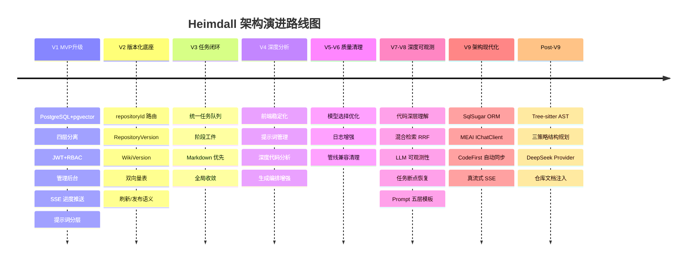

### 2.2 各版本核心变更

| 版本 | 归档日期 | 核心变更 |
|------|---------|---------|
| **V1** | 2026-05-14 前 | PostgreSQL+pgvector、四层分离（Api/Core/Infrastructure/Repository）、JWT+RBAC、管理后台、SSE 进度推送、提示词分层 |
| **V2** | 2026-05-14 | `repositoryId` 路由统一、`RepositoryVersion` 仓库快照模型、`WikiVersion` 知识版本模型、双向量表（`code_embedding_chunks` + `wiki_embedding_chunks`）、刷新/发布语义 |
| **V3** | 2026-05-14 | 统一任务队列执行、阶段工件（`task_artifacts`）、Markdown 优先生成、四段式管道（结构规划→页面草案→全局收敛→渲染后处理）、Ask/Slides/Workshop 并轨版本底座 |
| **V4** | 2026-05-15 | 前端分层架构、提示词管理系统（`prompt_templates`+`prompt_overrides`+`prompt_template_history`）、三阶段深度代码分析（结构索引→分层摘要→语义驱动规划）、前端稳定化 |
| **V5** | 2026-05-18 | 前端 UI 修复、日志增强、Provider/Model 选择优化、Prompt Management 落地 |
| **V6** | 2026-05-21 | 移除管线版本兼容层、清理旧 `Wiki` 聚合表依赖 |
| **V7** | 2026-05-21 | 代码深层理解（方法级调用图、设计模式检测）、混合检索（BM25+pgvector RRF 融合）、LLM 可观测性、Provider 计费策略 |
| **V8** | 2026-05-22 | 质量闭环、模型元数据配置（`provider_model_metadata`）、Prompt 五层模板（角色/上下文/指令/输出约束/质量清单）、调试模式、任务断点续跑、Settings Dashboard |
| **V9** | 2026-05-23 | EF Core → SqlSugar ORM（CodeFirst 自动同步）、`IChatProvider` → MEAI `IChatClient`（`ChatClientFactory`+Keyed DI）、CodeFirst 开关 `HEIMDALL_CODEFIRST_AUTOSYNC`、Ask 真流式 SSE、Token 精确估算、SQL 建表脚本回退方案 |
| **结构规划三策略** | 2026-05-24 | 三种结构规划策略：Deterministic（纯算法，零 Token）、LlmJson（LLM 生成 JSON 结构）、LlmEnhanced（LLM 增强 Deterministic 结果） |
| **Tree-sitter AST** | 2026-05-24 | `TreeSitter.DotNet` 统一 AST 引擎，28+ 语言符号提取与依赖分析，替代 C#-only Roslyn 方案 |
| **Wiki 增强+DeepSeek** | 2026-05-24 | DeepSeek Provider、仓库文档注入（AGENTS.md/README.md 等优先注入结构规划与页面生成）、5 层深度目录结构 |

---

## 3. 系统架构全景

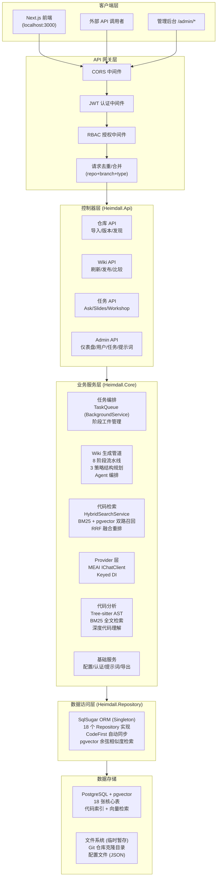

---

## 4. 分层架构设计

### 4.1 四层分离与依赖方向

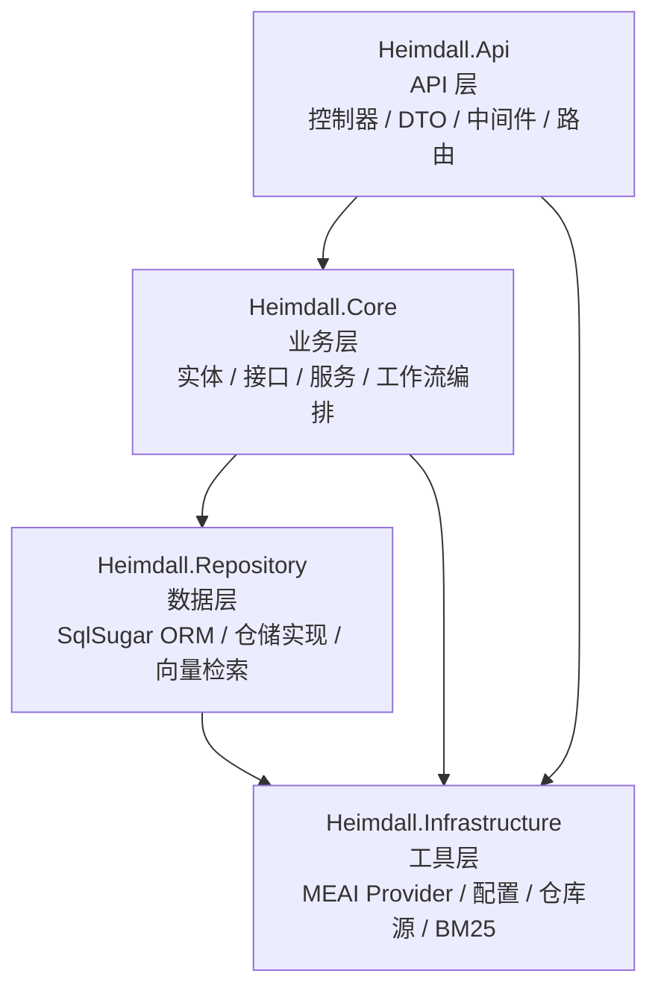

### 4.2 依赖规则

| 规则 | 说明 |
|------|------|
| **Api → Core** | API 调用 Core 层服务接口，不直接调用 Repository |
| **Core → Repository** | Core 通过接口依赖 Repository，由 DI 注入实现 |
| **全部 → Infrastructure** | Infrastructure 是工具层，被所有项目引用 |
| **Core 不依赖 Api** | 核心业务逻辑不得反向依赖 API 层 |
| **Repository 不依赖 Core** | 数据访问层仅依赖 Infrastructure 工具体 |
| **所有注入走接口** | 层间通信必须通过接口，不直接 new 具体实现 |

### 4.3 关键目录结构

```
backend/
├── Heimdall.Api/                    ← API 层
│   ├── Controllers/                 ← 21 个控制器
│   │   ├── Admin/                   ← Dashboard/Users/Settings/Prompts/Repositories/Tasks/Logging
│   │   ├── AuthController.cs
│   │   ├── RepositoriesController.cs
│   │   ├── RepositoryVersionsController.cs
│   │   ├── WikiVersionController.cs
│   │   ├── WikiCompareController.cs
│   │   ├── TasksController.cs
│   │   ├── TaskStatusController.cs
│   │   ├── ChatController.cs
│   │   ├── ConfigurationController.cs
│   │   ├── LlmMetricsController.cs
│   │   ├── PromptTemplatesController.cs
│   │   └── ...
│   ├── Middleware/
│   ├── Models/                      ← API 层 DTO
│   ├── config/                      ← JSON 配置文件 (generator/embedder/lang/repo)
│   └── Program.cs                   ← DI 注册、中间件管道、CodeFirst 同步
│
├── Heimdall.Core/                   ← 业务层
│   ├── Entities/                    ← 17 个领域实体 (SqlSugar [SugarTable] 标注)
│   ├── Interfaces/
│   │   ├── Services/                ← 业务服务接口
│   │   └── Repositories/            ← 仓储接口 (9+ 个)
│   └── Services/                    ← 业务服务实现 (41 个)
│       ├── Tasks/                   ← 任务编排与执行 (20 个服务)
│       ├── Repository/              ← 仓库与版本 (10 个服务)
│       ├── Prompt/                  ← 提示词管理 (4 个服务)
│       ├── Auth/                    ← 认证授权 (2 个服务)
│       ├── Admin/                   ← 管理统计 (1 个服务)
│       ├── Search/                  ← 混合检索 (1 个服务)
│       ├── Logging/                 ← 结构化日志 (1 个服务)
│       ├── CodeFirstSyncService.cs  ← 启动时自动同步表结构
│       └── LlmObservabilityService.cs ← LLM 调用可观测性
│
├── Heimdall.Infrastructure/         ← 工具层
│   ├── Providers/                   ← MEAI IChatClient Provider
│   │   ├── ChatClientFactory.cs     ← Keyed DI 工厂
│   │   ├── OpenAiCompatibleClientFactory.cs ← OpenAI/OpenRouter/DashScope/DeepSeek
│   │   ├── BedrockClientFactory.cs
│   │   └── CustomBackends/          ← Ollama/Gemini/MiniMax 自定义适配器
│   ├── Search/
│   │   └── Bm25SearchService.cs     ← BM25 全文检索
│   ├── RepositorySources/           ← 仓库来源适配 (GitHub/GitLab/Bitbucket/Local)
│   ├── Configuration/
│   │   └── HeimdallConfigService.cs
│   ├── Utilities/
│   │   └── TextUtilityService.cs
│   └── Models/                      ← 通用模型 (Provider/Configuration/Repository)
│
└── Heimdall.Repository/             ← 数据层
    └── Repositories/                ← 18 个仓储实现 (注入 ISqlSugarClient)
```

### 4.4 服务生命周期

| 层 | 组件 | 生命周期 | 原因 |
|----|------|---------|------|
| Api | Controllers | Scoped | 按请求创建 |
| Core | 业务服务 | Scoped | 依赖 Scoped Repository |
| Core | TaskQueueService | Singleton | BackgroundService 长生命周期 |
| Core | WikiTaskService | Singleton | 因 BackgroundService 要求，内部通过 `IServiceScopeFactory` 创建 Scoped |
| Infrastructure | Provider 实例 | Singleton | 无状态，线程安全 |
| Infrastructure | ConfigService | Singleton | 全局共享配置 |
| Infrastructure | RepositorySource | Singleton | 无状态策略 |
| Infrastructure | Bm25SearchService | Singleton | 无状态，索引内存驻留 |
| Repository | SqlSugar Client | Singleton | SqlSugar 官方推荐 |
| Repository | Repository 实现 | Scoped | 依赖 Scoped 上下文 |

---

## 5. 核心领域模型

### 5.1 版本化知识底座

这是 Heimdall 最核心的架构决策。`RepositoryVersion`（代码快照）与 `WikiVersion`（知识版本）分离，成为所有读写路径的**唯一运行时锚点**。

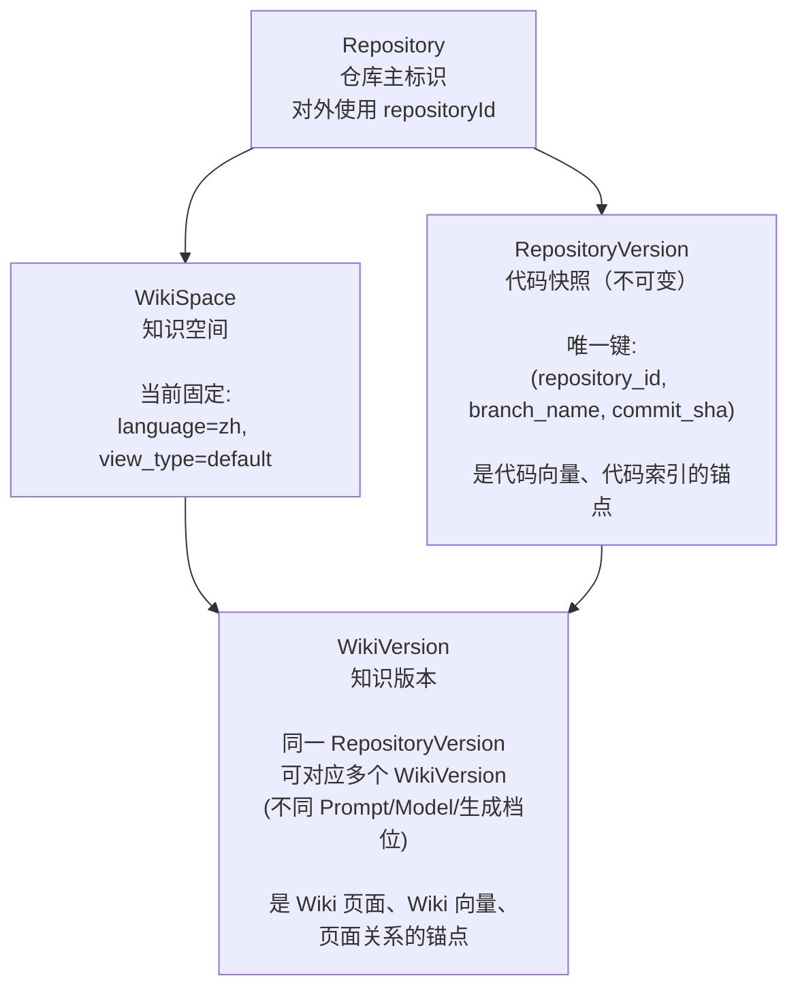

**为什么两者的分离至关重要？**

- 同一个代码版本可以多次生成（换模型、换 Prompt、换生成档位）
- 可以区分"代码变了"和"生成配置变了"
- 支持发布、回滚、A/B 对比
- 增量重建时只需对新的 RepositoryVersion 重新生成

### 5.2 核心实体关系

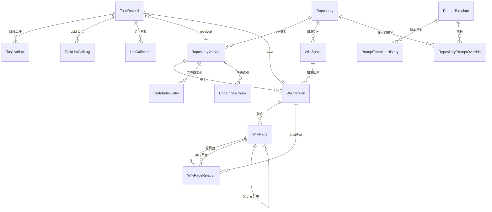

### 5.3 任务与工件模型

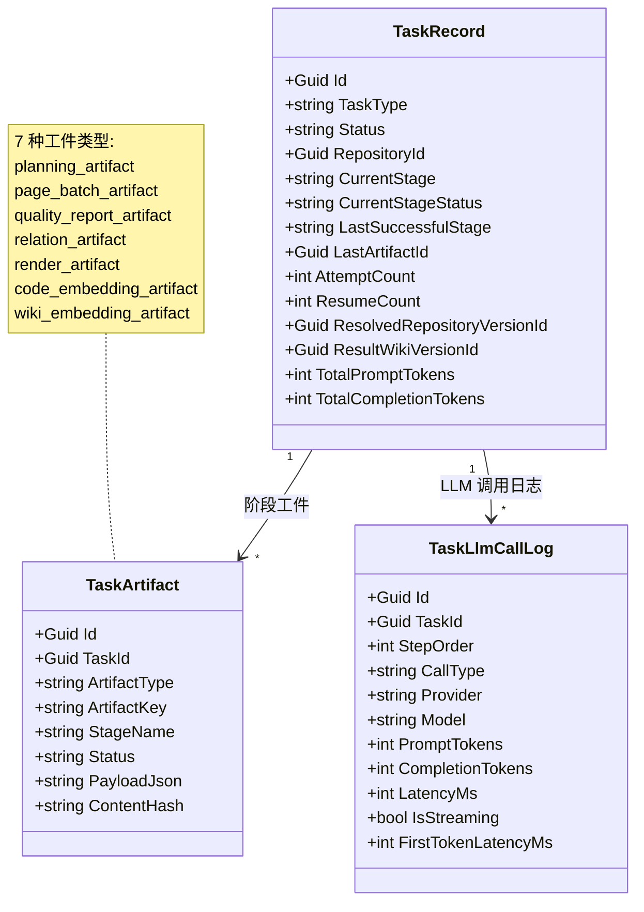

**任务恢复机制**：每个阶段完成后写入 `task_artifacts`，任务失败后根据 `LastSuccessfulStage` 从最近工件恢复，避免整链路重跑。

### 5.4 代码索引与检索模型

V8 后，向量嵌入阶段已从主链路移除，检索升级为 BM25 + pgvector 混合模式。

| 模型 | 锚点 | 内容 | 用途 |
|------|------|------|------|
| **CodeIndexEntry** | RepositoryVersionId | 文件级索引（路径、语言、符号、依赖） | Tree-sitter 解析结果持久化 |
| **CodeIndexChunk** | RepositoryVersionId | 块级索引（内容、行范围、块类型） | 代码片段快速定位 |
| **BM25 内存索引** | 按 RepositoryVersionId 分区 | 全文倒排索引 | 关键词快速召回 |
| **pgvector 向量** | 按 RepositoryVersionId 分区 | embedding_vector 字段 | 语义相似度检索 |

检索时通过 `HybridSearchService` 进行 BM25 + pgvector 双路召回 + RRF（Reciprocal Rank Fusion）融合重排。

---

## 6. Wiki 生成管线（8 阶段）

### 6.1 流程总览

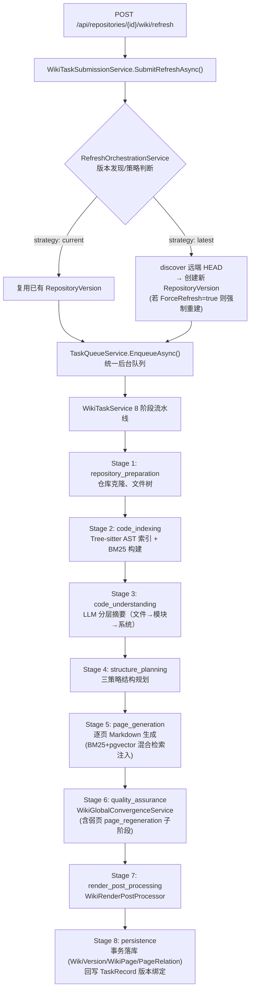

### 6.2 结构规划三策略

结构规划阶段根据配置选择三种策略之一：

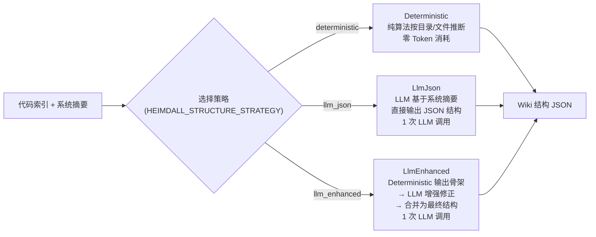

策略选择优先级：`HEIMDALL_STRUCTURE_STRATEGY` 环境变量 > `appsettings.json`（`StructurePlanning:Strategy`）> 默认 `Deterministic`

### 6.3 混合代码检索（Hybrid Code Retrieval）

页面生成阶段，每个页面的 prompt 注入相关源代码：

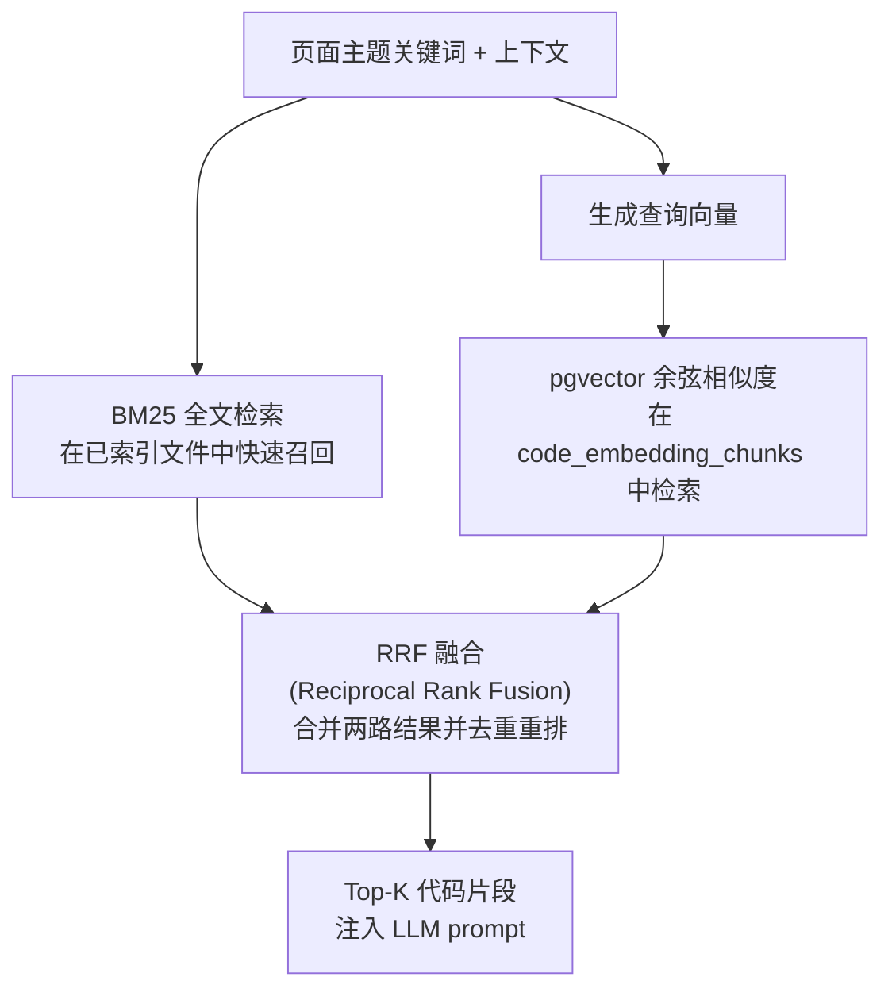

### 6.4 代码索引

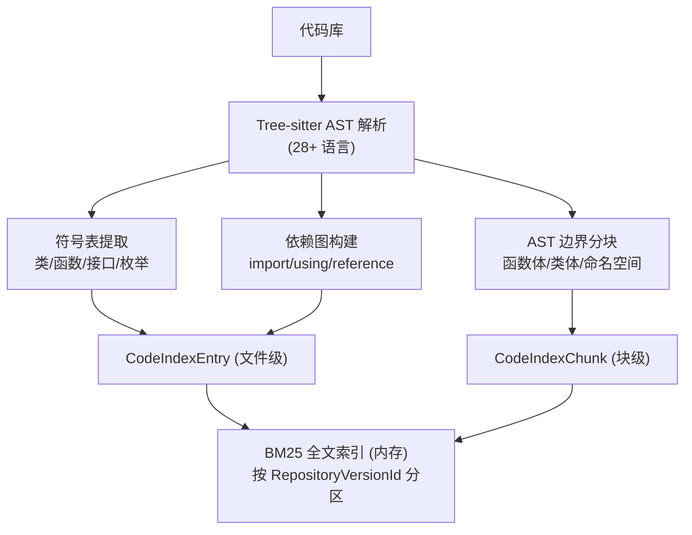

### 6.5 代码理解（CodeUnderstandingService）

对应管线 Stage 3 `code_understanding`，由 `CodeUnderstandingService` 编排三层 LLM 分析：

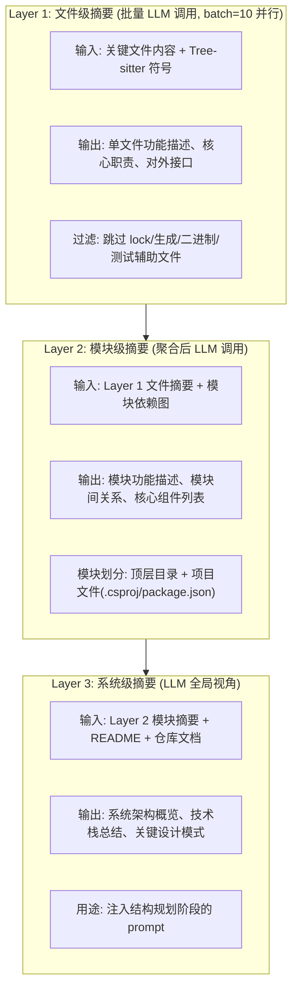

辅助服务：`CallGraphBuilder`（方法级调用图）、`DesignPatternDetector`（设计模式启发检测）、`DependencyTopologyService`（模块依赖拓扑）。

### 6.6 大仓库分治策略（Agent Orchestration）

当仓库文件数 > 2000 时，`AgentOrchestratorService` 介入：

- 按模块拆分，每个模块分配独立子 Agent
- 每个 Agent 拥有独立的代码索引窗口 + LLM 调用上下文
- 并行生成各模块页面
- 主 Agent 负责跨模块一致性合并与全局收敛
- 并发数由 `HEIMDALL_MAX_CONCURRENT_AGENTS` 控制

---

## 7. AI Provider 架构

### 7.1 MEAI IChatClient 抽象

V9 用 Microsoft.Extensions.AI (`IChatClient`) 替换了自研 `IChatProvider`，实现标准化 AI 调用。

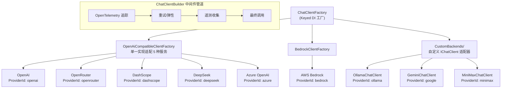

**Embedding Provider（4 类）**：

| Provider | EmbedderType | 默认模型 | 维度 |
|----------|-------------|---------|------|
| OpenAI | `openai` | text-embedding-3-small | 256 |
| Google | `google` | gemini-embedding-001 | 768 |
| AWS Bedrock | `bedrock` | amazon.titan-embed-text-v2:0 | 256 |
| Ollama | `ollama` | nomic-embed-text | 768 |

### 7.2 模型分层策略（Model Tier Strategy）

为平衡质量与成本，系统支持按任务阶段配置不同模型（`TierConfig`）：

| Tier | 用途 | 推荐模型 |
|------|------|---------|
| **Planner** | 结构规划、系统摘要 | 高推理模型（Opus/Claude） |
| **Generator** | 页面正文生成 | 标准模型（Sonnet/GPT-4o） |
| **Reviewer** | 质量审查、收敛修正 | 廉价模型（Haiku/DeepSeek） |

可通过 `appsettings.json` 或管理后台按任务类型配置每个 Tier 的 Provider/Model。

### 7.3 Token 估算与成本追踪

- **精确模式**（`HEIMDALL_TOKEN_ESTIMATION_MODE=precise`）：使用 `IChatClient.GetStreamingResponseAsync()` 返回的 MEAI `UsageDetails` 精确 Token 计数
- **估算模式**（`HEIMDALL_TOKEN_ESTIMATION_MODE=estimated`）：使用启发式算法估算（字符数 × 系数）
- 每次 LLM 调用写入 `task_llm_call_logs`（含 `IsStreaming`、`FirstTokenLatencyMs`、`IsEstimated` 标记）
- 成本由 `ProviderBillingService` 按 Provider 实时定价计算

---

## 8. 前端架构

### 8.1 路由设计 (V2+)

```
/                                    ← 首页（输入仓库 URL，导入后跳转）
/login                               ← 登录页
/repositories/[repositoryId]         ← 仓库 Wiki 主页
/repositories/[repositoryId]/slides  ← 演示幻灯片
/repositories/[repositoryId]/workshop← 工作坊材料
/wiki/projects                       ← 已处理项目列表
/admin/dashboard                     ← 管理仪表盘
/admin/users                         ← 用户管理
/admin/tasks                         ← 任务监控
/admin/prompts                       ← 提示词管理
/admin/repositories                  ← 仓库管理
/admin/settings                      ← 系统设置
```

**版本参数通过 URL Query 传递**：`?wikiVersionId=xxx&repositoryVersionId=xxx`

### 8.2 组件架构

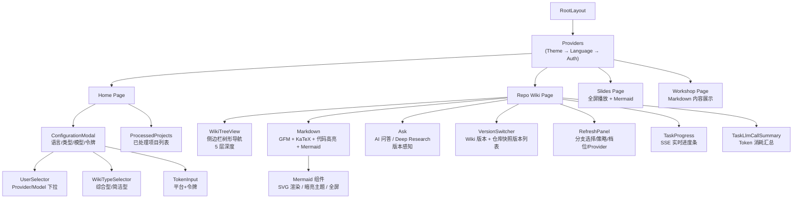

### 8.3 BFF 代理策略

Next.js 通过两层代理连接 .NET 后端 (localhost:8001)：

**Rewrites（零 JS 开销，简单透传）**：
- `/api/repositories/:path*` → `{BASE}/api/repositories/:path*`
- `/api/tasks/:path*` → `{BASE}/tasks/:path*`（前缀不一致，需 Rewrite 处理）
- `/api/admin/:path*` → `{BASE}/admin/:path*`
- `/api/chat/:path*` → `{BASE}/chat/:path*`

**API Routes（需要校验或流式处理）**：
- `api/chat/stream/route.ts` → SSE 流式透传
- `api/tasks/[task]/route.ts` → 白名单校验 (wiki/ask/slides/workshop)
- `api/tasks/ask/stream/route.ts` → Ask 问答 SSE 流式透传
- `api/auth/status/route.ts` → 认证状态
- `api/auth/validate/route.ts` → Token 验证
- `api/models/config/route.ts` → 模型配置（缓存控制）
- `api/wiki/projects/route.ts` → 已处理项目列表

### 8.4 版本上下文透传 (V3+)

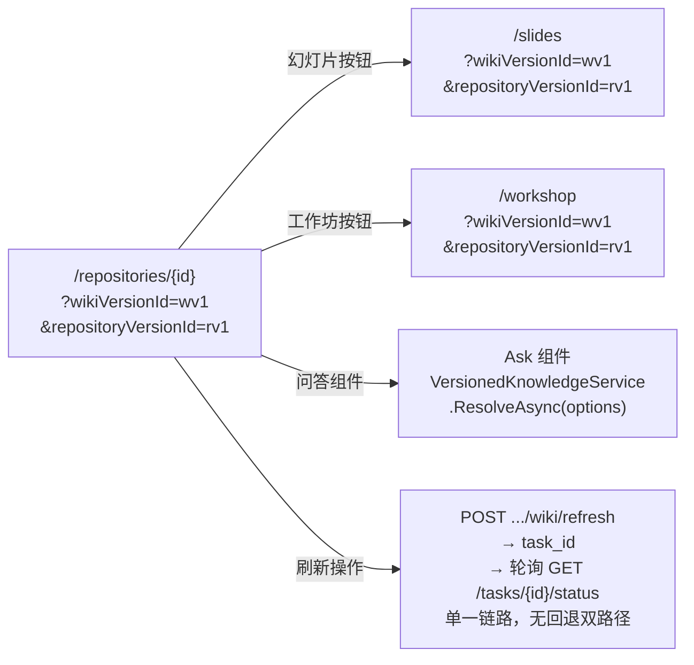

### 8.5 组件职责矩阵

| 组件 | 文件 | 核心职责 |
|------|------|----------|
| **Ask** | `Ask.tsx` | AI 问答聊天界面，Deep Research 多阶段研究，对话历史管理，版本上下文感知 |
| **ConfigurationModal** | `ConfigurationModal.tsx` | 首页 Wiki 生成前完整配置：语言、Wiki 类型、模型、文件过滤、令牌 |
| **ModelSelectionModal** | `ModelSelectionModal.tsx` | 可复用的模型选择模态框（仓库页/Ask 共用），局部状态先存后提交 |
| **UserSelector** | `UserSelector.tsx` | Provider/Model 下拉选择，自定义模型切换，高级文件过滤选项 |
| **WikiTypeSelector** | `WikiTypeSelector.tsx` | 综合型 vs 简洁型 Wiki 切换 |
| **TokenInput** | `TokenInput.tsx` | 平台选择 + 访问令牌输入 |
| **Markdown** | `Markdown.tsx` | Markdown 渲染管道：GFM、数学公式、代码高亮、Mermaid 内联 |
| **Mermaid** | `Mermaid.tsx` | Mermaid 图表 SVG 渲染，暗/亮主题，全屏缩放 |
| **WikiTreeView** | `WikiTreeView.tsx` | Wiki 页面层级树形导航，递归节点渲染，重要性指示器，展开/折叠 |
| **ProcessedProjects** | `ProcessedProjects.tsx` | 已处理项目卡片/列表视图，搜索过滤，删除 |
| **RefreshPanel** | `RefreshPanel.tsx` | Wiki 刷新面板：分支选择、刷新策略、强制刷新、生成档位、Provider/Model |
| **VersionSwitcher** | `VersionSwitcher.tsx` | 版本切换器：Wiki 版本列表 + 仓库快照列表，版本元信息展示 |
| **TaskProgress** | `TaskProgress.tsx` | 任务进度条，通过 SSE 实时更新阶段名称与百分比 |
| **TaskLlmCallSummary** | `TaskLlmCallSummary.tsx` | Token 消耗汇总 + LLM 调用明细表 |
| **ThemeToggle** | `theme-toggle.tsx` | 暗色/亮色主题切换按钮 |
| **Providers** | `Providers.tsx` | 根级 Provider 组合：Theme → Language → Auth |
| **LoadingState** | `ui/LoadingState.tsx` | 通用加载态组件（骨架屏） |
| **ErrorState** | `ui/ErrorState.tsx` | 通用错误态组件（含重试按钮） |
| **EmptyState** | `ui/EmptyState.tsx` | 通用空态组件（含操作引导） |
| **ConfigStatusPanel** | `ConfigStatusPanel.tsx` | 当前 Provider/Model 配置状态面板 |
| **ProviderCard** | `ProviderCard.tsx` | 单个 Provider 信息卡片 |
| **WikiActionBar** | `wiki/WikiActionBar.tsx` | Wiki 页面操作工具栏（刷新/导出/发布） |
| **WikiBrowser** | `wiki/WikiBrowser.tsx` | Wiki 浏览容器（侧边栏+内容+工具栏组合） |
| **WikiContent** | `wiki/WikiContent.tsx` | Wiki 页面正文渲染容器 |
| **WikiSidebar** | `wiki/WikiSidebar.tsx` | Wiki 侧边栏导航（含版本切换和树形目录） |

### 8.6 数据流架构

```mermaid
flowchart LR
    subgraph Sources["状态来源"]
        URL["URL Query Params<br/>(repositoryId, versionId)"]
        API["API 响应<br/>(/api/repositories/...)"]
        SSE["SSE 流<br/>(/tasks/{id}/stream)"]
    end

    subgraph State["组件状态 (useState, 无全局状态库)"]
        HOME_S["Home: repoUrl, loading"]
        WIKI_S["Wiki: wikiViewState, activePage,<br/>selectedVersionId, taskId"]
        ASK_S["Ask: messages, loading, researchStages"]
        SLIDES_S["Slides: slides[], currentSlide"]
        WORKSHOP_S["Workshop: content, loading"]
        REFRESH_S["RefreshPanel: branch, strategy, profile, provider"]
    end

    subgraph API_CALLS["API 调用"]
        IMPORT["POST /api/repositories/import"]
        REPO_GET["GET /api/repositories/{id}"]
        WIKI_VER["GET .../wiki/versions"]
        WIKI_PAGES["GET .../wiki/pages?wikiVersionId="]
        WIKI_REFRESH["POST .../wiki/refresh"]
        TASK_ASK["POST /tasks/ask"]
        TASK_STATUS["GET /tasks/{id}/status"]
    end

    Sources --> State
    State --> API_CALLS
```

### 8.7 关键 Hooks

| Hook | 用途 |
|------|------|
| `useProcessedProjects` | 从 `/api/processed_projects` 获取已处理项目列表 |
| `useTaskStream` | 通过 `EventSource` 连接 SSE 流，监听 `progress`/`complete`/`error` 事件 |
| `useArtifactVersionContext` | 验证 Slides/Workshop 页面的版本上下文（GUID 校验 + 后端交叉验证） |

### 8.8 Context 层

| Context | 用途 |
|---------|------|
| `LanguageContext` | 国际化上下文，当前仅支持 `zh`（中文），提供 `messages` 对象 |
| `AuthContext` | 认证上下文，支持 `none` 模式（自动管理员）和 `jwt` 模式（localStorage Token） |
| `RepositoryContext` | 仓库上下文，管理当前浏览的 repositoryId/versionId 等全局状态 |

### 8.9 BFF Rewrite 规则详情（`next.config.ts`）

| 源路径 | 转发目标 | 说明 |
|--------|---------|------|
| `/api/repositories/:path*` | `{BASE}/api/repositories/:path*` | 仓库 API（保留 /api 前缀） |
| `/api/processed_projects/:path*` | `{BASE}/api/processed_projects/:path*` | 项目列表 |
| `/api/processed_projects` | `{BASE}/api/processed_projects` | 项目列表（精确匹配） |
| `/api/tasks/:path*` | `{BASE}/tasks/:path*` | 任务 API（移除 /api 前缀） |
| `/api/chat/:path*` | `{BASE}/chat/:path*` | Chat API |
| `/api/admin/:path*` | `{BASE}/admin/:path*` | Admin API |
| `/api/models/config` | `{BASE}/models/config` | 模型配置 |
| `/api/auth/status` | `{BASE}/auth/status` | 认证状态 |
| `/api/auth/validate` | `{BASE}/auth/validate` | 认证验证 |
| `/api/lang/config` | `{BASE}/lang/config` | 语言配置 |
| `/api/wiki_cache/:path*` | `{BASE}/api/wiki_cache/:path*` | Wiki 缓存（兼容旧接口） |
| `/api/wiki_cache` | `{BASE}/api/wiki_cache` | Wiki 缓存（精确匹配） |
| `/export/wiki/:path*` | `{BASE}/export/wiki/:path*` | Wiki 导出 |
| `/local_repo/structure` | `{BASE}/local_repo/structure` | 本地仓库结构 |

### 8.10 核心类型定义

```typescript
// 仓库主标识
interface RepositoryDetail {
  repository_id: string;
  display_name: string;
  owner: string;
  repo_name: string;
  provider_type: string;
  repo_url: string;
  default_branch: string;
  default_language: string;
  is_archived: boolean;
}

// 版本概要
interface RepositoryVersionSummary {
  id: string;
  branch_name: string;
  commit_sha: string;
  commit_time: string;
  is_latest_on_branch: boolean;
}

interface WikiVersionSummary {
  id: string;
  version_no: number;
  status: string;          // draft / generating / ready / published / failed / superseded
  generation_mode: string;
  generation_profile: string;
  page_count?: number;
  created_at: string;
  completed_at?: string;
}

// Wiki 页面
interface WikiPage {
  id: string;
  title: string;
  content: string;          // Markdown
  filePaths: string[];
  importance: "high" | "medium" | "low";
  relatedPages: string[];
  parentId?: string;
  isSection?: boolean;
  children?: string[];
  frontMatter?: WikiPageFrontMatter;
  outline?: WikiPageHeading[];
  pageType?: string;
  status?: string;
}
```

### 8.11 构建与部署

| 配置项 | 值 | 说明 |
|--------|-----|------|
| `output` | `standalone` | 自包含 Node.js 部署包 |
| `SERVER_BASE_URL` | `http://localhost:8001` (默认) | 后端 API 地址，Docker 中覆盖 |
| 包管理器 | Yarn 1.22.22 | |
| TypeScript | strict mode | |
| React | 19.2.6 | |
| Next.js | 16.2.6 | App Router + Turbopack |
| Tailwind CSS | 4.3.0 | |

### 8.12 前端关键设计决策

**薄前端设计**：前端不包含任何业务编排逻辑。Wiki 生成、RAG 检索、LLM 调用等全部在后端完成，前端仅负责 UI 呈现与用户交互。

**repositoryId 为主标识 (V2)**：废弃旧的 `[owner]/[repo]` 路由，全部使用 `/repositories/[repositoryId]` 统一模式，支持跨 Provider 的仓库标识。

**版本上下文透传 (V3)**：`repositoryVersionId` 和 `wikiVersionId` 通过 URL Query 参数在 Wiki → Slides/Workshop → Ask 之间透传，确保所有派生内容基于同一版本。

**Next.js Rewrite + API Route 混合代理**：简单透传使用 Rewrite（零 JS 开销），需要校验或流式处理的请求使用 API Route 代理。

**组件自包含**：每个组件管理自己的状态，通过 Props 接收外部配置和回调。采用 React 原生 `useState`，无全局状态库（无 Redux/Zustand）。

**RefreshPanel → taskId → 轮询 单链路**：前端刷新只走 `POST .../wiki/refresh → task_id → GET /tasks/{id}/status` 单一链路，不再有回退到旧 `generateWikiTask` 的双路径。

---

## 9. API 端点总览

### 9.1 仓库与版本

| 方法 | 路由 | 描述 |
|------|------|------|
| `POST` | `/api/repositories/import` | 导入仓库（URL → repositoryId） |
| `GET` | `/api/repositories` | 列出所有仓库 |
| `GET` | `/api/repositories/{id}` | 获取仓库详情 |
| `PATCH` | `/api/repositories/{id}` | 更新仓库元数据 |
| `DELETE` | `/api/repositories/{id}` | 删除仓库及关联数据 |
| `GET` | `/api/repositories/{id}/versions` | 仓库版本列表 |
| `GET` | `/api/repositories/{id}/versions/{vid}` | 版本详情 |
| `POST` | `/api/repositories/{id}/versions/discover` | 触发版本发现 |
| `GET` | `/api/repositories/{id}/versions/latest` | 获取最新版本 |

### 9.2 Wiki

| 方法 | 路由 | 描述 |
|------|------|------|
| `GET` | `/api/repositories/{id}/wiki` | 读取 Wiki 缓存 |
| `DELETE` | `/api/repositories/{id}/wiki` | 删除 Wiki 缓存 |
| `GET` | `/api/repositories/{id}/wiki/versions` | Wiki 版本列表 |
| `GET` | `/api/repositories/{id}/wiki/versions/{wvId}` | Wiki 版本详情（含页面树） |
| `POST` | `/api/repositories/{id}/wiki/refresh` | 触发 Wiki 刷新/生成 |
| `POST` | `/api/repositories/{id}/wiki/versions/{wvId}/publish` | 发布指定版本 |
| `GET` | `/api/repositories/{id}/wiki/published` | 获取当前发布版本 |
| `GET` | `/api/repositories/{id}/wiki/pages` | 获取版本页面列表 |
| `POST` | `/api/repositories/{id}/wiki/compare` | 比较两个 Wiki 版本 |

### 9.3 任务与问答

| 方法 | 路由 | 描述 |
|------|------|------|
| `POST` | `/tasks/ask` | AI 问答（JSON 响应） |
| `POST` | `/tasks/ask/stream` | AI 流式问答（SSE 真流式） |
| `POST` | `/tasks/slides` | 生成演示幻灯片 |
| `POST` | `/tasks/workshop` | 生成工作坊材料 |
| `GET` | `/tasks/{id}/status` | 查询任务状态 |
| `GET` | `/tasks/{id}/stream` | SSE 订阅任务进度 |
| `GET` | `/tasks/{id}/token-summary` | Token 消耗汇总 |
| `GET` | `/tasks/{id}/llm-calls` | LLM 调用日志 |
| `GET` | `/tasks/{id}/artifacts` | 任务工件列表 |
| `POST` | `/tasks/{id}/cancel` | 取消任务 |
| `POST` | `/tasks/{id}/resume` | 手动恢复失败任务 |
| `GET` | `/tasks/{id}/llm-metrics` | LLM 调用指标详情 |

### 9.4 Admin (需 Admin 角色)

| 方法 | 路由 | 描述 |
|------|------|------|
| `GET` | `/admin/dashboard` | 仪表盘统计 |
| `GET/POST` | `/admin/users` | 用户管理 |
| `PUT/DELETE` | `/admin/users/{id}` | 更新/删除用户 |
| `GET/PUT` | `/admin/settings` | 系统设置（键值对） |
| `GET/POST` | `/admin/prompts` | Prompt 模板管理 |
| `PUT/DELETE` | `/admin/prompts/{id}` | 更新/删除模板 |
| `GET` | `/admin/repositories` | 仓库管理列表 |
| `DELETE` | `/admin/repositories/{id}` | 强制删除仓库 |
| `GET` | `/admin/tasks` | 全量任务列表 |
| `POST` | `/admin/tasks/{id}/retry` | 重试失败任务 |
| `GET` | `/admin/logging` | 系统日志查询 |
| `GET` | `/api/admin/provider-metadata` | Provider 模型元数据列表 |
| `GET` | `/api/admin/system-info` | 系统运行信息摘要 |

### 9.5 其他

| 方法 | 路由 | 描述 |
|------|------|------|
| `GET` | `/health` | 健康检查 |
| `GET` | `/lang/config` | 支持语言列表 |
| `GET` | `/models/config` | Provider/Model 配置 |
| `POST` | `/auth/register` | 用户注册 |
| `POST` | `/auth/login` | 用户登录 |
| `POST` | `/auth/refresh` | 刷新 JWT Token |
| `GET` | `/auth/me` | 当前用户信息 |
| `POST` | `/chat/completions/stream` | SSE 流式聊天 |
| `GET` | `/api/processed_projects` | 已处理项目列表 |
| `DELETE` | `/api/processed_projects/{id}` | 删除项目 |
| `GET` | `/export/wiki/{repoId}` | 导出 Wiki（Markdown zip） |

---

## 10. 数据库设计

### 10.1 表总览

| 表名 | 实体 | 用途 |
|------|------|------|
| `users` | User | 用户账户与角色 |
| `repositories` | Repository | 仓库主标识（对外使用 `Id`） |
| `repository_versions` | RepositoryVersion | 代码快照版本（不可变） |
| `wiki_spaces` | WikiSpace | 知识空间（语言+视角维度） |
| `wiki_versions` | WikiVersion | Wiki 知识版本 |
| `wiki_pages` | WikiPage | Wiki 页面内容（Markdown） |
| `wiki_page_relations` | WikiPageRelation | 页面间关系（parent/depends_on/related_to 等） |
| `tasks` | TaskRecord | 任务记录（含阶段状态与恢复字段） |
| `task_artifacts` | TaskArtifact | 任务阶段工件（planning/page_batch/quality_report 等） |
| `task_llm_call_logs` | TaskLlmCallLog | LLM 调用审计日志（含流式/时延/估算标记） |
| `llm_call_metrics` | LlmCallMetric | LLM 调用指标详情（IsStreaming/FirstTokenLatencyMs） |
| `code_index_entries` | CodeIndexEntry | Tree-sitter 文件级索引（路径/语言/符号/依赖） |
| `code_index_chunks` | CodeIndexChunk | Tree-sitter 块级索引（与 CodeIndexEntry 同文件） |
| `prompt_templates` | PromptTemplate | Prompt 模板（5 层结构，DB 存储） |
| `repository_prompt_overrides` | RepositoryPromptOverride | 仓库级 Prompt 覆写（override/merge/append 策略） |
| `prompt_template_history` | PromptTemplateHistory | 模板修改历史（含版本号与变更人） |
| `system_settings` | SystemSetting | 系统设置键值对 |
| `provider_model_metadata` | ProviderModelMetadataEntity | Provider/Model 元数据（计费/上下文窗口/流式支持） |

### 10.2 关键约束

- **并发控制**：同一仓库+分支同一时间仅允许一个 running 任务（数据库唯一索引保证）
- **去重**：`SHA256(repository_id + branch + task_type + config_hash)` 作为请求去重键
- **版本唯一**：`(repository_id, branch_name, commit_sha)` 唯一确定一个 RepositoryVersion
- **ORM**：SqlSugar CodeFirst，启动时 `CodeFirstSyncService` 自动同步表结构，无迁移文件
- **回退**：`SqlSugar.DbMaintenance` API 可导出完整建表脚本，用于离线部署恢复
- **向量索引**：pgvector IVF/HNSW 索引，按 `repository_version_id` / `wiki_version_id` 分区检索

---

## 11. 配置与环境变量

### 11.1 配置来源优先级

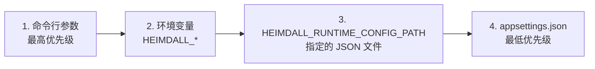

### 11.2 核心环境变量

| 变量 | 用途 | 默认值 |
|------|------|--------|
| `HEIMDALL_CONNECTION_STRING` | PostgreSQL 连接字符串 | —（必须设置） |
| `HEIMDALL_DEFAULT_PROVIDER` | 默认 Chat Provider | `ollama` |
| `HEIMDALL_DEFAULT_MODEL` | 默认模型 | — |
| `HEIMDALL_EMBEDDER_TYPE` | 嵌入 Provider 类型 | `ollama` |
| `HEIMDALL_JWT_SECRET` | JWT 签名密钥 | —（生产必须设置） |
| `HEIMDALL_JWT_EXPIRY_HOURS` | Token 过期时间 | `72` |
| `HEIMDALL_AUTH_MODE` | 认证模式：`none`/`jwt` | `jwt` |
| `HEIMDALL_REGISTRATION_OPEN` | 是否开放注册 | `true` |
| `HEIMDALL_CODEFIRST_AUTOSYNC` | 启动时自动同步表结构 | `true` |
| `HEIMDALL_STRUCTURE_STRATEGY` | 结构规划策略：`Deterministic`/`LlmJson`/`LlmEnhanced` | `Deterministic` |
| `HEIMDALL_DEEP_ANALYSIS_ENABLED` | 深度代码分析开关 | `true` |
| `HEIMDALL_MAX_CONCURRENT_AGENTS` | 大仓库子 Agent 并发数 | `4` |
| `HEIMDALL_TOKEN_ESTIMATION_MODE` | Token 统计算法 | `precise` |
| `HEIMDALL_QUALITY_REGEN_ENABLED` | 弱页面自动重生成 | `true` |
| `HEIMDALL_DEBUG_MODE` | 调试模式（限制页面数，按 `DebugWikiPageCount`） | `false` |
| `HEIMDALL_LOG_SQL` | 输出 SqlSugar SQL 日志到控制台 | `false` |
| `HEIMDALL_OLLAMA_CHAT_HOST` | Ollama Chat 地址 | 回退 `OLLAMA_HOST` → `http://127.0.0.1:11434` |
| `HEIMDALL_OLLAMA_EMBED_HOST` | Ollama Embedding 地址 | 回退 `OLLAMA_HOST` → `http://127.0.0.1:11434` |

### 11.3 配置文件

```
backend/Heimdall.Api/config/
├── generator.json    (Chat Provider 定义列表)
├── embedder.json     (嵌入器 & 检索器配置)
├── lang.json         (支持语言列表)
└── repo.json         (仓库文件过滤规则)
```

---

## 12. 关键架构决策（AD）

### AD1：RepositoryVersion 与 WikiVersion 分离

**决策**：代码快照版本与知识版本必须独立建模。
**理由**：同一代码版本可多次生成（换模型/Prompt/档位），支持发布/回滚/A/B 对比，增量重建时只对新快照重新生成。
**影响**：所有读写路径必须以 `RepositoryVersion` + `WikiVersion` 为唯一锚点。旧 `Wiki` 表仅作兼容层只读。

### AD2：数据库为唯一信源

**决策**：Wiki 内容、向量嵌入、任务记录全部以 PostgreSQL 为唯一持久化存储。文件系统仅作任务执行期间的临时暂存。
**理由**：避免数据一致性问题，支持版本化与增量更新，简化部署（单容器 PostgreSQL + pgvector）。
**影响**：不产生本地 JSON 缓存文件，Wiki 导出从 DB 实时查询拼接。

### AD3：BM25 + pgvector 混合检索

**决策**：代码检索采用 BM25 全文检索 + pgvector 语义检索双路召回 + RRF 融合重排。
**理由**：BM25 对关键词/符号名精确匹配效果好，pgvector 对语义相关性好，双路融合互补，比单一检索方式召回率显著提升。
**影响**：`HybridSearchService` 负责融合逻辑，`Bm25SearchService` 管理内存索引。

### AD4：Markdown 是主内容格式，HTML 是受控扩展

**决策**：页面正文以 Markdown + Frontmatter + Mermaid 为主格式。原始 HTML 仅用于少量白名单扩展。
**理由**：Markdown 更易维护、版本比较、增量编辑；HTML 直接输出导致结构不可控、维护成本高。
**影响**：Slides/Workshop 优先从稳定 Markdown/结构工件派生，不直接要求大模型产出大段 HTML。

### AD5：所有长任务统一走后台队列

**决策**：Wiki 生成、Ask、Slides、Workshop 全部通过 `TaskQueueService`（`BackgroundService`）入队消费。
**理由**：避免控制器内 `Task.Run` 绕过队列导致状态不一致、无法统一恢复、并发不可控。
**影响**：控制器只负责验证→创建任务→返回 `task_id`。任务完成后才能标记 `completed`。

### AD6：阶段工件支持断点续跑

**决策**：每个管道阶段完成后写入 `task_artifacts`，失败后从 `LastSuccessfulStage` 恢复。
**理由**：大规模 Wiki 生成耗时数十分钟，整链路重跑成本不可接受。
**影响**：`TaskRecord` 包含 `CurrentStage`、`LastSuccessfulStage`、`LastArtifactId`、`ResumeCount` 等恢复字段。

### AD7：SqlSugar CodeFirst 自动同步

**决策**：ORM 使用 SqlSugar CodeFirst 自动同步表结构，由 `HEIMDALL_CODEFIRST_AUTOSYNC` 环境变量控制。
**理由**：CodeFirst 消除迁移文件维护负担，`ISqlSugarClient.DbMaintenance` 可导出建表脚本用于离线恢复。
**影响**：实体变更后只需更新实体类本身（`[SugarTable]`/`[SugarColumn]` 标注），无需手动维护迁移文件。

### AD8：MEAI IChatClient 标准化 AI 调用

**决策**：采用 `Microsoft.Extensions.AI` 的 `IChatClient` 替代自研 `IChatProvider` 接口。
**理由**：行业标准抽象，中间件管道（OpenTelemetry/Retry/Telemetry），`GetStreamingResponseAsync()` 真流式 SSE，减少自研维护成本。
**影响**：5 个 OpenAI 兼容走 `OpenAiCompatibleClientFactory`，Ollama/Gemini/MiniMax 实现自定义 `IChatClient` 适配器。

### AD9：repositoryId 为前后端统一主标识

**决策**：前后端全部接口以 `repositoryId`（GUID）为主标识。
**理由**：消除 `owner/repo` 路由的标识不稳定问题，仓库重命名/迁移不受影响，权限/分享/版本切换更清晰。
**影响**：前端路由从 `/[owner]/[repo]` 迁移到 `/repositories/[repositoryId]`，导入接口 `POST /api/repositories/import` 作为 URL→ID 的桥梁。

---

## 13. 演进路线图

### 13.1 已完成的里程碑

| 里程碑 | 核心能力 | 状态 |
|--------|---------|------|
| **M1: 数据基础设施** | PostgreSQL+pgvector、四层分离、JWT+RBAC | ✅ 完成 |
| **M2: 版本化底座** | RepositoryVersion、WikiVersion、双向量表、repositoryId 路由 | ✅ 完成 |
| **M3: 任务闭环** | 统一队列、阶段工件、Markdown 优先、全局收敛 | ✅ 完成 |
| **M4: 深度分析** | Tree-sitter AST、混合检索、深度代码理解、三策略结构规划 | ✅ 完成 |
| **M5: 质量与可观测** | LLM 可观测性、任务恢复、提示词管理、调试模式 | ✅ 完成 |
| **M6: V9 架构现代化** | SqlSugar ORM、MEAI IChatClient、CodeFirst 自动同步、真流式 SSE | ✅ 完成 |

### 13.2 未来演进方向

| 优先级 | 方向 | 说明 |
|--------|------|------|
| **P1** | 大规模 Wiki 增量生成 | 按变更文件推断受影响模块→仅重生成受影响页面，而非整仓库重建 |
| **P1** | 页面级质量闭环 | 内容评分、重复检测、可读性量化，低于阈值的页面自动重生成 |
| **P2** | 版本对比可视化 | 两个 RepositoryVersion 或 WikiVersion 的差异展示（新增/删除/修改页面） |
| **P2** | 多视角 Wiki | 按 `view_type`（架构/安全/入门/API）生成不同视角的 Wiki |
| **P2** | Agent Loop 增强 | 在规划/审查/收敛阶段试点多 Agent 协同，不替换主链路 |
| **P3** | 跨页面知识图谱 | 基于 `wiki_page_relations` 构建可视化知识导航图 |
| **P3** | 多语言 Wiki | 非中文（en/ja 等）Wiki 生成支持 |
| **P3** | 训练营材料自动生成 | 从 Wiki 自动派生分步骤的实验手册与练习材料 |

---

## 14. 附录

### 14.1 技术依赖

**NuGet 核心依赖**：

| 包名 | 用途 |
|------|------|
| `SqlSugarCore` | ORM — 替代 EF Core |
| `Microsoft.Extensions.AI` | 统一 AI 调用抽象 |
| `Microsoft.Extensions.AI.OpenAI` | OpenAI/OpenRouter/DashScope/DeepSeek IChatClient |
| `OllamaSharp` | Ollama API 客户端（自定义 IChatClient 适配器底层） |
| `Microsoft.AspNetCore.Authentication.JwtBearer` | JWT 认证 |
| `AWSSDK.Extensions.Bedrock.MEAI` | AWS Bedrock MEAI 集成 |
| `BCrypt.Net-Next` | 密码哈希 |
| `Swashbuckle.AspNetCore.Swagger` | Swagger API 文档 |
| `TreeSitter.DotNet` | 跨语言 AST 引擎（位于 Infrastructure 项目） |
| `Npgsql` | PostgreSQL 驱动（SqlSugar 传递依赖） |

**npm 核心**：

| 包名 | 用途 |
|------|------|
| `next` 16.2.6 | React 框架 (App Router + Turbopack) |
| `react` 19.2.6 | UI 库 |
| `tailwindcss` 4.3.0 | CSS 框架 |
| `mermaid` | 图表渲染 |
| `katex` | 数学公式渲染 |
| `next-themes` | 暗色/亮色主题 |

### 14.2 调试工作流

参阅 `CLAUDE.md` 中的脚本体系。核心命令：

```bash
# macOS/Linux 一键启动
bash scripts/dev.sh

# 仅后端
bash scripts/dev.sh --backend-only

# 后端构建
dotnet build backend/Heimdall.Api/Heimdall.Api.csproj

# 前端构建与 Lint
cd frontend && npm run build && npm run lint
```

### 14.3 文档归档说明

本文档合并并替代以下历史文档：

- `doc/architecture/architecture-upgrade-plan.md`（V1）
- `doc/architecture/architecture-upgrade-planV2.md`（V2）
- `doc/architecture/architecture-upgrade-planV3.md`（V3）
- `doc/architecture/architecture-upgrade-planV4.md`（V4）
- `doc/architecture/audit-checklist.md`
- `doc/architecture/backend-architecture.md`（已删除，内容已合并）
- `doc/architecture/frontend-architecture.md`（已删除，内容已合并）
- `openspec/changes/archive/*/proposal.md`（V5～V9 及后续变更）
- `openspec/specs/*/spec.md`（所有当前有效 spec）

本文档是 Heimdall 系统架构的**唯一权威参考**，后续所有架构讨论、变更提案、新人上手均应以此为准。
