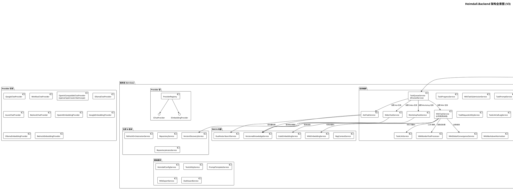
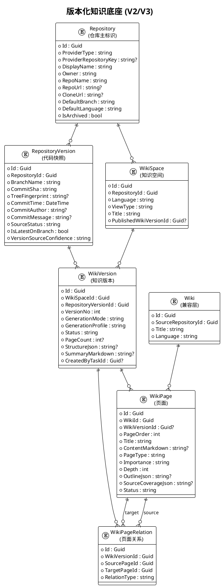
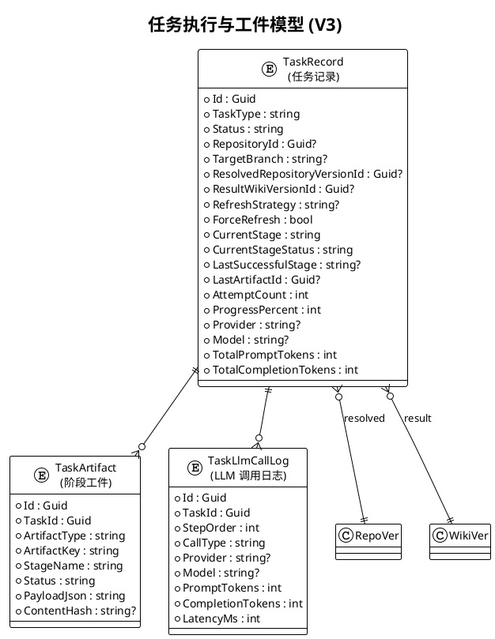
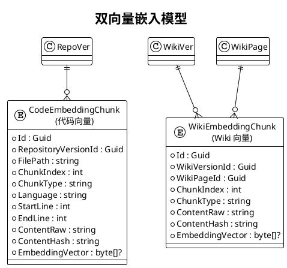
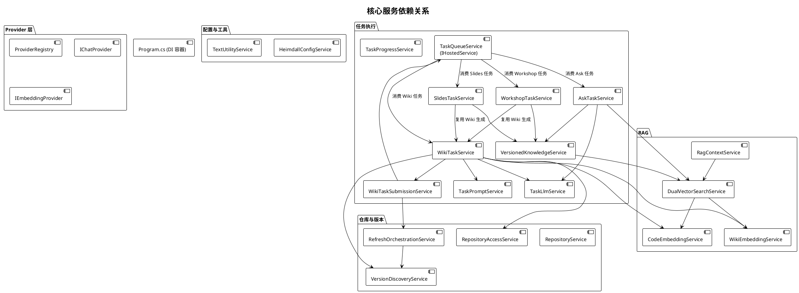
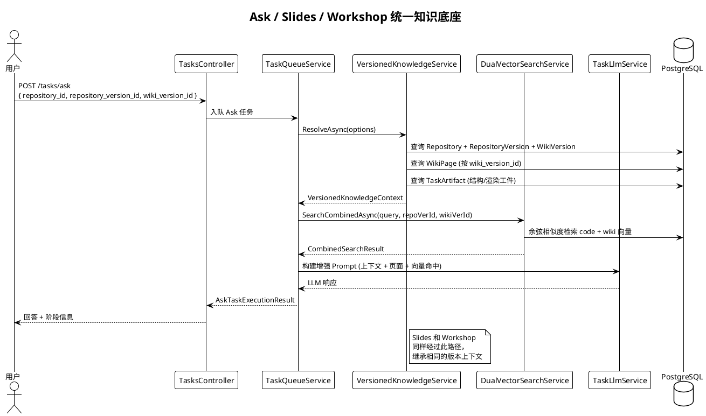
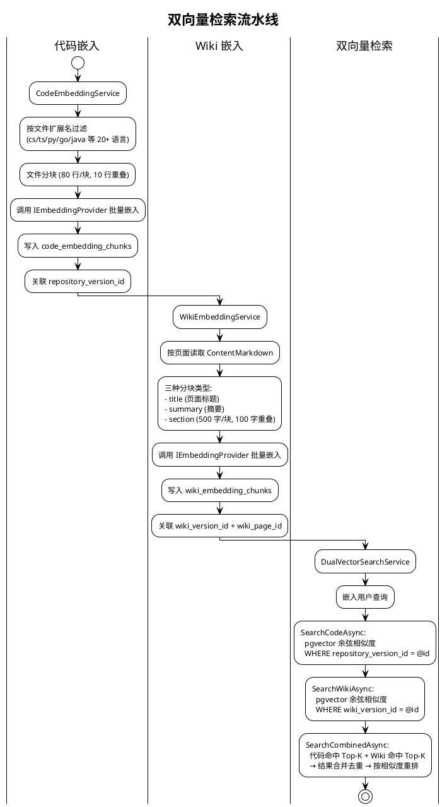

# Heimdall.Backend 后端架构设计文档

> 最后更新：2026-05-15（V3 架构落地后）

## 1. 设计目标与理念

### 1.1 核心设计目标

Heimdall 是一个 AI 驱动的代码仓库知识库自动生成系统，其后端承担着将任意代码仓库转化为结构化 Wiki 文档、交互式问答、演示幻灯片以及工作坊培训材料的核心职责。

| 目标 | 描述 |
|------|------|
| **多 Provider 可插拔** | 支持 OpenAI、Google Gemini、Azure OpenAI、AWS Bedrock、Ollama、MiniMax、DashScope、OpenRouter 等 8 种 LLM Provider 的热切换 |
| **版本化知识底座** | 以 `RepositoryVersion`（代码快照） + `WikiVersion`（知识版本）为唯一运行时锚点，Ask/Slides/Workshop 统一继承版本上下文 |
| **RAG 双向量检索** | 代码向量 + Wiki 向量双域索引，支持联合检索与结果重排 |
| **统一任务执行器** | 单一后台任务队列（`TaskQueueService`）驱动 Wiki 生成、问答、幻灯片、工作坊四类任务，支持阶段追踪与失败恢复 |
| **Markdown 优先生成** | Wiki 页面以 Markdown + Frontmatter + Mermaid 为主格式，HTML 仅作受控扩展，全局收敛阶段保证质量 |
| **异步解耦** | SSE 流式进度推送，前端断连不中断后端任务执行 |

### 1.2 架构设计理念

- **管道（Pipeline）模式**：Wiki 生成遵循 版本发现 → 结构规划 → 页面草案 → 全局收敛 → 渲染后处理 → 持久化 → 向量化 的清晰管道
- **策略（Strategy）模式**：通过 `IChatProvider` / `IEmbeddingProvider` 接口实现多 Provider 可替换
- **适配器（Adapter）模式**：`OpenAiCompatibleChatProvider` 以单一实现适配 OpenAI / OpenRouter / DashScope 三种服务
- **版本主锚点**：所有读取路径以 `RepositoryVersion` + `WikiVersion` 为权威来源，旧 `Wiki` 聚合表仅作兼容层

---

## 2. 架构全景图



---

## 3. 核心领域模型

### 3.1 版本化知识底座



### 3.2 任务与工件模型



### 3.3 双向量模型



---

## 4. 服务依赖与调用关系



---

## 5. Wiki 生成完整流水线 (V3)

### 5.1 八阶段流水线

```
POST /api/repositories/{id}/wiki/refresh
         │
         ▼
  WikiTaskSubmissionService.SubmitRefreshAsync()
         │
         ├─ RefreshOrchestrationService (版本发现/策略判断)
         │
         ▼
  TaskQueueService.EnqueueAsync()
         │
         ▼
  WikiTaskService (后台消费，8 阶段)
         │
         ├─ Stage 1: repository_preparation   仓库克隆与文件树
         ├─ Stage 2: structure_planning       LLM 生成 Wiki 结构 (JSON)
         ├─ Stage 3: page_generation          批量页面 Markdown 生成
         ├─ Stage 4: quality_assurance        WikiGlobalConvergenceService
         ├─ Stage 5: render_post_processing   WikiRenderPostProcessor
         ├─ Stage 6: persistence              落库 (版本/页面/关系)
         ├─ Stage 7: code_embedding           代码向量写入
         └─ Stage 8: wiki_embedding           Wiki 向量写入
```

### 5.2 阶段工件与恢复

每个阶段完成后写入 `task_artifacts` 表：

| 阶段 | 工件类型 | 工件 Key | 用途 |
|------|---------|---------|------|
| structure_planning | `wiki_structure` | `structure` | Wiki 结构 JSON，任务重试时可复用 |
| page_generation | `page_batch` | `batch_{n}` | 每批 5 页，记录已生成页 ID 列表 |
| quality_assurance | `convergence_report` | `report` | 收敛报告：重复、遗漏、修正列表 |
| render_post_processing | `render_result` | `render` | 渲染后页面树 |
| persistence | `persist_result` | `persist` | 落库结果：version_id、page_count |

任务失败后，`TaskQueueService` 根据 `LastSuccessfulStage` 从最近工件恢复，而非整链路重跑。

---

## 6. Ask / Slides / Workshop 并轨架构



---

## 7. RAG 双向量检索流水线



---

## 8. Provider 可插拔架构

### 8.1 Chat Provider (6 类实现)

| Provider | ProviderId | 实现类 | API |
|----------|-----------|--------|-----|
| OpenAI | `openai` | `OpenAiCompatibleChatProvider` | Chat Completions |
| OpenRouter | `openrouter` | `OpenAiCompatibleChatProvider` | Chat Completions |
| DashScope | `dashscope` | `OpenAiCompatibleChatProvider` | Chat Completions |
| Google | `google` | `GoogleChatProvider` | Gemini v1beta |
| Azure OpenAI | `azure` | `AzureChatProvider` | Azure OpenAI |
| AWS Bedrock | `bedrock` | `BedrockChatProvider` | Bedrock Runtime |
| MiniMax | `minimax` | `MiniMaxChatProvider` | MiniMax Chat |
| Ollama | `ollama` | `OllamaChatProvider` | Ollama Local |

### 8.2 Embedding Provider (4 类实现)

| Provider | EmbedderType | 实现类 | 默认模型 / 维度 |
|----------|-------------|--------|-----------------|
| OpenAI | `openai` | `OpenAiEmbeddingProvider` | text-embedding-3-small (256d) |
| Google | `google` | `GoogleEmbeddingProvider` | gemini-embedding-001 |
| AWS Bedrock | `bedrock` | `BedrockEmbeddingProvider` | amazon.titan-embed-text-v2:0 (256d) |
| Ollama | `ollama` | `OllamaEmbeddingProvider` | nomic-embed-text |

### 8.3 ProviderRegistry

通过 `IEnumerable<IChatProvider>` / `IEnumerable<IEmbeddingProvider>` 多实现注入，运行时按 `ProviderId` / `EmbedderType` 匹配。

---

## 9. 配置系统

```
配置来源 (优先级从高到低):
  1. 命令行参数
  2. 环境变量 (HEIMDALL_*)
  3. HEIMDALL_RUNTIME_CONFIG_PATH JSON 文件
  4. appsettings.json

配置文件 (backend/Heimdall.Api/config/):
  ├── generator.json    (LLM Provider 定义)
  ├── embedder.json     (嵌入器 & 检索器配置)
  ├── lang.json         (支持语言列表)
  └── repo.json         (仓库过滤规则)
```

---

## 10. 控制器与 API 端点总览

### 10.1 核心 API

| 方法 | 路由 | 控制器 | 描述 |
|------|------|--------|------|
| `GET` | `/health` | SystemController | 健康检查 |
| `GET` | `/lang/config` | LanguageController | 支持语言列表 |
| `GET` | `/models/config` | ConfigurationController | Provider/Model 配置 |
| `POST` | `/auth/register` | AuthController | 用户注册 |
| `POST` | `/auth/login` | AuthController | 用户登录 |
| `POST` | `/auth/refresh` | AuthController | 刷新 JWT Token |
| `GET` | `/auth/status` | AuthController | 认证状态查询 |
| `GET` | `/auth/me` | AuthController | 当前用户信息 (需认证) |
| `POST` | `/chat/completions/stream` | ChatController | SSE 流式聊天 |

### 10.2 仓库与版本 API

| 方法 | 路由 | 描述 |
|------|------|------|
| `POST` | `/api/repositories/import` | 导入仓库 (URL → repositoryId) |
| `GET` | `/api/repositories` | 列出所有仓库 |
| `GET` | `/api/repositories/{id}` | 获取仓库详情 |
| `PATCH` | `/api/repositories/{id}` | 更新仓库元数据 |
| `DELETE` | `/api/repositories/{id}` | 删除仓库及关联数据 |
| `GET` | `/api/repositories/{id}/versions` | 仓库版本列表 |
| `GET` | `/api/repositories/{id}/versions/{vid}` | 版本详情 |
| `POST` | `/api/repositories/{id}/versions/discover` | 触发版本发现 |
| `GET` | `/api/repositories/{id}/versions/latest` | 获取最新版本 |

### 10.3 Wiki API

| 方法 | 路由 | 描述 |
|------|------|------|
| `GET` | `/api/repositories/{id}/wiki` | 读取 Wiki 缓存 |
| `DELETE` | `/api/repositories/{id}/wiki` | 删除 Wiki 缓存 |
| `GET` | `/api/repositories/{id}/wiki/versions` | Wiki 版本列表 |
| `GET` | `/api/repositories/{id}/wiki/versions/{wvId}` | Wiki 版本详情（含页面树） |
| `POST` | `/api/repositories/{id}/wiki/refresh` | 触发 Wiki 刷新/生成 |
| `POST` | `/api/repositories/{id}/wiki/versions/{wvId}/publish` | 发布指定版本 |
| `GET` | `/api/repositories/{id}/wiki/published` | 获取当前发布版本 |
| `GET` | `/api/repositories/{id}/wiki/pages` | 获取版本页面列表 |
| `POST` | `/api/repositories/{id}/wiki/compare` | 比较两个 Wiki 版本 |
| `DELETE` | `/api/repositories/{id}/vectors/code` | 清除代码向量 |
| `DELETE` | `/api/repositories/{id}/vectors/wiki` | 清除 Wiki 向量 |

### 10.4 任务与项目 API

| 方法 | 路由 | 描述 |
|------|------|------|
| `POST` | `/tasks/ask` | AI 问答 (支持 DeepResearch) |
| `POST` | `/tasks/slides` | 生成演示幻灯片 |
| `POST` | `/tasks/workshop` | 生成工作坊材料 |
| `GET` | `/tasks/{id}/status` | 查询任务状态 |
| `GET` | `/tasks/{id}/stream` | SSE 订阅任务进度 |
| `GET` | `/tasks/{id}/token-summary` | Token 消耗汇总 |
| `GET` | `/tasks/{id}/llm-calls` | LLM 调用日志 |
| `GET` | `/tasks/{id}/artifacts` | 任务工件列表 |
| `POST` | `/tasks/{id}/cancel` | 取消任务 |
| `GET` | `/api/processed_projects` | 已处理项目列表 |
| `DELETE` | `/api/processed_projects/{id}` | 删除项目 |

### 10.5 Admin API (需 Admin 角色)

| 方法 | 路由 | 描述 |
|------|------|------|
| `GET` | `/admin/dashboard` | 仪表盘统计 |
| `GET/POST` | `/admin/users` | 用户管理 |
| `PUT/DELETE` | `/admin/users/{id}` | 更新/删除用户 |
| `GET/PUT` | `/admin/settings` | 系统设置 |
| `GET/POST` | `/admin/prompts` | Prompt 模板管理 |
| `PUT/DELETE` | `/admin/prompts/{id}` | 更新/删除模板 |
| `GET` | `/admin/repositories` | 仓库管理列表 |
| `DELETE` | `/admin/repositories/{id}` | 强制删除仓库 |
| `GET` | `/admin/tasks` | 全量任务列表 |
| `POST` | `/admin/tasks/{id}/retry` | 重试失败任务 |

---

## 11. 数据库表总览

| 表名 | 实体 | 用途 |
|------|------|------|
| `users` | User | 用户账户 |
| `repositories` | Repository | 仓库主标识 |
| `repository_versions` | RepositoryVersion | 代码快照版本 |
| `wiki_spaces` | WikiSpace | 知识空间（语言+视图维度） |
| `wiki_versions` | WikiVersion | Wiki 知识版本 |
| `wikis` | Wiki | 旧版 Wiki 聚合（兼容层） |
| `wiki_pages` | WikiPage | Wiki 页面内容 |
| `wiki_page_relations` | WikiPageRelation | 页面间关系 |
| `tasks` | TaskRecord | 任务记录 |
| `task_artifacts` | TaskArtifact | 任务阶段工件 |
| `task_llm_call_logs` | TaskLlmCallLog | LLM 调用审计日志 |
| `code_embedding_chunks` | CodeEmbeddingChunk | 代码向量分块 |
| `wiki_embedding_chunks` | WikiEmbeddingChunk | Wiki 向量分块 |
| `prompt_templates` | PromptTemplate | Prompt 模板 |
| `repository_prompt_overrides` | RepositoryPromptOverride | 仓库级 Prompt 覆盖 |
| `system_settings` | SystemSetting | 系统设置键值对 |

---

## 12. 关键设计决策

### 12.1 版本主锚点 (V2)
所有读取路径以 `RepositoryVersion` + `WikiVersion` 为权威来源。旧 `Wiki` 表仅作兼容层，不在新链路中使用。

### 12.2 统一任务执行器 (V3)
Wiki 生成、Ask、Slides、Workshop 全部通过 `TaskQueueService`（后台 `IHostedService`）消费，禁止控制器内 `Task.Run` 绕过队列。

### 12.3 Markdown 优先生成 (V3)
页面草案以 Markdown + Frontmatter + Mermaid 为主格式，`WikiGlobalConvergenceService` 负责全局收敛（去重、补漏、风格统一），`WikiRenderPostProcessor` 输出稳定的页面树。

### 12.4 任务工件与阶段恢复 (V3)
长任务每阶段完成后写入 `task_artifacts`，失败后从 `LastSuccessfulStage` 恢复，避免整链路重跑。

### 12.5 双向量域检索
代码向量和 Wiki 向量独立存储、独立检索，`DualVectorSearchService` 提供联合检索 + 结果重排。

### 12.6 前端断连不中断任务
任务通过 `IHostApplicationLifetime` 感知进程关闭，但不因 HTTP 请求取消而中断 —— 即使用户关闭浏览器，Wiki 生成继续进行。

### 12.7 全单例基础设施服务
`HeimdallConfigService`、`ProviderRegistry`、`TaskQueueService`、Provider 实现等无状态服务注册为 Singleton。依赖 DbContext 的 Repository 和业务 Service 注册为 Scoped。
