# Heimdall.Backend 后端架构设计文档

## 1. 设计目标与理念

### 1.1 核心设计目标

Heimdall 是一个 AI 驱动的代码仓库知识库自动生成系统，其后端承担着将任意代码仓库（GitHub/GitLab/Bitbucket/本地）转化为结构化 Wiki 文档、交互式问答、演示幻灯片以及工作坊培训材料的核心职责。

| 目标 | 描述 |
|------|------|
| **多 Provider 可插拔** | 支持 OpenAI、Google Gemini、Azure OpenAI、AWS Bedrock、Ollama、MiniMax、DashScope、OpenRouter 等 8 种 LLM Provider 的热切换 |
| **RAG 增强生成** | 基于向量嵌入的代码检索增强生成，实现深层次代码理解 |
| **多任务流水线** | 统一的任务编排框架，支持 Wiki 生成、深度问答、幻灯片生成、工作坊生成四种任务类型 |
| **容错与降级** | Wiki 结构解析失败时降级为目录树结构；页面生成失败时生成占位内容；RAG 上下文过大时回退至无上下文模式 |
| **缓存策略** | 两层文件缓存 —— Wiki 内容缓存与向量嵌入索引缓存，避免重复计算 |
| **异步解耦** | SSE 流式响应，前端断连不中断后端任务执行 |

### 1.2 架构设计理念

- **管道（Pipeline）模式**：Chat 流程遵循 验证 → 上下文构建 → Prompt 构造 → Provider 解析 → LLM 调用 → 响应处理 的清晰管道
- **策略（Strategy）模式**：通过 `IChatProvider` / `IEmbeddingProvider` 接口实现多 Provider 可替换
- **适配器（Adapter）模式**：`OpenAiCompatibleChatProvider` 以单一实现适配 OpenAI / OpenRouter / DashScope 三种服务
- **生命周期感知**：Wiki 任务使用 `IHostApplicationLifetime` 感知应用关闭，使用链接的 `CancellationToken` 合并用户取消、超时、关闭信号

---

## 2. 架构全景图

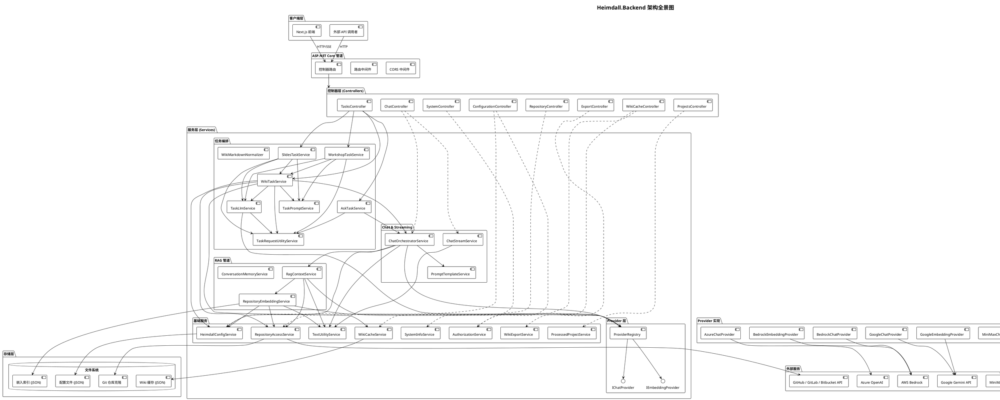

---

## 3. 领域模型图

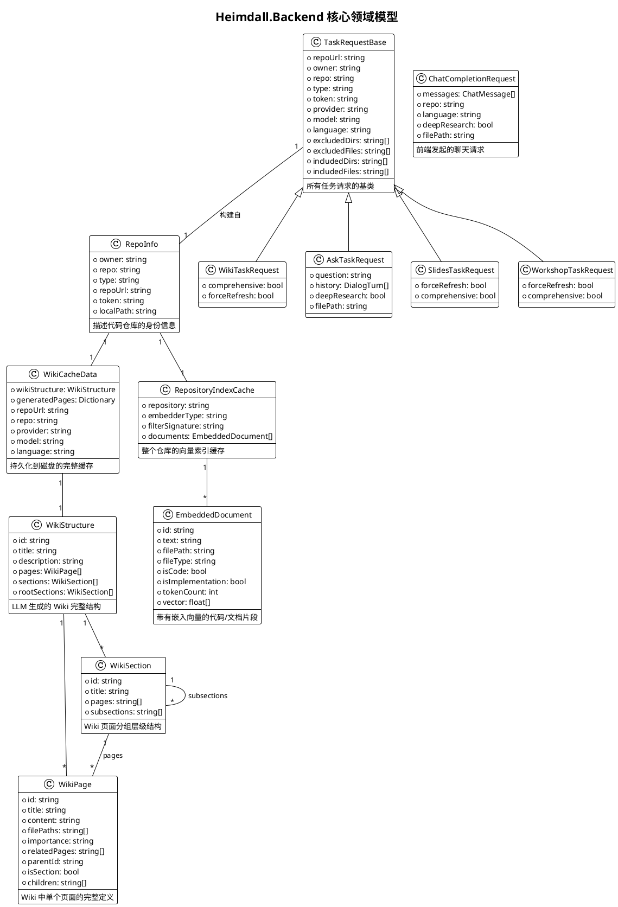

---

## 4. 领域调用关系图

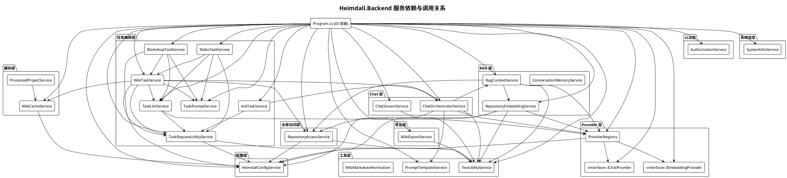

---

## 5. Wiki 生成完整流水线

### 5.1 流程图

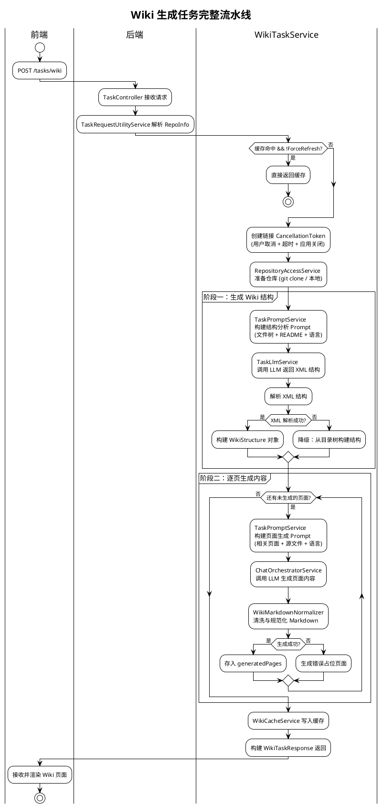

### 5.2 时序图

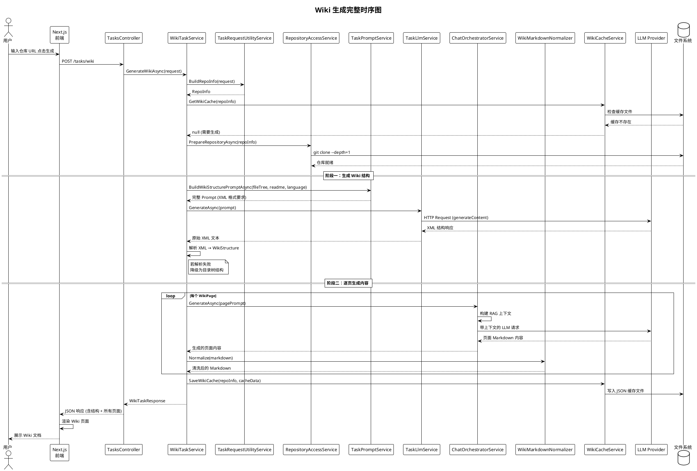

---

## 6. Chat 交互与 SSE 流式响应

### 6.1 流程图

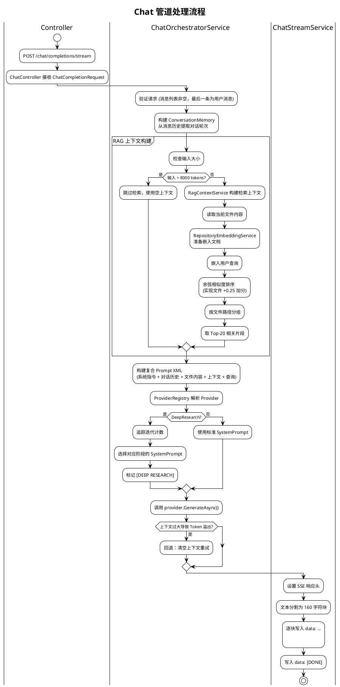

### 6.2 时序图

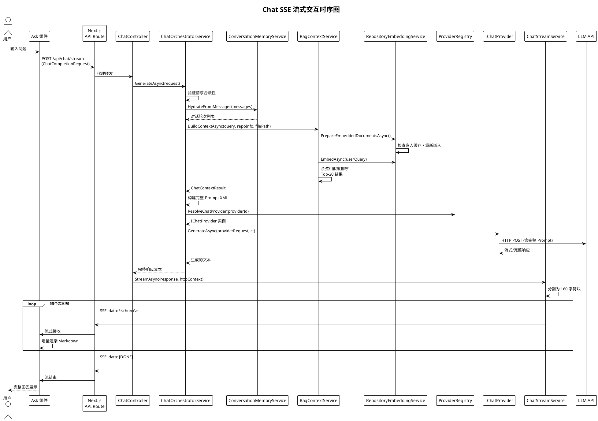

---

## 7. RAG（检索增强生成）流水线

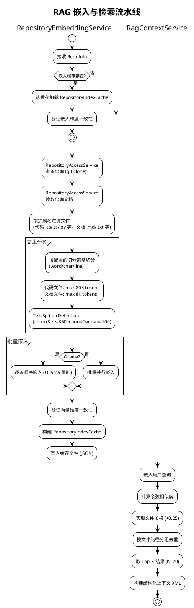

---

## 8. Provider 可插拔架构

```plantuml
@startuml
!theme plain
title Provider 策略模式架构

interface IChatProvider {
  + {abstract} ProviderId: string
  + {abstract} GenerateAsync(ProviderChatRequest, CancellationToken): Task<string>
}

interface IEmbeddingProvider {
  + {abstract} EmbedderType: string
  + {abstract} EmbedAsync(string, CancellationToken): Task<float[]>
  + {abstract} EmbedBatchAsync(IReadOnlyList<string>, CancellationToken): Task<List<float[]>>
}

class GoogleChatProvider {
  ProviderId: "google"
  API: Gemini v1beta
  Model: gemini-2.5-flash / gemini-2.5-pro
}
class MiniMaxChatProvider {
  ProviderId: "minimax"
  API: MiniMax Chat Completions
  Model: MiniMax-Text-01 / abab7-chat
}
class OpenAiCompatibleChatProvider {
  ProviderId: "openai" / "openrouter" / "dashscope"
  API: OpenAI-compatible
  Model: 按配置选择
}
class OllamaChatProvider {
  ProviderId: "ollama"
  API: Ollama Local
  Model: 按配置选择
}
class AzureChatProvider {
  ProviderId: "azure"
  API: Azure OpenAI
  Model: 按部署名选择
}
class BedrockChatProvider {
  ProviderId: "bedrock"
  API: AWS Bedrock Runtime
  Model: Claude / Titan / Cohere / AI21
}

class OpenAiEmbeddingProvider {
  EmbedderType: "openai"
  Model: text-embedding-3-small (256d)
}
class GoogleEmbeddingProvider {
  EmbedderType: "google"
  Model: gemini-embedding-001
}
class OllamaEmbeddingProvider {
  EmbedderType: "ollama"
  Model: 按配置选择
}
class BedrockEmbeddingProvider {
  EmbedderType: "bedrock"
  Model: amazon.titan-embed-text-v2:0 (256d)
}

class ProviderRegistry {
  - _chatProviders: IEnumerable<IChatProvider>
  - _embeddingProviders: IEnumerable<IEmbeddingProvider>
  + ResolveChatProvider(providerId): IChatProvider
  + ResolveEmbeddingProvider(embedderType): IEmbeddingProvider
}

class HeimdallConfigService {
  + GetDefaultProvider(): string
  + GetEmbedderType(): string
  + GetProviderConfig(providerId): ProviderDefinition
}

IChatProvider <|.. GoogleChatProvider
IChatProvider <|.. MiniMaxChatProvider
IChatProvider <|.. OpenAiCompatibleChatProvider
IChatProvider <|.. OllamaChatProvider
IChatProvider <|.. AzureChatProvider
IChatProvider <|.. BedrockChatProvider
IEmbeddingProvider <|.. OpenAiEmbeddingProvider
IEmbeddingProvider <|.. GoogleEmbeddingProvider
IEmbeddingProvider <|.. OllamaEmbeddingProvider
IEmbeddingProvider <|.. BedrockEmbeddingProvider
ProviderRegistry --> IChatProvider : IEnumerable 注入
ProviderRegistry --> IEmbeddingProvider : IEnumerable 注入
ProviderRegistry --> HeimdallConfigService : 查找配置

@enduml
```

---

## 9. 配置系统架构

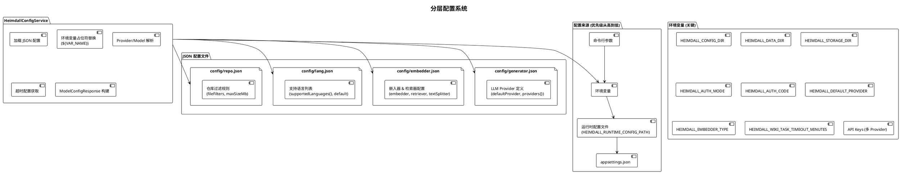

---

## 10. 部署架构

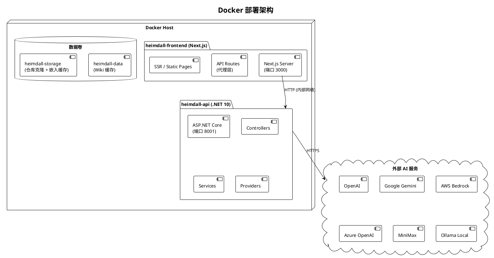

---

## 11. 控制器与 API 端点总览

| 方法 | 路由 | 控制器 | 描述 |
|------|------|--------|------|
| `GET` | `/` | SystemController | 应用信息与端点列表 |
| `GET` | `/health` | SystemController | 健康检查 |
| `GET` | `/lang/config` | ConfigurationController | 支持的语言列表 |
| `GET` | `/auth/status` | ConfigurationController | 认证状态查询 |
| `POST` | `/auth/validate` | ConfigurationController | 验证授权码 |
| `GET` | `/models/config` | ConfigurationController | 可用 Provider 与模型列表 |
| `POST` | `/chat/completions/stream` | ChatController | SSE 流式聊天补全 |
| `GET` | `/local_repo/structure` | RepositoryController | 本地目录结构与 README |
| `POST` | `/export/wiki` | ExportController | 导出 Wiki (Markdown/JSON) |
| `GET` | `/api/wiki_cache` | WikiCacheController | 获取缓存 Wiki |
| `POST` | `/api/wiki_cache` | WikiCacheController | 保存缓存 Wiki |
| `DELETE` | `/api/wiki_cache` | WikiCacheController | 删除缓存 (需认证) |
| `GET` | `/api/processed_projects` | ProjectsController | 已处理项目列表 |
| `POST` | `/tasks/wiki` | TasksController | 生成 Wiki |
| `POST` | `/tasks/ask` | TasksController | 问答 (支持 DeepResearch) |
| `POST` | `/tasks/slides` | TasksController | 生成幻灯片 |
| `POST` | `/tasks/workshop` | TasksController | 生成工作坊 |

---

## 12. 关键设计决策

### 12.1 全单例服务注册
所有服务注册为 **Singleton**，避免复杂的生命周期管理。Provider 通过 `IEnumerable<T>` 多实现注入。

### 12.2 Wiki 生成双阶段架构
Wiki 生成分为两个独立阶段：**结构规划**（LLM 生成 XML 结构）→ **逐页生成**（每页独立调用 ChatOrchestratorService），确保每页内容质量且支持独立失败降级。

### 12.3 XML 中间格式
Wiki 结构使用 XML 作为 LLM 与后端之间的中间格式，利用 `XDocument` 进行严格解析，同时内置常见 XML 错误的修复逻辑（如 `<parent_section>` 标签未闭合修复）。

### 12.4 前端断连不中断任务
Wiki 任务通过 `IHostApplicationLifetime` 感知进程关闭，但不因 HTTP 请求取消而中断 —— 即使用户关闭浏览器，Wiki 生成继续进行，结果写入缓存供下次访问。

### 12.5 文件级 JSON 缓存
缓存采用文件级 JSON 而非数据库，支持跨会话持久化，便于在 Docker 卷中挂载，无需额外的数据库依赖。

### 12.6 Markdown 规范化器
`WikiMarkdownNormalizer` 专门处理 LLM 输出中的常见问题：`<think>` 标签残留（推理模型）、外层 ```markdown 包裹、裸代码块修复、XML 标签转义。
