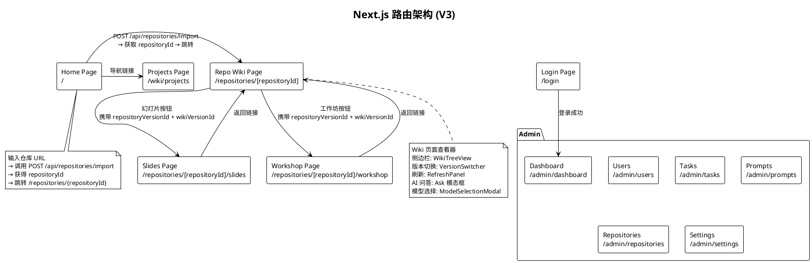
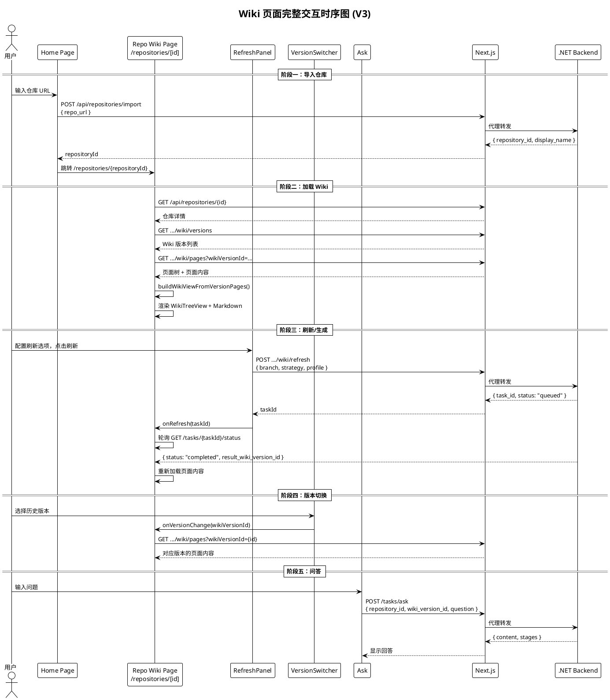

# Heimdall.Frontend 前端架构设计文档

> 最后更新：2026-05-15（V3 架构落地后）

## 1. 设计目标与理念

### 1.1 核心设计目标

Heimdall 前端是一个基于 Next.js 16 App Router 的单页应用，提供 AI 驱动的代码仓库知识库的可视化交互界面。

| 目标 | 描述 |
|------|------|
| **极致简约的交互** | 用户仅需输入仓库 URL 即可一键完成 Wiki 生成、问答、幻灯片、工作坊的完整流程 |
| **流式响应体验** | 通过 SSE 流式传输任务进度与聊天补全，实现实时状态更新 |
| **版本感知导航** | 所有页面（Wiki/Ask/Slides/Workshop）基于 `repositoryId` + `wikiVersionId` 统一版本上下文 |
| **丰富的可视化** | 集成 Mermaid 图表渲染、代码语法高亮、数学公式（KaTeX）、Markdown 富文本呈现 |
| **暗色/亮色主题** | 基于 `next-themes` 的主题系统，使用 CSS 自定义属性实现全组件主题切换 |
| **BFF 代理模式** | Next.js API Routes 与 Rewrite 规则混合代理，转发请求至 .NET 后端 |
| **管理后台** | 内置仪表盘、用户管理、任务监控、Prompt 模板管理、系统设置 |

### 1.2 架构设计理念

- **薄前端、厚后端**：前端负责 UI 呈现与用户交互，业务逻辑（Wiki 生成、RAG 检索、LLM 调用）全部在后端完成
- **repositoryId 为主标识**：V2 起废弃 `[owner]/[repo]` 路由，全部页面使用 `/repositories/[repositoryId]` 模式
- **组件局部状态**：采用 React 原生 `useState` 管理组件状态，无全局状态库（无 Redux/Zustand）
- **URL 参数传递版本上下文**：`repositoryVersionId` 和 `wikiVersionId` 通过 URL Query 参数在页面间传递

---

## 2. 架构全景图

```plantuml
@startuml
!theme plain
title Heimdall.Frontend 架构全景图 (V3)

package "用户浏览器" {
  [用户界面] as UI
}

package "Next.js 前端 (端口 3000)" {
  package "页面层 (App Router)" as Pages {
    [Home Page\n/] as Home
    [Login Page\n/login] as Login
    [Repo Wiki Page\n/repositories/[repositoryId]] as Wiki
    [Slides Page\n/repositories/[repositoryId]/slides] as Slides
    [Workshop Page\n/repositories/[repositoryId]/workshop] as Workshop
    [Projects Page\n/wiki/projects] as Projects
    package "Admin" {
      [Dashboard\n/admin/dashboard] as AdmDash
      [Users\n/admin/users] as AdmUsers
      [Tasks\n/admin/tasks] as AdmTasks
      [Prompts\n/admin/prompts] as AdmPrompts
      [Repositories\n/admin/repositories] as AdmRepos
      [Settings\n/admin/settings] as AdmSettings
    }
  }

  package "API Routes (BFF 代理)" as API_Routes {
    [api/auth/status] as AuthStatus
    [api/auth/validate] as AuthValidate
    [api/chat/stream] as ChatStream
    [api/models/config] as ModelsConfig
    [api/tasks/[task]] as TasksProxy
    [api/wiki/projects] as WikiProjects
  }

  package "组件库 (Components)" as Components {
    [Ask] as AskComp
    [ConfigurationModal] as ConfigModal
    [ModelSelectionModal] as ModelModal
    [UserSelector] as UserSel
    [WikiTypeSelector] as WikiType
    [TokenInput] as Token
    [Markdown] as MD
    [Mermaid] as MermaidComp
    [WikiTreeView] as TreeView
    [ProcessedProjects] as ProcProj
    [RefreshPanel] as RefreshPanel
    [VersionSwitcher] as VersionSwitcher
    [TaskProgress] as TaskProg
    [TaskLlmCallSummary] as LlmSummary
    [ThemeToggle] as Theme
    [Providers] as ProvidersWrap
  }

  package "上下文 (Context)" {
    [LanguageContext] as LangCtx
    [AuthContext] as AuthCtx
  }

  package "Hooks" {
    [useProcessedProjects] as UsePP
    [useTaskStream] as UseTS
    [useArtifactVersionContext] as UseAVC
  }

  package "工具与类型" as Utils {
    [utils/response.ts]
    [utils/sse.ts]
    [utils/taskRequest.ts]
    [utils/urlDecoder.tsx]
    [types/wiki.ts]
    [types/repoinfo.tsx]
  }

  package "国际化" {
    [messages/zh.json] as ZH
  }
}

cloud ".NET 后端 (端口 8001)" as Backend

UI --> Pages
Pages --> Components
Pages --> Hooks
Pages --> API_Routes
Components --> Hooks
API_Routes --> Backend : 代理转发
Pages --> LangCtx
Pages --> AuthCtx

@enduml
```

---

## 3. 路由架构



### 3.1 路由参数传递模式

V3 核心参数通过 URL Query 在页面间传递：

| 参数 | 类型 | 描述 |
|------|------|------|
| `repository_id` / `repositoryId` | string (GUID) | 仓库主标识 |
| `repository_version_id` / `repositoryVersionId` | string (GUID) | 代码快照版本 |
| `wiki_version_id` / `wikiVersionId` | string (GUID) | Wiki 知识版本 |
| `language` | string | 语言（默认 `zh`） |
| `provider` | string | LLM Provider ID |
| `model` | string | 模型 ID |

---

## 4. 组件树与层次结构

```plantuml
@startuml
!theme plain
title 组件树层次结构 (V3)

package "RootLayout" {
  [Providers] as PROV
  PROV --> [ThemeProvider]
  PROV --> [LanguageProvider]
  PROV --> [AuthProvider]
}

package "Home Page" {
  [ConfigurationModal] as CM_HOME
  [ProcessedProjects] as PP_HOME
  [ThemeToggle] as TT_HOME
}

package "Repo Wiki Page" {
  [WikiTreeView] as WTV
  [Markdown] as MD_WIKI
  [Ask] as ASK_WIKI
  [ModelSelectionModal] as MSM_WIKI
  [VersionSwitcher] as VS_WIKI
  [RefreshPanel] as RP_WIKI
  [ThemeToggle] as TT_WIKI
}

package "Slides Page" {
  [ThemeToggle] as TT_SLIDES
}

package "Workshop Page" {
  [Markdown] as MD_WORKSHOP
  [ThemeToggle] as TT_WORKSHOP
}

package "Admin Pages" {
  [TaskProgress] as TP_ADMIN
  [TaskLlmCallSummary] as TLCS_ADMIN
}

CM_HOME --> [UserSelector]
CM_HOME --> [WikiTypeSelector]
CM_HOME --> [TokenInput]
ASK_WIKI --> [Markdown]
ASK_WIKI --> [ModelSelectionModal]
MSM_WIKI --> [UserSelector]
MSM_WIKI --> [WikiTypeSelector]
MSM_WIKI --> [TokenInput]
PP_HOME --> [useProcessedProjects]
RP_WIKI --> [useTaskStream]
ASK_WIKI --> [useArtifactVersionContext]

@enduml
```



---

## 5. 组件职责矩阵

| 组件 | 文件 | 行数 | 核心职责 |
|------|------|------|----------|
| **Ask** | `Ask.tsx` | 520 | AI 问答聊天界面，Deep Research 多阶段研究，对话历史管理，版本上下文感知 |
| **ConfigurationModal** | `ConfigurationModal.tsx` | 299 | 首页 Wiki 生成前完整配置：语言、Wiki 类型、模型、文件过滤、令牌 |
| **ModelSelectionModal** | `ModelSelectionModal.tsx` | 260 | 可复用的模型选择模态框（仓库页/Ask 共用），局部状态先存后提交 |
| **UserSelector** | `UserSelector.tsx` | 523 | Provider/Model 下拉选择，自定义模型切换，高级文件过滤选项 |
| **WikiTypeSelector** | `WikiTypeSelector.tsx` | 79 | 综合型 vs 简洁型 Wiki 切换 |
| **TokenInput** | `TokenInput.tsx` | 108 | 平台选择 + 访问令牌输入 |
| **Markdown** | `Markdown.tsx` | 178 | Markdown 渲染管道：GFM、数学公式、代码高亮、Mermaid 内联、原始 HTML |
| **Mermaid** | `Mermaid.tsx` | 409 | Mermaid 图表 SVG 渲染，暗/亮主题，全屏缩放 |
| **WikiTreeView** | `WikiTreeView.tsx` | 179 | Wiki 页面层级树形导航，递归节渲染，重要性指示器，展开/折叠 |
| **ProcessedProjects** | `ProcessedProjects.tsx` | 268 | 已处理项目卡片/列表视图，搜索过滤，删除 |
| **RefreshPanel** | `RefreshPanel.tsx` | 292 | Wiki 刷新面板：分支选择、刷新策略、强制刷新、生成档位、Provider/Model |
| **VersionSwitcher** | `VersionSwitcher.tsx` | 173 | 版本切换器：Wiki 版本列表 + 仓库快照列表，版本元信息展示 |
| **TaskProgress** | `TaskProgress.tsx` | 47 | 任务进度条，通过 SSE 实时更新阶段名称与百分比 |
| **TaskLlmCallSummary** | `TaskLlmCallSummary.tsx` | 101 | Token 消耗汇总 + LLM 调用明细表 |
| **ThemeToggle** | `theme-toggle.tsx` | 32 | 暗色/亮色主题切换按钮 |
| **Providers** | `Providers.tsx` | 17 | 根级 Provider 组合：Theme → Language → Auth |

---

## 6. 数据流架构

```plantuml
@startuml
!theme plain
title 前端数据流全景图 (V3)

package "状态来源" {
  [URL Query Params\n(repositoryId, versionId)] as URL
  [API 响应\n(/api/repositories/...)] as API
  [SSE 流\n(/tasks/{id}/stream)] as SSE
}

package "组件状态" {
  [Home: repoUrl, loading]
  [Wiki: wikiViewState, activePage,\nselectedVersionId, taskId]
  [Ask: messages, loading,\nresearchStages]
  [Slides: slides[], currentSlide]
  [Workshop: content, loading]
  [RefreshPanel: branch, strategy,\nprofile, provider]
}

package "API 调用" {
  [POST /api/repositories/import] as IMPORT
  [GET /api/repositories/{id}] as REPO_GET
  [GET .../wiki/versions] as WIKI_VERSIONS
  [GET .../wiki/pages?wikiVersionId=] as WIKI_PAGES
  [POST .../wiki/refresh] as WIKI_REFRESH
  [POST /tasks/ask] as TASK_ASK
  [POST /tasks/slides] as TASK_SLIDES
  [POST /tasks/workshop] as TASK_WORKSHOP
  [GET /tasks/{id}/status] as TASK_STATUS
  [GET /api/processed_projects] as PROJ_LIST
}

package "Next.js Rewrites" {
  [直接转发 15+ 条规则]
}

URL --> [组件状态] : 页面初始化
API --> [组件状态] : 数据加载
SSE --> [组件状态] : 实时进度

[组件状态] --> IMPORT
[组件状态] --> REPO_GET
[组件状态] --> WIKI_VERSIONS
[组件状态] --> WIKI_PAGES
[组件状态] --> WIKI_REFRESH
[组件状态] --> TASK_ASK
[组件状态] --> TASK_SLIDES
[组件状态] --> TASK_WORKSHOP
[组件状态] --> TASK_STATUS

@enduml
```

---

## 7. Wiki 页面交互时序图 (V3)



---

## 8. BFF 代理与 Rewrite 策略

### 8.1 Rewrite 规则（`next.config.ts`）

| 源路径 | 转发目标 | 说明 |
|--------|---------|------|
| `/api/repositories/:path*` | `{BASE}/api/repositories/:path*` | 仓库 API（保留 /api 前缀） |
| `/api/processed_projects/:path*` | `{BASE}/api/processed_projects/:path*` | 项目列表 |
| `/api/processed_projects` | `{BASE}/api/processed_projects` | 项目列表（精确匹配） |
| `/api/tasks/:path*` | `{BASE}/tasks/:path*` | 任务 API（移除 /api 前缀） |
| `/api/chat/:path*` | `{BASE}/chat/:path*` | Chat API |
| `/api/admin/:path*` | `{BASE}/admin/:path*` | Admin API |
| `/api/models/config` | `{BASE}/models/config` | 模型配置 |
| `/api/auth/status` | `{BASE}/auth/status` | 认证状态 |
| `/api/auth/validate` | `{BASE}/auth/validate` | 认证验证 |
| `/api/lang/config` | `{BASE}/lang/config` | 语言配置 |
| `/export/wiki/:path*` | `{BASE}/export/wiki/:path*` | Wiki 导出 |
| `/local_repo/structure` | `{BASE}/local_repo/structure` | 本地仓库结构 |

### 8.2 API Route 代理（`src/app/api/`）

| 路由文件 | 方法 | 额外处理 |
|---------|------|---------|
| `api/auth/status/route.ts` | GET | 错误处理 |
| `api/auth/validate/route.ts` | POST | 错误处理 |
| `api/chat/stream/route.ts` | POST | SSE 流式透传，CORS |
| `api/models/config/route.ts` | GET | 缓存控制 |
| `api/tasks/[task]/route.ts` | POST | 白名单校验（仅 wiki/ask/slides/workshop） |
| `api/wiki/projects/route.ts` | GET | 错误处理 |

---

## 9. 关键 Hooks

| Hook | 用途 |
|------|------|
| `useProcessedProjects` | 从 `/api/processed_projects` 获取已处理项目列表 |
| `useTaskStream` | 通过 `EventSource` 连接 SSE 流，监听 `progress`/`complete`/`error` 事件 |
| `useArtifactVersionContext` | 验证 Slides/Workshop 页面的版本上下文（GUID 校验 + 后端交叉验证） |

---

## 10. Context 层

| Context | 用途 |
|---------|------|
| `LanguageContext` | 国际化上下文，当前仅支持 `zh`（中文），提供 `messages` 对象 |
| `AuthContext` | 认证上下文，支持 `none` 模式（自动管理员）和 `jwt` 模式（localStorage Token） |

---

## 11. 核心类型定义

```typescript
// 仓库主标识
interface RepositoryDetail {
  repository_id: string;
  display_name: string;
  owner: string;
  repo_name: string;
  provider_type: string;
  repo_type: string;
  repo_url: string;
  default_branch: string;
  default_language: string;
  is_archived: boolean;
}

// 版本概要
interface RepositoryVersionSummary {
  id: string;
  branch_name: string;
  commit_sha: string;
  commit_time: string;
  is_latest_on_branch: boolean;
}

interface WikiVersionSummary {
  id: string;
  version_no: number;
  status: string;          // draft/generating/ready/published/failed/superseded
  generation_mode: string;
  generation_profile: string;
  page_count?: number;
  created_at: string;
  completed_at?: string;
}

// Wiki 页面
interface WikiPage {
  id: string;
  title: string;
  content: string;          // Markdown
  filePaths: string[];
  importance: "high" | "medium" | "low";
  relatedPages: string[];
  parentId?: string;
  isSection?: boolean;
  children?: string[];
  frontMatter?: WikiPageFrontMatter;
  outline?: WikiPageHeading[];
  pageType?: string;
  status?: string;
}
```

---

## 12. 构建与部署

| 配置项 | 值 | 说明 |
|--------|-----|------|
| `output` | `standalone` | 自包含 Node.js 部署包 |
| `SERVER_BASE_URL` | `http://localhost:8001` (默认) | 后端 API 地址，Docker 中覆盖 |
| 包管理器 | Yarn 1.22.22 | |
| TypeScript | strict mode | |
| React | 19.2.6 | |
| Next.js | 16.2.6 | App Router + Turbopack |
| Tailwind CSS | 4.3.0 | |

---

## 13. 关键设计决策

### 13.1 薄前端设计
前端不包含任何业务编排逻辑。Wiki 生成、RAG 检索、LLM 调用等全部在后端完成，前端仅负责 UI 呈现与用户交互。

### 13.2 repositoryId 为主标识 (V2)
废弃旧的 `[owner]/[repo]` 路由，全部使用 `/repositories/[repositoryId]` 统一模式，支持跨 Provider 的仓库标识。

### 13.3 版本上下文透传 (V3)
`repositoryVersionId` 和 `wikiVersionId` 通过 URL Query 参数在 Wiki → Slides/Workshop → Ask 之间透传，确保所有派生内容基于同一版本。

### 13.4 Next.js Rewrite + API Route 混合代理
简单透传使用 Rewrite（零 JS 开销），需要校验或流式处理的请求使用 API Route 代理。后端路径不一致的路由（如 `/api/tasks/*` → `/tasks/*`）通过 Rewrite 处理前缀差异。

### 13.5 组件自包含
每个组件管理自己的状态，通过 Props 接收外部配置和回调。避免全局状态库的复杂性。

### 13.6 RefreshPanel → taskId → 轮询 单链路
前端刷新只走 `POST .../wiki/refresh → task_id → GET /tasks/{id}/status` 单一链路，不再有回退到旧 `generateWikiTask` 的双路径。
