# Heimdall.Frontend 前端架构设计文档

## 1. 设计目标与理念

### 1.1 核心设计目标

Heimdall 前端是一个基于 Next.js 16 App Router 的单页应用，提供 AI 驱动的代码仓库知识库的可视化交互界面。

| 目标 | 描述 |
|------|------|
| **极致简约的交互** | 用户仅需输入仓库 URL 即可一键完成 Wiki 生成、问答、幻灯片、工作坊的完整流程 |
| **流式响应体验** | 通过 SSE 流式传输聊天补全，实现打字机效果的实时内容输出 |
| **丰富的可视化** | 集成 Mermaid 图表渲染、代码语法高亮、数学公式（KaTeX）、Markdown 富文本呈现 |
| **暗色/亮色主题** | 基于 `next-themes` 的主题系统，使用 CSS 自定义属性实现全组件主题切换 |
| **配置持久化** | 基于 URL 的仓库配置 localStorage 缓存，用户再次访问同一仓库时自动恢复配置 |
| **BFF 代理模式** | Next.js API Routes 作为 BFF（Backend For Frontend）层，代理转发请求至 .NET 后端 |

### 1.2 架构设计理念

- **薄前端、厚后端**：前端负责 UI 呈现与用户交互，业务逻辑（Wiki 生成、RAG 检索、LLM 调用）全部在后端完成
- **配置驱动路由**：所有配置（Provider、Model、语言、文件过滤）通过 URL Query 参数在页面间传递，确保可分享、可书签
- **组件局部状态**：采用 React 原生 `useState` 管理组件状态，无全局状态库（无 Redux/Zustand），保持架构简单
- **渐进式加载**：Wiki 页面先尝试缓存，缓存未命中才触发生成任务；幻灯片/工作坊在页面挂载时自动触发

---

## 2. 架构全景图

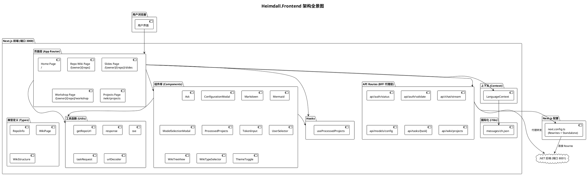

---

## 3. 路由架构

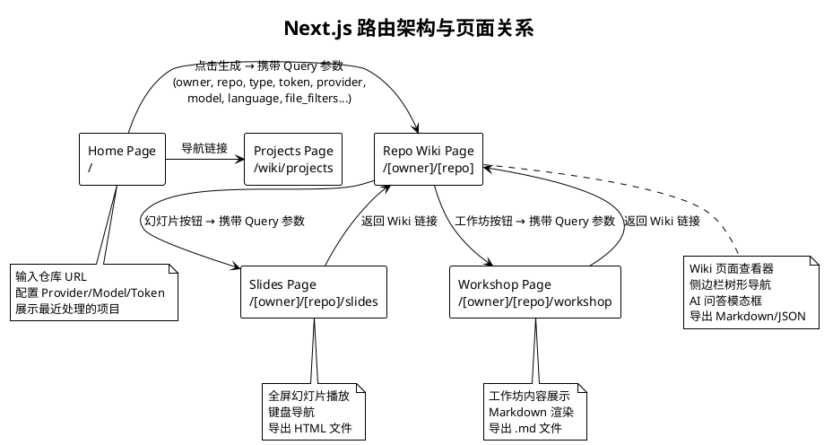

### 3.1 路由参数传递模式

所有配置通过 URL Query 参数在页面间传递，关键参数如下：

| 参数 | 类型 | 描述 |
|------|------|------|
| `token` | string | 仓库访问令牌 |
| `type` | string | 仓库类型 (github/gitlab/bitbucket/local) |
| `repo_url` | string | 仓库完整 URL |
| `local_path` | string | 本地路径 |
| `provider` | string | LLM Provider ID |
| `model` | string | 模型 ID |
| `is_custom_model` | string | 是否为自定义模型 |
| `custom_model` | string | 自定义模型名称 |
| `language` | string | 生成语言 |
| `excluded_dirs` | string | 排除目录 (逗号分隔) |
| `excluded_files` | string | 排除文件 (逗号分隔) |
| `included_dirs` | string | 仅包含目录 (逗号分隔) |
| `included_files` | string | 仅包含文件 (逗号分隔) |
| `comprehensive` | string | Wiki 类型 (comprehensive/concise) |

---

## 4. 组件树与层次结构

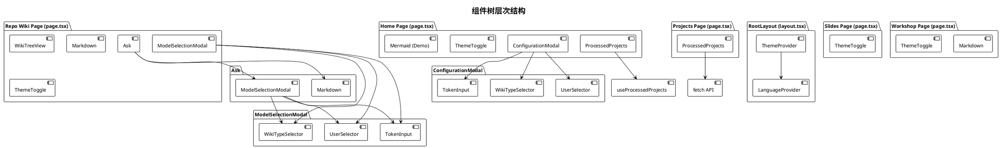

---

## 5. 数据流架构

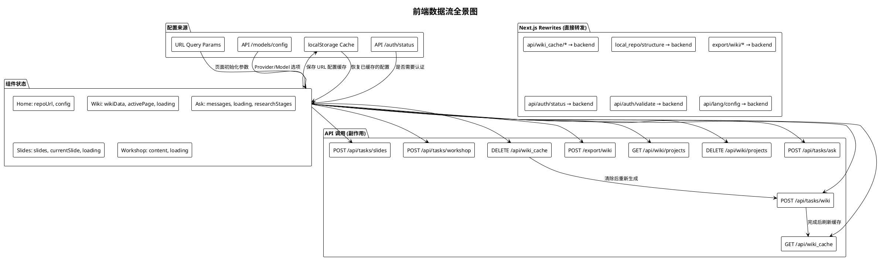

---

## 6. Wiki 页面交互时序图

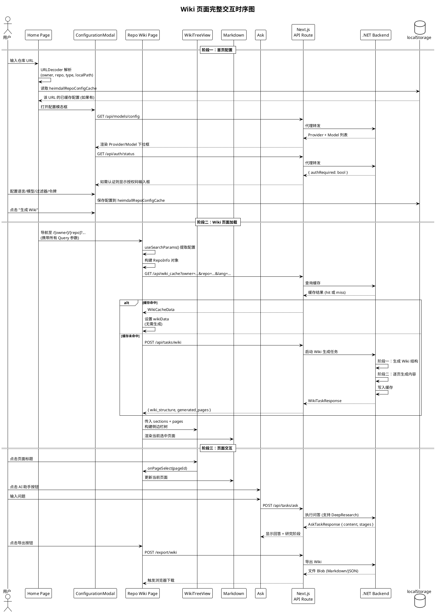

---

## 7. Ask 深度研究流程序列图

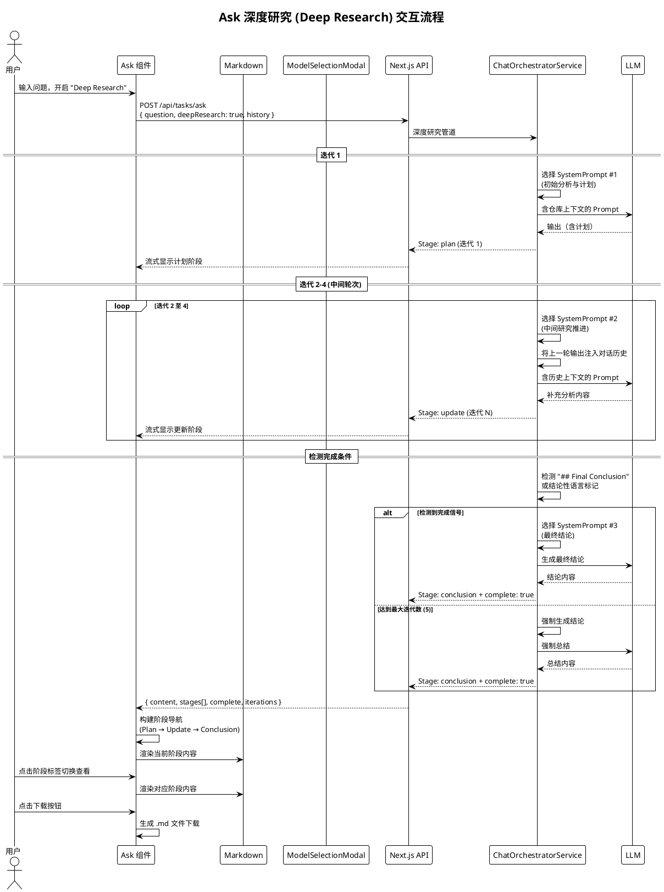

---

## 8. 幻灯片生成与播放流程

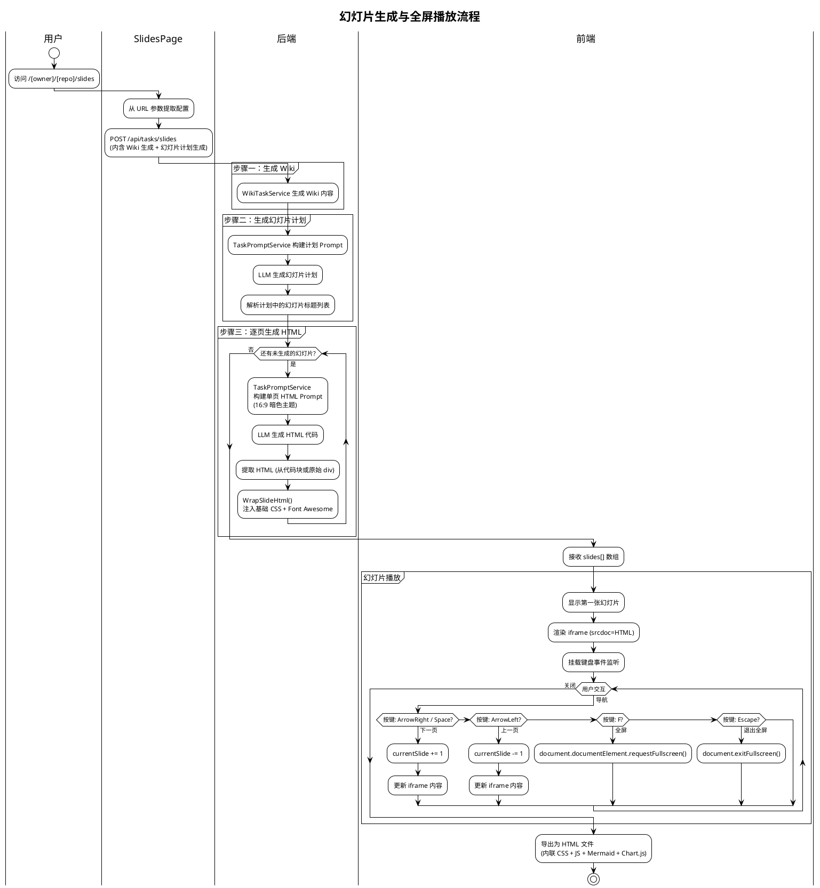

---

## 9. Markdown 渲染组件架构

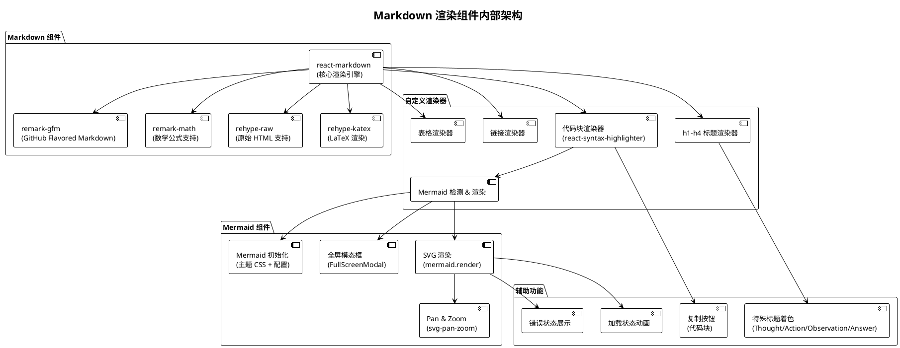

---

## 10. 组件功能职责矩阵

| 组件 | 文件 | 行数 | 核心职责 |
|------|------|------|----------|
| **Ask** | `Ask.tsx` | 489 | AI 问答聊天界面，支持 Deep Research 多阶段研究，对话历史管理，模型切换，流式显示 |
| **ConfigurationModal** | `ConfigurationModal.tsx` | 298 | Wiki 生成前的完整配置：语言、类型、模型、文件过滤、访问令牌、授权码 |
| **Markdown** | `Markdown.tsx` | 176 | Markdown 到 React 的渲染管道，支持 GFM、数学公式、代码高亮、Mermaid、原始 HTML |
| **Mermaid** | `Mermaid.tsx` | 408 | Mermaid 图表 SVG 渲染，支持暗/亮主题、全屏缩放、svg-pan-zoom 交互 |
| **ModelSelectionModal** | `ModelSelectionModal.tsx` | 259 | AI 模型选择模态框（Ask 组件和 Wiki 刷新共用），局部状态先存后提交 |
| **ProcessedProjects** | `ProcessedProjects.tsx` | 268 | 已处理项目列表的卡片/列表视图切换，支持搜索过滤与删除 |
| **TokenInput** | `TokenInput.tsx` | 107 | 平台选择 + 访问令牌输入，支持 GitHub/GitLab/Bitbucket |
| **UserSelector** | `UserSelector.tsx` | 522 | Provider/Model 下拉选择，自定义模型切换，高级文件过滤选项（排除/仅包含目录和文件） |
| **WikiTreeView** | `WikiTreeView.tsx` | 183 | Wiki 页面层级树形导航，递归节渲染，重要性指示器，展开/折叠 |
| **WikiTypeSelector** | `WikiTypeSelector.tsx` | 78 | 综合型 vs 简洁型 Wiki 切换 |
| **ThemeToggle** | `theme-toggle.tsx` | 31 | 暗色/亮色主题切换按钮 |

---

## 11. BFF 代理与 Rewrite 策略

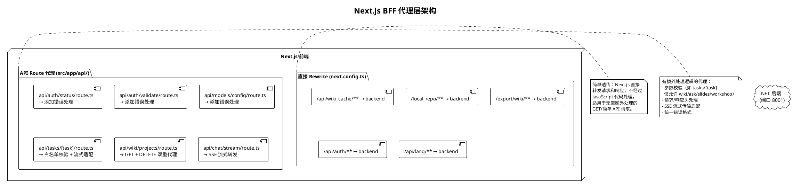

### 11.1 Rewrite vs API Route 代理策略

| 策略 | 适用场景 | 示例 |
|------|----------|------|
| **直接 Rewrite** | 无需额外处理的简单请求 | 缓存 CRUD、认证状态、语言配置 |
| **API Route 代理** | 需要参数校验、错误转换、流式处理 | 任务创建（白名单校验）、聊天（SSE 适配） |

---

## 12. 国际化架构

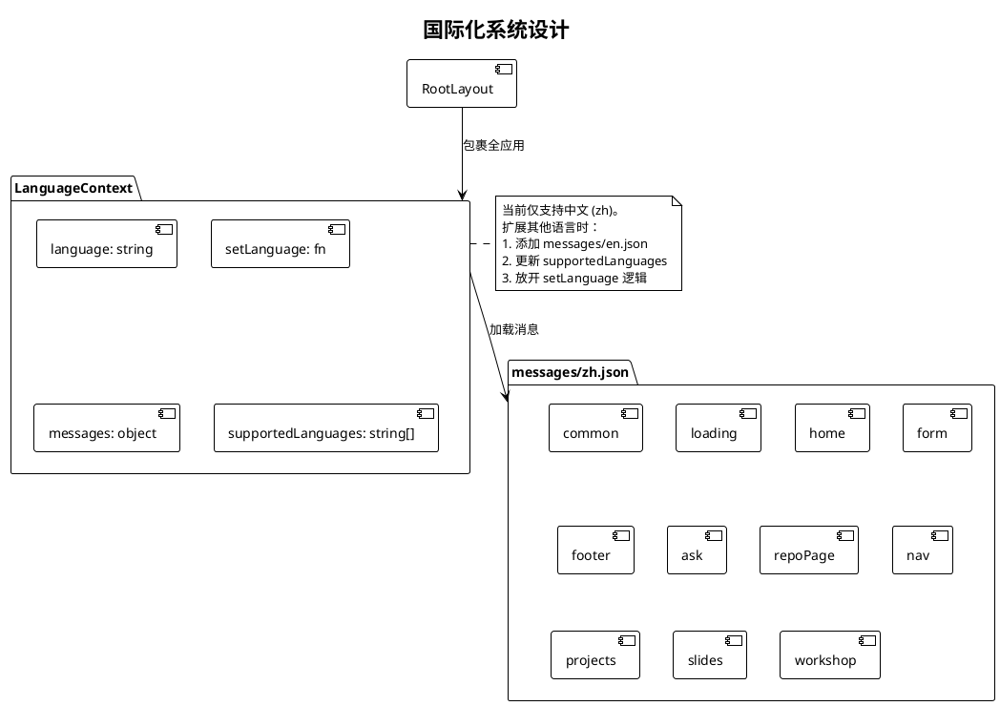

---

## 13. 关键类型定义

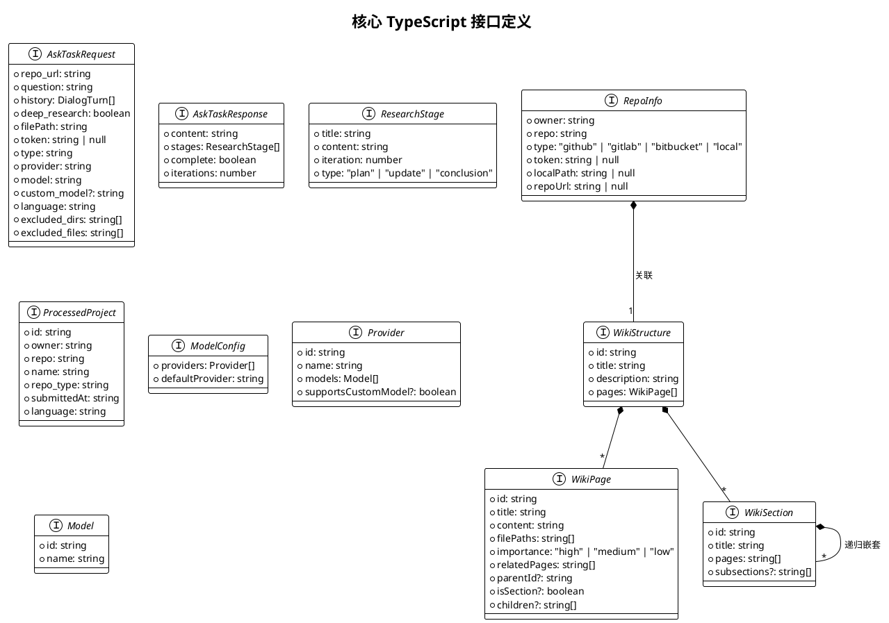

---

## 14. 构建与部署配置

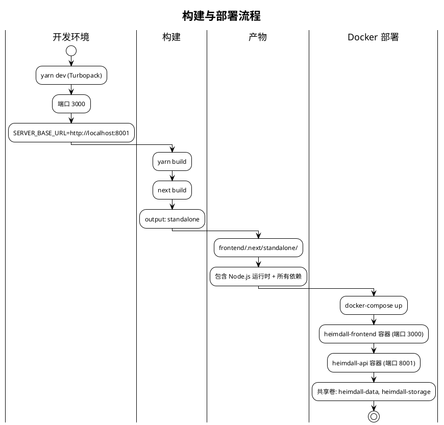

### 14.1 关键构建配置

| 配置项 | 值 | 说明 |
|--------|-----|------|
| `output` | `standalone` | 生成自包含的 Node.js 部署包 |
| `SERVER_BASE_URL` | `http://localhost:8001` (默认) | 后端 API 地址，Docker 中通过环境变量覆盖 |
| 包管理器 | Yarn 1.22.22 | 锁定依赖版本 |
| TypeScript | strict mode | 全量类型检查 |
| React 版本 | 19.2.6 | 最新稳定版 |
| Next.js 版本 | 16.2.6 | App Router + Turbopack |

---

## 15. 关键设计决策

### 15.1 薄前端设计
前端不包含任何业务编排逻辑。Wiki 生成、RAG 检索、LLM 调用等全部在后端完成，前端仅负责 UI 呈现与用户交互。这使得前后端可以独立演进。

### 15.2 URL 作为配置载体
所有配置参数通过 URL Query 传递而非全局状态。这带来三个好处：页面可书签保存、可分享链接、刷新不丢失状态。

### 15.3 Next.js Rewrite + API Route 混合代理
简单透传使用 Next.js Rewrite（零 JS 开销），需要校验或流式处理的请求使用 API Route 代理。既保持了性能又保证了灵活性。

### 15.4 组件自包含
每个组件管理自己的状态，通过 Props 接收外部配置和回调。避免了全局状态库的复杂性，使组件可独立测试和复用。

### 15.5 Mermaid SVGPanZoom 集成
Mermaid 组件使用内存中的 SVG 渲染与可选的 `svg-pan-zoom` 集成，支持在全屏模态框中缩放和平移复杂的架构图。
