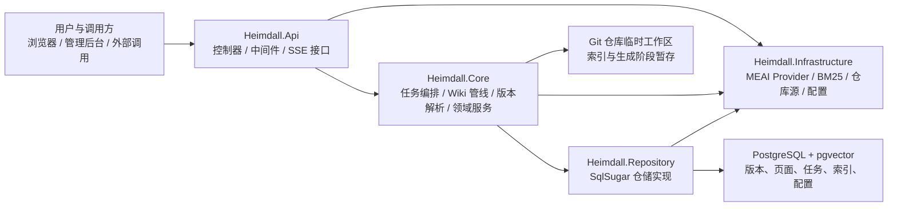

# Heimdall 架构文档入口

> 最后更新：2026-05-25
>
> 本文档是 Heimdall 架构文档体系的统一入口，用于帮助读者在 5 分钟内建立全局认知，并导航到后续专题文档。

---

## 1. 系统摘要

Heimdall 用于把代码仓库自动转换为中文 Wiki、问答内容、演示文稿与训练营材料。系统以仓库快照和知识版本为底座，围绕代码索引、代码理解、结构规划、内容生成和版本化发布构建完整链路。

| 维度 | 摘要 |
|------|------|
| **后端** | C# / ASP.NET Core / `.NET 10` |
| **前端** | Next.js 16（App Router） |
| **数据库** | PostgreSQL + pgvector |
| **ORM** | SqlSugar（CodeFirst 自动同步，无迁移文件） |
| **AI 抽象** | Microsoft.Extensions.AI（MEAI）`IChatClient` |
| **代码分析** | Tree-sitter AST + BM25 全文检索 |
| **认证** | `none` / JWT + RBAC |
| **核心产物** | Wiki、Ask、Slides、Workshop |

### 1.1 系统全景摘要图

### 1.2 系统级事实

- 输入是仓库地址或已有仓库标识，输出是版本化的知识资产，而不是一次性生成结果。
- 后端采用 `Api -> Core -> Repository` 的主依赖链，`Infrastructure` 作为共享工具层被各层复用。
- `RepositoryVersion` 与 `WikiVersion` 共同构成运行时锚点，支撑刷新、发布、回滚和派生产物复用。
- Wiki 生成采用后台任务模式，Ask、Slides、Workshop 与 Wiki 共用版本与任务底座。

---

## 2. 核心原则

1. **四层依赖单向流动**：`Heimdall.Api -> Heimdall.Core -> Heimdall.Repository`，三层均可依赖 `Heimdall.Infrastructure`，`Core` 不反向依赖 `Api`。
2. **版本化优先于即时态**：代码快照和知识版本分离建模，所有读写行为都围绕版本展开，而不是围绕仓库当前状态展开。
3. **数据库是唯一持久化信源**：Wiki 页面、任务工件、索引和配置统一落 PostgreSQL，文件系统仅承担任务执行期暂存。
4. **后台任务统一入队**：长耗时流程通过统一任务队列执行，避免控制器直跑导致状态不一致、不可恢复或并发失控。
5. **专题事实单点维护**：入口页只保留全局事实，各专题细节仅在对应专题文档中维护，避免重复描述。
6. **先建立全局认知，再下钻细节**：入口页服务于导航和边界说明，不再承载 API、数据库、前端组件等详细正文。

---

## 3. 专题目录

下表给出当前专题文档目录与职责边界。所有专题正文均已按统一模板落地，入口页只保留导航、摘要与跨专题关系。

| 分组 | 规划文档 | 主题职责 |
|------|------|------|
| `overview` | `docs/architecture/overview/system-overview.md` | 系统边界、能力矩阵、全景关系、关键运行路径 |
| `overview` | `docs/architecture/overview/layered-architecture.md` | 四层架构、依赖规则、目录职责、生命周期 |
| `overview` | `docs/architecture/overview/domain-model.md` | 版本底座、实体关系、任务工件、索引模型 |
| `runtime` | `docs/architecture/runtime/wiki-pipeline.md` | 8 阶段 Wiki 管线、结构规划、检索、代码理解、Agent 编排 |
| `runtime` | `docs/architecture/runtime/ai-provider-architecture.md` | MEAI `IChatClient`、Provider 工厂、模型分层、成本追踪 |
| `runtime` | `docs/architecture/runtime/frontend-architecture.md` | 路由、组件、BFF、状态流、版本透传 |
| `runtime` | `docs/architecture/runtime/api-overview.md` | 接口分组、主链路、职责边界、典型调用顺序 |
| `persistence` | `docs/architecture/persistence/database-design.md` | 表结构、约束、索引、CodeFirst 与恢复策略 |
| `persistence` | `docs/architecture/persistence/configuration-and-env.md` | 配置优先级、环境变量、配置文件入口 |
| `governance` | `docs/architecture/governance/architecture-decisions.md` | 架构决策记录（AD/ADR） |
| `governance` | `docs/architecture/governance/evolution-roadmap.md` | 演进历史、里程碑、未来方向 |
| `governance` | `docs/architecture/governance/appendix-and-archive.md` | 依赖、调试工作流、归档与附录信息 |

---

## 4. 阅读顺序

### 4.1 新人上手或架构评审

1. `docs/architecture/architecture.md`
2. `docs/architecture/overview/system-overview.md`
3. `docs/architecture/overview/layered-architecture.md`
4. `docs/architecture/overview/domain-model.md`
5. `docs/architecture/runtime/wiki-pipeline.md`
6. `docs/architecture/governance/architecture-decisions.md`

### 4.2 后端开发

1. `docs/architecture/architecture.md`
2. `docs/architecture/overview/layered-architecture.md`
3. `docs/architecture/overview/domain-model.md`
4. `docs/architecture/runtime/wiki-pipeline.md`
5. `docs/architecture/runtime/ai-provider-architecture.md`
6. `docs/architecture/persistence/database-design.md`
7. `docs/architecture/persistence/configuration-and-env.md`
8. `docs/architecture/runtime/api-overview.md`

### 4.3 前端开发

1. `docs/architecture/architecture.md`
2. `docs/architecture/overview/system-overview.md`
3. `docs/architecture/runtime/frontend-architecture.md`
4. `docs/architecture/runtime/api-overview.md`
5. `docs/architecture/overview/domain-model.md`

### 4.4 平台治理与演进规划

1. `docs/architecture/architecture.md`
2. `docs/architecture/governance/architecture-decisions.md`
3. `docs/architecture/governance/evolution-roadmap.md`
4. `docs/architecture/governance/appendix-and-archive.md`

---

## 5. 跨模块关系

### 5.1 核心依赖关系

- **系统全景** 是理解所有专题的起点，为分层、运行时和治理类主题提供共同上下文。
- **分层架构** 约束后端项目依赖方向，并决定服务注册、目录职责和层间协作边界。
- **领域模型** 是 Wiki、Ask、Slides、Workshop 共享的版本化底座，也是数据库设计和 API 语义的前提。
- **Wiki 生成管线** 依赖领域模型、AI Provider、数据库设计和配置策略，是最强的跨模块汇聚点。
- **前端架构** 依赖 API 总览和领域模型中的版本语义，尤其依赖 `repositoryId`、`RepositoryVersion`、`WikiVersion` 的上下文透传。
- **架构决策** 为 ORM、Provider、版本模型、任务队列等关键设计提供背景，治理类文档需要与运行时文档配套阅读。

### 5.2 典型链路视角

1. 仓库导入与版本发现：系统全景 -> 分层架构 -> 领域模型 -> API 总览
2. Wiki 刷新与生成：领域模型 -> Wiki 生成管线 -> AI Provider 架构 -> 数据库设计
3. 仓库页浏览与派生内容：系统全景 -> 前端架构 -> API 总览 -> 领域模型
4. 架构演进与治理：系统全景 -> 架构决策 -> 演进路线图 -> 附录与归档

---

## 6. 迁移说明

### 6.1 入口页定位变更

- 本文档已从“单文件完整架构设计文档”重构为“总览入口页”。
- 原先集中在本文件中的演进历史、分层设计、领域模型、Wiki 管线、Provider 架构、前端架构、API、数据库、配置、决策、路线图和附录等详细正文，不再继续在入口页维护。
- 自本次重构起，入口页只保留系统摘要、核心原则、专题目录、阅读顺序、跨模块关系和迁移说明。

### 6.2 事实归属规则

- 需要查找系统级摘要时，以本入口页为准。
- 需要查找某一专题的详细设计时，以对应专题文档为准。
- 需要回看拆分边界、命名规范或迁移背景时，以 `docs/architecture/split-plan.md` 为参考。
- 后续若入口页摘要与专题正文出现冲突，应优先修正专题正文，再回看入口页是否需要同步更新摘要。
