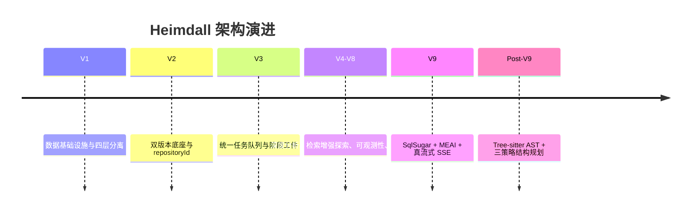

# Heimdall 架构专题：演进路线图

> 文档类型：专题文档
>
> 所属分组：治理
>
> 最后更新：2026-05-25
>
> 返回入口页：[`architecture.md`](../architecture.md)
>
> 顺序导航：上一篇 [`架构决策`](../governance/architecture-decisions.md) ｜ 下一篇 [`附录与归档`](../governance/appendix-and-archive.md)

## 文档范围

本文记录 Heimdall 从早期版本到当前 V9 以及后续方向的演进脉络，说明关键能力是如何逐步进入系统的，以及未来优先级最高的演进方向是什么。

## 核心职责

| 职责主题 | 具体职责 | 输出形式 |
|------|------|------|
| 历史回溯 | 解释当前架构能力分别在哪个阶段形成 | 演进阶段表、时间线、能力来源说明 |
| 演进规划 | 统一表达近期与中长期的优先建设方向 | 未来方向优先级清单 |
| 决策映射 | 把架构决策与具体版本落地阶段对应起来 | 决策与里程碑的对照认知 |
| 治理协同 | 为入口页、附录归档和专题更新提供时间维度依据 | 文档迁移、归档与后续扩写参考 |

## 关键结构

### 演进阶段

| 阶段 | 代表版本 | 关键变化 |
|------|------|------|
| 基础建设期 | V1 | PostgreSQL、四层分离、JWT + RBAC、管理后台 |
| 版本化成型期 | V2 | `repositoryId` 路由、`RepositoryVersion`、`WikiVersion` |
| 任务闭环期 | V3 | 统一队列、阶段工件、Markdown 优先、派生内容并轨 |
| 深度分析期 | V4-V8 | Prompt 治理、深度代码理解、检索增强探索、质量闭环、任务恢复 |
| 架构现代化期 | V9 | SqlSugar、MEAI、CodeFirst 自动同步、真流式 SSE |
| 后 V9 增强期 | Post-V9 | Tree-sitter AST、三策略结构规划、DeepSeek、仓库文档注入 |

## 关键流程

### 架构演进时间线

### 当前能力如何由历史版本累积而来

1. 今天的双版本底座来自 V2，是所有后续能力的稳定锚点。
2. V3 把长任务统一收敛到任务系统，为恢复、派生内容和治理提供基础。
3. V4 到 V8 逐步把“能生成”推进到“能理解、能检索、能审查、能观测”。
4. V9 则主要解决技术债和基础设施现代化问题，为后续继续扩展 Provider 和数据模型打底。

## 依赖关系

| 主题 | 与路线图的关系 |
|------|------|
| 架构决策 | 说明每项关键决策在哪个阶段落地 |
| 系统全景 | 解释当前全景中的每个能力来自哪次架构升级 |
| 附录与归档 | 历史文档归档与调试脚本需要与路线图同步更新 |

## 未来方向

| 优先级 | 方向 | 说明 |
|------|------|------|
| P1 | 大规模 Wiki 增量生成 | 从整仓重建转向按受影响模块重生成 |
| P1 | 页面级质量闭环 | 引入更细粒度评分、重复检测与自动重写 |
| P2 | 版本差异可视化 | 强化 RepositoryVersion 和 WikiVersion 的可视化比较 |
| P2 | 多视角 Wiki | 在 `view_type` 维度扩展架构、安全、入门等视角 |
| P2 | Agent Loop 增强 | 在局部阶段试点更强的多 Agent 协作 |
| P3 | 跨页面知识图谱 | 让 `wiki_page_relations` 变成可视化导航能力 |
| P3 | 多视图输出能力 | 在保持中文主线和单语界面约束的前提下，评估不同受众视图的内容表达方式 |

## 设计取舍

| 取舍点 | 当前选择 | 理由 |
|------|------|------|
| 路线图表达 | 把历史与未来放在同一文档 | 方便读者从“怎么来的”直接看到“往哪去” |
| 优先级规划 | 用 P1/P2/P3 分层 | 便于区分近期建设与中长期探索 |
| 演进叙事 | 以能力主题而不是纯日期罗列 | 更方便与专题文档和架构决策建立映射 |

## 导航与关联阅读

### 返回入口

- [`architecture.md`](../architecture.md)

### 顺序导航

- 上一篇：[`架构决策`](../governance/architecture-decisions.md)
- 下一篇：[`附录与归档`](../governance/appendix-and-archive.md)

### 关联阅读

- [`governance/architecture-decisions.md`](./architecture-decisions.md)
- [`overview/system-overview.md`](../overview/system-overview.md)
- [`runtime/wiki-pipeline.md`](../runtime/wiki-pipeline.md)
- [`governance/appendix-and-archive.md`](./appendix-and-archive.md)
