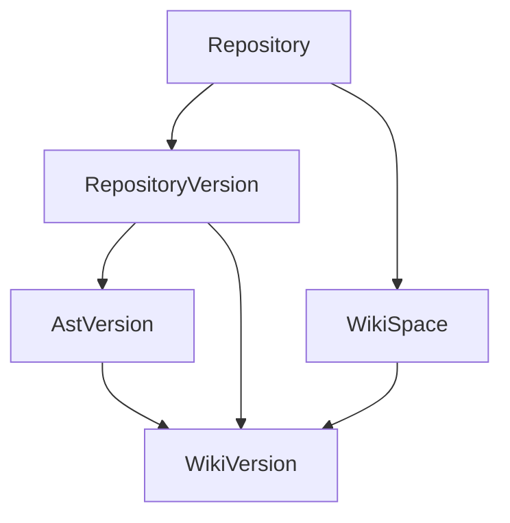
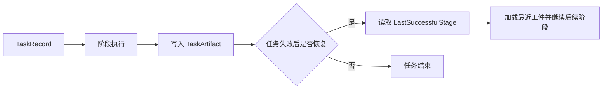

# Heimdall 架构专题：领域模型

> 文档类型：专题文档
>
> 所属分组：总览
>
> 最后更新：2026-05-28
>
> 返回入口页：[`architecture.md`](../architecture.md)
>
> 顺序导航：上一篇 [`分层架构`](../overview/layered-architecture.md) ｜ 下一篇 [`Wiki 生成管线`](../runtime/wiki-pipeline.md)

## 文档范围

本文描述 Heimdall 的核心领域实体与运行时锚点，重点覆盖版本模型（含 AST 版本）、Wiki 内容模型、任务工件模型、代码索引模型以及 Workspace 文件引用模型，说明系统为什么围绕这些实体建模，以及这些实体如何支撑生成、问答与治理能力。

## 核心职责

| 模型组 | 核心实体 | 作用 |
|------|------|------|
| 仓库与版本 | `Repository`、`RepositoryVersion`、`WikiSpace`、`WikiVersion`、`AstVersion` | 为代码快照、AST 解析结果和知识产物建立稳定锚点 |
| Wiki 内容 | `WikiPage`、`WikiPageRelation` | 表达页面树、跨页关系和正文内容（内容存储在 Workspace 文件系统） |
| 任务治理 | `TaskRecord`、`TaskArtifact`、`TaskLlmCallLog`、`LlmCallMetric` | 承载异步执行状态、恢复点与调用审计 |
| 检索索引 | `CodeIndexEntry`、`CodeIndexChunk` | 支撑 Tree-sitter 结果持久化、片段定位和 BM25 检索 |
| Prompt 治理 | `PromptTemplate`、`PromptTemplateHistory`、`RepositoryPromptOverride` | 管理模板演进、仓库差异化覆写和审计 |
| Workspace 引用 | `AstVersion.ast_dir_path`、`WikiPage.content_file_path`、`WikiVersion.structure_file_path` | DB 仅存储路径引用，大文本内容存储在 Workspace 文件系统 |

## 关键结构

### 三版本底座



### 为什么三版本是主锚点

- `RepositoryVersion` 表示不可变代码快照，解决"当前代码到底是哪一次提交"的问题。
- `AstVersion` 表示某次 AST 解析结果（与解析配置关联），解决"同一份代码是否需要重新解析 AST"的问题。若已有满足当前解析配置的成功 AST 版本，Wiki 生成可直接复用。
- `WikiVersion` 表示某次知识生成结果，解决"同一份代码是否可以基于不同模型和 Prompt 重新生成"的问题。`WikiVersion` 必须绑定到具体的 `RepositoryVersion` 和 `AstVersion`。
- 三者分离后，系统才能同时支持发布、回滚、A/B 对比、重生成以及派生内容复用。

### 主要实体关系

| 实体 | 上游依赖 | 下游影响 |
|------|------|------|
| `Repository` | 仓库导入 | 产出 `RepositoryVersion`、`WikiSpace` 与仓库级 Prompt 覆写 |
| `RepositoryVersion` | 仓库发现与代码快照 | 关联代码索引、AstVersion、WikiVersion、任务执行上下文 |
| `AstVersion` | `RepositoryVersion` + 解析配置 | 产出 `ast_dir_path`（Workspace 文件路径）+ DB 轻量索引（`symbol_names_json`、`file_list_json`），被 WikiVersion 引用 |
| `WikiVersion` | `RepositoryVersion` + `AstVersion` + 生成配置 | 关联页面、页面关系、问答与派生内容 |
| `WikiPage` | `WikiVersion` | `content_file_path` 指向 Workspace 文件，`ContentMarkdown` DB 列保留为空 |
| `TaskRecord` | 所有后台任务入口 | 关联工件、日志、指标与结果版本 |

## 关键流程

### 1. 生成流程中的模型流转

1. 控制器提交 Wiki 刷新任务后，系统先解析出目标 `RepositoryVersion`。
2. 系统检查是否存在可复用的 `AstVersion`（相同解析配置）。若不存在，先完成 AST 解析并创建 `AstVersion`，数据写入 `workspace/ast/{id}/`。
3. 任务服务为本次执行创建 `TaskRecord`，后续每个阶段都围绕该任务写入状态与工件。
4. 结构规划完成后，`WikiVersion.structure_file_path` 指向 `workspace/wiki/{id}/structure.json`。
5. 页面生成完成后，`WikiPage.content_file_path` 指向 `workspace/wiki/{id}/pages/{order}_{slug}.md`。
6. Ask、Slides、Workshop 不直接依赖仓库主表，而是通过 `RepositoryVersionId` 和 `WikiVersionId` 读取正确的知识上下文。

### 2. AST 版本复用流程

```mermaid
flowchart LR
    WikiGen[Wiki 生成触发] --> Check{RepositoryVersion<br/>已有可复用 AstVersion?}
    Check -->|是| Reuse[复用已有 AstVersion]
    Check -->|否| Parse[执行 AST 解析]
    Parse --> Write[写入 workspace/ast/{id}/]
    Write --> Create[创建 AstVersion 记录]
    Create --> Reuse
    Reuse --> Continue[继续 Wiki 管线]
    Parse -->|失败| Fail[WikiVersion 不进入成功态]
```

### 3. 失败恢复中的工件回放



## 依赖关系

| 主题 | 依赖本模型的原因 |
|------|------|
| Wiki 管线 | 每个阶段都要知道处理的是哪一个代码快照、AST 版本与目标知识版本 |
| Workspace 文件系统 | `AstVersion`、`WikiPage`、`WikiVersion` 的路径字段指向 Workspace 文件 |
| API 契约 | 前后端所有关键接口都围绕 `repositoryId`、`repositoryVersionId`、`wikiVersionId` 组织 |
| 数据库设计 | 绝大部分表和索引都是围绕这些领域实体展开 |
| Prompt 治理 | Prompt 覆写、模板历史需要能准确作用到仓库或任务上下文 |

### 关键不变量

- `RepositoryVersion` 由 `(repository_id, branch_name, commit_sha)` 唯一确定。
- `AstVersion` 必须绑定到具体 `RepositoryVersion`，同一快照 + 相同解析配置命中时可复用。
- `WikiVersion` 必须绑定到具体 `RepositoryVersion` 和 `AstVersion`，不能悬空存在。
- AST 持久化失败时，`WikiVersion` 不得进入成功态。
- 任务执行的恢复字段必须与工件一致，否则会导致断点续跑失效。
- 页面关系必须依附于具体 `WikiVersion`，避免跨版本串联污染。

## 设计取舍

| 取舍点 | 当前选择 | 放弃项 | 理由 |
|------|------|------|------|
| 版本建模 | 三版本分离（代码/AST/知识） | 单表聚合 | 同时表达代码变化、解析配置变化和知识变化 |
| AST 存储 | Workspace 文件 + DB 轻量索引 | DB TEXT 列存全量 JSON | 避免 DB 膨胀，文件系统更适合大内容 |
| Wiki 内容存储 | Workspace `.md` 文件 + DB 路径引用 | DB TEXT 列存 Markdown | 同上，且便于直接查看和编辑 |
| 任务恢复 | 工件化持久化 | 仅靠内存状态 | 保证长任务可恢复、可审计 |
| 索引建模 | 文件级 + 块级双层索引 | 只存整文件或只存切块 | 兼顾结构理解与片段检索 |
| Prompt 管理 | 模板 + 历史 + 仓库覆写 | 静态硬编码 Prompt | 便于后台治理和差异化配置 |

## 导航与关联阅读

### 返回入口

- [`architecture.md`](../architecture.md)

### 顺序导航

- 上一篇：[`分层架构`](../overview/layered-architecture.md)
- 下一篇：[`Wiki 生成管线`](../runtime/wiki-pipeline.md)

### 关联阅读

- [`overview/system-overview.md`](./system-overview.md)
- [`runtime/wiki-pipeline.md`](../runtime/wiki-pipeline.md)
- [`runtime/workspace-filesystem.md`](../runtime/workspace-filesystem.md)
- [`runtime/api-overview.md`](../runtime/api-overview.md)
- [`persistence/database-design.md`](../persistence/database-design.md)
