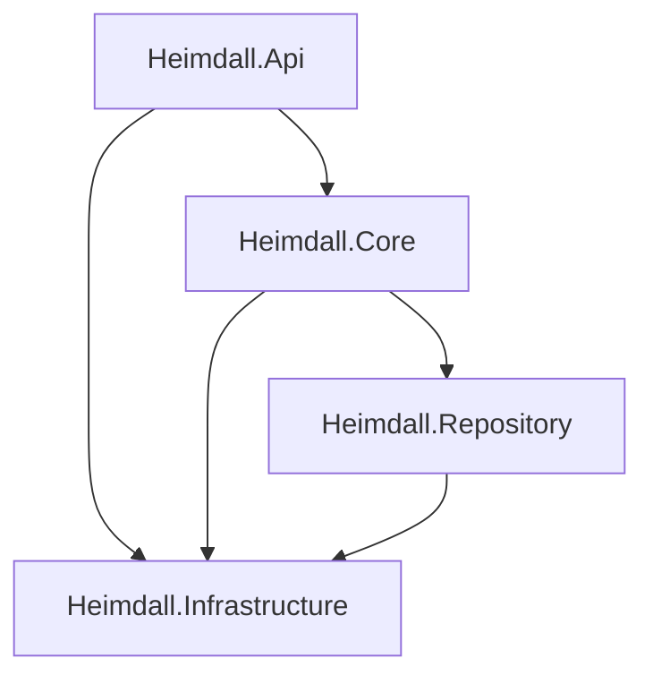
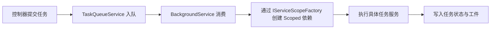

# Heimdall 架构专题：分层架构

> 文档类型：专题文档
>
> 所属分组：总览
>
> 最后更新：2026-05-25
>
> 返回入口页：[`architecture.md`](../architecture.md)
>
> 顺序导航：上一篇 [`系统全景`](../overview/system-overview.md) ｜ 下一篇 [`领域模型`](../overview/domain-model.md)

## 文档范围

本文描述后端四层分离、目录职责、依赖方向、服务生命周期与 DI 约束，帮助开发者在新增接口、服务或仓储时判断代码应该落在哪一层，以及为什么必须遵守这些边界。

## 核心职责

| 层级 | 目录 | 核心职责 | 典型内容 |
|------|------|------|------|
| API 层 | `backend/Heimdall.Api` | 暴露 HTTP 能力、组装 DTO、注册 DI 与中间件 | 控制器、模型、映射、配置入口、SSE 返回 |
| Core 层 | `backend/Heimdall.Core` | 承载领域模型、业务规则、任务编排与接口定义 | 实体、服务、工作流、接口、领域模型 |
| Repository 层 | `backend/Heimdall.Repository` | 承载数据访问与查询实现 | SqlSugar 仓储、事务写入、向量查询 |
| Infrastructure 层 | `backend/Heimdall.Infrastructure` | 适配第三方能力并提供跨层工具 | Provider 工厂、BM25、仓库源、配置与文本工具 |

## 关键结构

### 目录职责矩阵

| 路径 | 主要职责 | 典型扩展点 |
|------|------|------|
| `Heimdall.Api/Controllers` | 定义端点、鉴权边界、请求响应格式 | 新增控制器、补充 DTO、流式接口 |
| `Heimdall.Api/Program.cs` | 注册 DI、配置中间件、启动 CodeFirst | 新服务注册、配置加载、认证开关 |
| `Heimdall.Core/Interfaces` | 定义跨层契约 | 新业务服务接口、仓储接口 |
| `Heimdall.Core/Services` | 编排主业务流程 | 新任务服务、治理服务、版本服务 |
| `Heimdall.Core/Entities` | 定义领域实体和表映射 | 新实体、字段约束、关系演进 |
| `Heimdall.Repository/Repositories` | 封装读写和查询 | 新仓储实现、事务边界、分页检索 |
| `Heimdall.Infrastructure/Providers` | 统一模型调用适配 | 新 Provider、模型元数据、调用中间件 |
| `Heimdall.Infrastructure/Search` | 检索基础能力 | BM25、排序、索引装载策略 |

## 关键流程

### 1. 请求进入后的分层流转

1. 请求先进入 ASP.NET Core 中间件管道，完成 CORS、鉴权、授权和必要的请求去重。
2. 控制器进行入参校验，调用 Core 层接口，避免直接拼装仓储查询。
3. Core 层根据业务目标编排 Repository 和 Infrastructure 能力，必要时通过任务队列异步执行。
4. Repository 层负责落库或查询，Infrastructure 层负责外部模型调用、仓库访问或检索能力。
5. 结果回到控制器，由控制器转换为对外 DTO、SSE 事件或错误码。

### 2. 后台任务场景的生命周期处理

后台任务使用 Singleton 队列与 Worker，但每次真正执行阶段逻辑时都会创建新的 Scoped 作用域，避免把请求级依赖长期挂在单例对象上。

## 依赖关系

| 规则 | 约束说明 | 违反后的风险 |
|------|------|------|
| `Api -> Core` | API 层只依赖业务接口 | 控制器变成胖服务，难以复用与测试 |
| `Core -> Repository` | 数据访问经由仓储接口与实现 | 业务层掺入 SQL 细节，难以替换持久化策略 |
| `全部 -> Infrastructure` | 工具层可以被复用，但不承载领域状态 | 工具层膨胀为第二业务层 |
| `Core` 不依赖 `Api` | 避免业务规则与 Web 技术细节耦合 | 业务服务无法在后台任务或测试中独立运行 |
| `Repository` 不回调 `Core` | 防止循环依赖 | 读写边界失控、事务语义混乱 |

### 生命周期约束

| 组件 | 生命周期 | 说明 |
|------|------|------|
| 控制器 | Scoped | 与请求同生命周期 |
| 业务服务 | Scoped 为主 | 便于持有仓储和上下文依赖 |
| `TaskQueueService` | Singleton | 统一承接后台任务队列 |
| Provider 工厂与无状态适配器 | Singleton | 共享配置和连接池，减少重复构建成本 |
| 仓储实现 | Scoped | 与当前执行上下文绑定，便于事务控制 |
| `ISqlSugarClient` | Singleton | 与当前 SqlSugar 使用方式保持一致 |

## 设计取舍

| 取舍点 | 当前选择 | 说明 |
|------|------|------|
| 分层方式 | 明确四层，不做按功能切碎的微项目拆分 | 兼顾演进空间与仓库复杂度，降低基础设施噪音 |
| 接口位置 | 契约集中在 Core | 让 API、后台任务、测试都能复用同一套业务入口 |
| 工具层共享 | 允许各层依赖 Infrastructure | 把 Provider、检索和仓库源集中治理，避免重复实现 |
| 生命周期策略 | 长任务单例外壳 + Scoped 执行体 | 满足 BackgroundService 约束，同时避免状态污染 |

## 导航与关联阅读

### 返回入口

- [`architecture.md`](../architecture.md)

### 顺序导航

- 上一篇：[`系统全景`](../overview/system-overview.md)
- 下一篇：[`领域模型`](../overview/domain-model.md)

### 关联阅读

- [`overview/system-overview.md`](./system-overview.md)
- [`overview/domain-model.md`](./domain-model.md)
- [`runtime/api-overview.md`](../runtime/api-overview.md)
- [`persistence/database-design.md`](../persistence/database-design.md)
