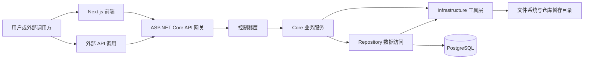
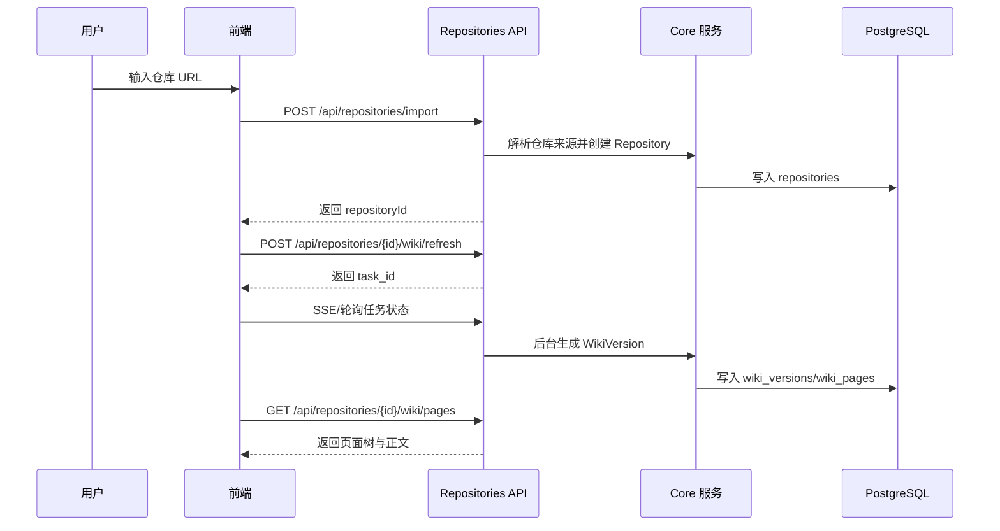

# Heimdall 架构专题：系统全景

> 文档类型：专题文档
>
> 所属分组：总览
>
> 最后更新：2026-05-25
>
> 返回入口页：[`architecture.md`](../architecture.md)
>
> 顺序导航：上一篇 无，建议从入口页开始阅读 ｜ 下一篇 [`分层架构`](../overview/layered-architecture.md)

## 文档范围

本文聚焦 Heimdall 的系统级全景，不展开具体控制器、表字段或组件实现细节。目标是让读者先理解系统边界、核心能力、主执行路径与跨模块协作关系，再按主题跳转到专题文档深入阅读。

## 核心职责

| 能力域 | 主要模块 | 职责说明 |
|------|------|------|
| 仓库接入 | `RepositoriesController`、`RepositorySource`、仓库版本服务 | 接收仓库 URL、本地仓库信息或远端仓库发现请求，生成统一的 `repositoryId` 与 `RepositoryVersion` |
| 知识生产 | `WikiTaskService`、`CodeIndexService`、`CodeUnderstandingService`、结构规划服务 | 把代码仓库转换为结构化中文 Wiki，完成索引、理解、规划、生成、审查与持久化 |
| 交互消费 | `TasksController`、`ChatController`、`VersionedKnowledgeService`、前端 Ask/Slides/Workshop 页面 | 基于同一版本上下文提供问答、演示文稿和训练营内容 |
| 运行治理 | `TaskQueueService`、`LlmObservabilityService`、Admin 控制器、Prompt 管理服务 | 提供任务排队、进度监控、调用审计、模型治理、系统设置与后台运维能力 |
| 数据底座 | `SqlSugar`、PostgreSQL、任务工件仓储 | 统一承载版本、页面、索引、提示词、调用日志与恢复工件 |

## 模块边界

### 模块职责摘要

| 模块 | 关注点 | 不负责内容 |
|------|------|------|
| 前端 | 页面导航、参数透传、流式交互、状态展示 | 业务编排、代码检索、LLM 调度 |
| API 层 | 鉴权、入参校验、路由编排、任务提交 | 长任务执行、跨阶段恢复 |
| Core | 版本解析、任务编排、检索融合、知识生成 | SQL 细节、第三方 SDK 适配细节 |
| Repository | 持久化、查询、事务落库 | 业务策略判断、提示词编排 |
| Infrastructure | Provider 适配、BM25、配置、仓库源、文本工具 | 领域状态管理、页面版本决策 |
| PostgreSQL | 持久化唯一信源 | 临时执行逻辑、运行时缓存策略 |

## 关键流程

### 1. 仓库导入到 Wiki 浏览

### 2. 问答与派生内容生成

1. 前端从当前页面 URL 中解析 `repositoryVersionId` 与 `wikiVersionId`。
2. Ask、Slides、Workshop 请求把版本参数透传到后端任务接口。
3. `VersionedKnowledgeService` 先解析当前可用的知识版本，再选择页面内容、关系与检索片段。
4. 任务服务依据类型选择 Prompt、模型分层与输出格式，最终返回 JSON 或流式 SSE。

## 依赖关系

| 依赖方向 | 原因 |
|------|------|
| 前端依赖 API 路由契约 | 所有页面、流式组件和版本切换都依赖稳定接口与参数语义 |
| API 依赖 Core 接口 | 控制器只负责入口编排，不承载长任务逻辑 |
| Core 依赖 Repository 与 Infrastructure | 业务逻辑同时需要持久化能力与外部能力适配 |
| Repository 依赖 Infrastructure | 统一复用 SqlSugar、配置和公共工具，不反向依赖 Core |
| 运行时所有主题都依赖版本模型 | `RepositoryVersion` 与 `WikiVersion` 是系统的一致性锚点 |

### 跨专题强依赖

- 本文与 `overview/domain-model.md` 强相关，因为系统主链路全部围绕双版本底座展开。
- 本文与 `runtime/wiki-pipeline.md` 强相关，因为 Wiki 生成是系统最核心的运行时流程。
- 本文与 `persistence/database-design.md` 强相关，因为所有状态最终以数据库为唯一信源落地。

## 设计取舍

| 取舍点 | 选择 | 放弃项 | 原因 |
|------|------|------|------|
| 系统入口 | 保留统一 `architecture.md` 入口页 + 专题文档 | 单文件承载全部细节 | 降低维护成本，便于读者按主题检索 |
| 版本锚点 | 双版本模型 | 单一 Wiki 聚合模型 | 区分代码变化与生成变化，支持回滚与多次生成 |
| 前后端职责 | 薄前端、厚后端 | 前端承接业务编排 | 统一鉴权、检索、任务治理与模型调用逻辑 |
| 数据存储 | PostgreSQL 为唯一信源 | 本地 JSON/文件缓存作为正式存储 | 提升一致性、可恢复性与版本可追踪性 |

## 导航与关联阅读

### 返回入口

- [`architecture.md`](../architecture.md)

### 顺序导航

- 上一篇：无，建议从入口页开始阅读
- 下一篇：[`分层架构`](../overview/layered-architecture.md)

### 关联阅读

- [`overview/layered-architecture.md`](./layered-architecture.md)
- [`overview/domain-model.md`](./domain-model.md)
- [`runtime/wiki-pipeline.md`](../runtime/wiki-pipeline.md)
- [`governance/architecture-decisions.md`](../governance/architecture-decisions.md)
