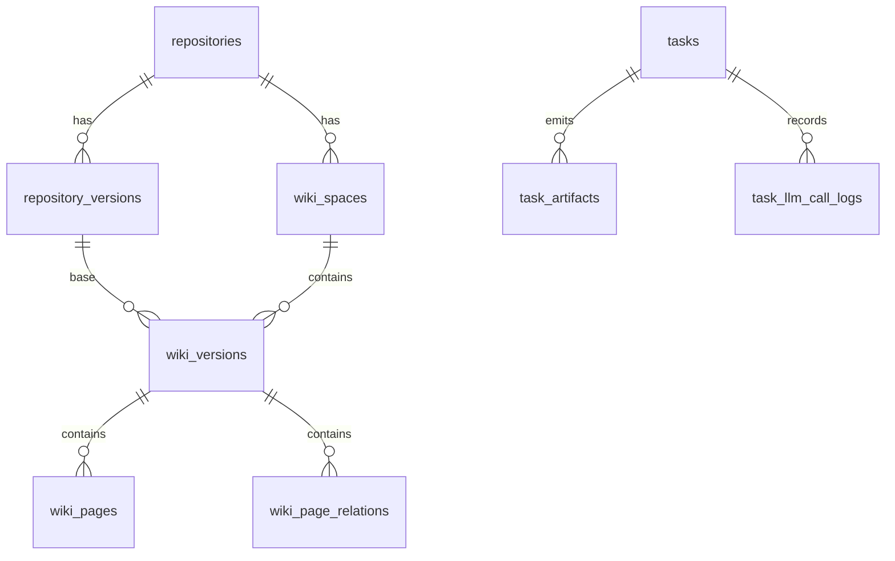
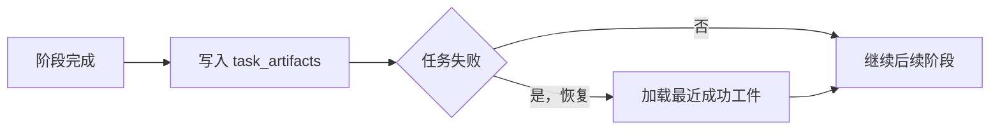

# Heimdall 架构专题：数据库设计

> 文档类型：专题文档
>
> 所属分组：持久化
>
> 最后更新：2026-05-25
>
> 返回入口页：[`architecture.md`](../architecture.md)
>
> 顺序导航：上一篇 [`API 总览`](../runtime/api-overview.md) ｜ 下一篇 [`配置与环境变量`](../persistence/configuration-and-env.md)

## 文档范围

本文描述 Heimdall 的核心持久化模型、关键表分组、约束、索引与恢复策略，重点解释为什么数据库被视为唯一信源，以及不同数据对象在表层面的职责边界。

## 核心职责

| 数据域 | 主要表 | 职责 |
|------|------|------|
| 身份与仓库 | `users`、`repositories`、`repository_versions` | 存放用户、仓库主标识和代码快照 |
| 知识内容 | `wiki_spaces`、`wiki_versions`、`wiki_pages`、`wiki_page_relations` | 存放知识空间、版本、页面正文与关系图 |
| 任务治理 | `tasks`、`task_artifacts`、`task_llm_call_logs`、`llm_call_metrics` | 存放异步任务状态、工件、审计日志和指标 |
| 检索索引 | `code_index_entries`、`code_index_chunks` | 存放 Tree-sitter 索引结果与检索块 |
| Prompt 与配置 | `prompt_templates`、`repository_prompt_overrides`、`prompt_template_history`、`system_settings`、`provider_model_metadata` | 支撑运行治理、Prompt 演进和模型元数据管理 |

## 关键结构

### 表分组关系

### 关键约束

| 约束 | 说明 |
|------|------|
| 版本唯一 | `(repository_id, branch_name, commit_sha)` 唯一确定一个 `RepositoryVersion` |
| 并发控制 | 同仓库同分支同类运行中任务需被限制，避免重复生成 |
| 请求去重 | 通过哈希键合并相同请求，减少重复任务 |
| 版本锚定 | `WikiVersion`、页面和关系都必须依附于具体版本 |
| CodeFirst 同步 | 由 `CodeFirstSyncService` 在启动时按配置增量同步表结构 |

## 关键流程

### 1. Wiki 持久化流程

1. 生成链路完成后，事务内创建新的 `WikiVersion`。
2. 批量写入 `wiki_pages` 和 `wiki_page_relations`，保持页面树与跨页关系一致。
3. 更新 `tasks` 中的结果绑定字段，把任务与新版本关联起来。
4. 如需发布，再由发布接口修改版本状态或指针信息。

### 2. 任务恢复流程

### 3. 索引与检索持久化流程

- `CodeIndexEntry` 记录文件级元信息、语言、符号和依赖。
- `CodeIndexChunk` 记录块级内容和行范围，便于快速检索片段。
- pgvector 字段与向量索引负责语义检索，BM25 负责内存关键词召回。
- 查询时通常先按 `repository_version_id` 或 `wiki_version_id` 缩小范围，再执行排序或相似度计算。

## 依赖关系

| 依赖项 | 说明 |
|------|------|
| 领域模型 | 表结构直接映射核心实体及其关系 |
| 任务管线 | 长任务的恢复、审计和状态展示都依赖这些表 |
| SqlSugar | CodeFirst、事务与查询都通过 `ISqlSugarClient` 组织 |
| pgvector | 语义检索能力依赖向量列和对应索引 |

## 设计取舍

| 取舍点 | 当前选择 | 理由 |
|------|------|------|
| 数据信源 | PostgreSQL 为唯一正式存储 | 避免文件缓存与数据库双写不一致 |
| ORM | SqlSugar CodeFirst | 减少迁移文件维护成本，适应当前实体演进节奏 |
| 表设计 | 版本、页面、任务、索引分表 | 让生命周期和查询模式更清晰 |
| 恢复策略 | 工件持久化到库 | 支撑失败后断点续跑与审计追踪 |

## 导航与关联阅读

### 返回入口

- [`architecture.md`](../architecture.md)

### 顺序导航

- 上一篇：[`API 总览`](../runtime/api-overview.md)
- 下一篇：[`配置与环境变量`](../persistence/configuration-and-env.md)

### 关联阅读

- [`overview/domain-model.md`](../overview/domain-model.md)
- [`runtime/wiki-pipeline.md`](../runtime/wiki-pipeline.md)
- [`persistence/configuration-and-env.md`](./configuration-and-env.md)
- [`governance/architecture-decisions.md`](../governance/architecture-decisions.md)
