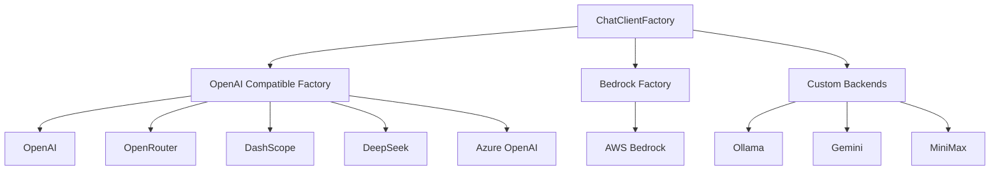
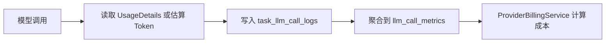

# Heimdall 架构专题：AI Provider 架构

> 文档类型：专题文档
>
> 所属分组：运行时
>
> 最后更新：2026-05-25
>
> 返回入口页：[`architecture.md`](../architecture.md)
>
> 顺序导航：上一篇 [`Wiki 生成管线`](../runtime/wiki-pipeline.md) ｜ 下一篇 [`前端架构`](../runtime/frontend-architecture.md)

## 文档范围

本文描述 Heimdall 如何基于 MEAI `IChatClient` 统一接入不同大模型与嵌入服务，重点关注 Provider 分类、工厂装配、模型分层、流式能力、Token 统计与成本治理。

## 核心职责

| 主题 | 主要模块 | 职责 |
|------|------|------|
| Chat 抽象统一 | `ChatClientFactory`、Keyed DI | 为业务层暴露统一的聊天调用接口 |
| Provider 适配 | `OpenAiCompatibleClientFactory`、`BedrockClientFactory`、`CustomBackends/*` | 屏蔽不同厂商 SDK 差异 |
| 流式与遥测 | `GetStreamingResponseAsync()`、调用日志服务 | 支持 SSE 真流式输出与延迟、Token 采集 |
| 模型治理 | `TierConfig`、Provider 元数据、系统设置 | 按阶段选择模型、估算成本并控制能力差异 |
| Embedding 能力 | Embedding Provider 配置 | 支撑 pgvector 检索与语义召回 |

## 关键结构

### Provider 分类

| 类型 | Provider | 特征 |
|------|------|------|
| OpenAI 兼容 | `openai`、`openrouter`、`dashscope`、`deepseek`、`azure` | 复用统一 HTTP 协议和工厂构建逻辑 |
| 专有实现 | `bedrock`、`ollama`、`google`、`minimax` | 因 SDK、认证或流式协议差异，需要单独适配 |
| Embedding | `openai`、`google`、`bedrock`、`ollama` | 提供向量生成，服务于代码和知识检索 |

## 关键流程

### 1. 业务层获取模型客户端

1. Core 服务根据任务类型、阶段和配置解析目标 Provider/Model。
2. `ChatClientFactory` 通过 Keyed DI 选择具体工厂或适配器。
3. 构建好的 `IChatClient` 进入中间件链路，叠加重试、遥测和可观测性逻辑。
4. 业务层使用统一方法发起普通或流式调用，不感知底层厂商差异。

### 2. Token 与成本治理

### 模型分层策略

| Tier | 典型阶段 | 目标 |
|------|------|------|
| `Planner` | 结构规划、系统摘要 | 强调推理与结构归纳 |
| `Generator` | 页面生成、Slides、Workshop | 平衡质量、速度和上下文长度 |
| `Reviewer` | 质量审查、收敛、轻量修正 | 压低成本并提高审查吞吐 |

## 依赖关系

| 依赖项 | 说明 |
|------|------|
| 配置体系 | 决定默认 Provider、模型、Token 估算模式与各类密钥来源 |
| Prompt 模板体系 | Provider 选择与 Prompt 结构共同决定模型调用效果 |
| LLM 可观测性 | 需要在任务日志与指标表中记录真实调用结果 |
| 前端流式能力 | Ask 和 Chat 页面依赖后端 SSE 真流式输出 |

## 设计取舍

| 取舍点 | 当前选择 | 放弃项 | 理由 |
|------|------|------|------|
| 抽象接口 | 采用 MEAI `IChatClient` | 继续维护自研 `IChatProvider` | 降低适配成本，复用标准生态能力 |
| Provider 接入 | 能复用协议的统一走兼容工厂 | 每家厂商单独重写一套调用逻辑 | 降低重复代码与配置复杂度 |
| 流式实现 | 后端统一输出 SSE | 前端直接直连第三方模型 | 便于审计、鉴权、版本控制与日志归档 |
| Token 统计 | 精确优先，估算兜底 | 仅保留粗略估算 | 兼顾成本准确性和兼容性 |

## 导航与关联阅读

### 返回入口

- [`architecture.md`](../architecture.md)

### 顺序导航

- 上一篇：[`Wiki 生成管线`](../runtime/wiki-pipeline.md)
- 下一篇：[`前端架构`](../runtime/frontend-architecture.md)

### 关联阅读

- [`runtime/wiki-pipeline.md`](./wiki-pipeline.md)
- [`persistence/configuration-and-env.md`](../persistence/configuration-and-env.md)
- [`governance/architecture-decisions.md`](../governance/architecture-decisions.md)
- [`governance/evolution-roadmap.md`](../governance/evolution-roadmap.md)
