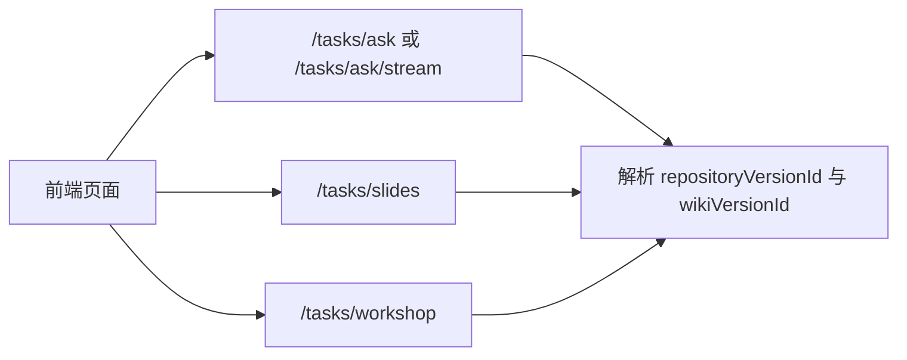

# Heimdall 架构专题：API 总览

> 文档类型：专题文档
>
> 所属分组：运行时
>
> 最后更新：2026-05-25
>
> 返回入口页：[`architecture.md`](../architecture.md)
>
> 顺序导航：上一篇 [`前端架构`](../runtime/frontend-architecture.md) ｜ 下一篇 [`数据库设计`](../persistence/database-design.md)

## 文档范围

本文面向需要调用或扩展 Heimdall 接口的开发者，按仓库、Wiki、任务、管理后台与系统能力分组说明接口边界、典型调用顺序和依赖关系，不逐项展开 DTO 字段。

## 核心职责

| 接口分组 | 主要端点 | 职责 |
|------|------|------|
| 仓库与版本 | `/api/repositories/**` | 导入仓库、获取详情、发现与读取代码版本 |
| Wiki | `/api/repositories/{id}/wiki/**` | 触发生成、读取页面树、发布与版本比较 |
| 任务与问答 | `/tasks/**`、`/chat/**` | 承载 Ask、Slides、Workshop、任务状态和流式输出 |
| Admin | `/admin/**`、部分 `/api/admin/**` | 管理用户、设置、提示词、任务与平台元数据 |
| 通用系统 | `/health`、`/models/config`、`/auth/**` | 健康检查、模型配置、认证能力 |

## 关键流程

### 1. 仓库导入与生成流程

1. `POST /api/repositories/import` 导入仓库并返回 `repositoryId`。
2. `GET /api/repositories/{id}` 和 `GET /api/repositories/{id}/versions` 查询仓库与快照信息。
3. `POST /api/repositories/{id}/wiki/refresh` 提交生成任务，立即返回 `task_id`。
4. `GET /tasks/{id}/status` 或 `GET /tasks/{id}/stream` 跟踪执行进度。
5. 任务完成后，通过 `GET /api/repositories/{id}/wiki/versions` 与 `/wiki/pages` 读取生成结果。

### 2. 问答与派生内容流程

## 模块职责

| 控制器或分组 | 主要职责 | 说明 |
|------|------|------|
| `RepositoriesController` | 仓库导入、查询、更新、删除 | 建立对外主标识 `repositoryId` |
| 版本相关控制器 | 版本发现、最新版本读取、详情查询 | 承接代码快照语义 |
| Wiki 控制器 | 刷新、发布、比较、页面读取 | 承接知识版本读写语义 |
| `TasksController` | Ask、Slides、Workshop 与任务生命周期 | 是派生内容统一任务入口 |
| `ChatController` | 流式聊天与通用模型试用能力 | 面向更轻量的即时对话场景 |
| Admin 控制器 | 平台治理与运维能力 | 与普通业务接口解耦，默认更强鉴权 |

## 依赖关系

| 依赖项 | 说明 |
|------|------|
| 版本模型 | 大多数核心接口都需要 `repositoryId`、`repositoryVersionId` 或 `wikiVersionId` |
| 任务队列 | 所有长任务接口必须统一提交到后台队列执行 |
| 鉴权与 RBAC | Admin 接口及部分系统能力依赖 JWT 与角色控制 |
| 前端 BFF | 浏览器侧多数访问通过 Next.js 代理转发，依赖稳定路由语义 |

### 接口边界约束

- 控制器只做输入校验、鉴权和调用编排，不在接口层执行长耗时生成逻辑。
- 生成类接口返回 `task_id`，由状态接口或 SSE 提供后续进度，而不是同步阻塞等待结果。
- 版本相关接口必须尊重双版本底座，避免用仓库主表直接替代运行时上下文。

## 设计取舍

| 取舍点 | 当前选择 | 理由 |
|------|------|------|
| 长任务接口 | 统一任务化返回 `task_id` | 便于恢复、重试、并发控制和前端进度展示 |
| 路由主标识 | 统一使用 `repositoryId` | 降低跨 Provider 仓库命名差异带来的复杂度 |
| 流式返回 | 使用 SSE | 兼顾浏览器兼容性、实现复杂度与增量展示体验 |
| Admin 分组 | 单独隔离到 `/admin` | 将治理面和业务面分离，便于权限控制 |

## 导航与关联阅读

### 返回入口

- [`architecture.md`](../architecture.md)

### 顺序导航

- 上一篇：[`前端架构`](../runtime/frontend-architecture.md)
- 下一篇：[`数据库设计`](../persistence/database-design.md)

### 关联阅读

- [`overview/layered-architecture.md`](../overview/layered-architecture.md)
- [`overview/domain-model.md`](../overview/domain-model.md)
- [`runtime/frontend-architecture.md`](./frontend-architecture.md)
- [`runtime/wiki-pipeline.md`](./wiki-pipeline.md)
