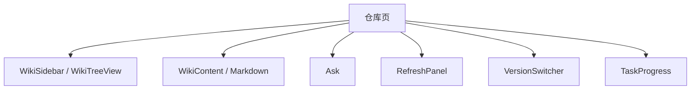
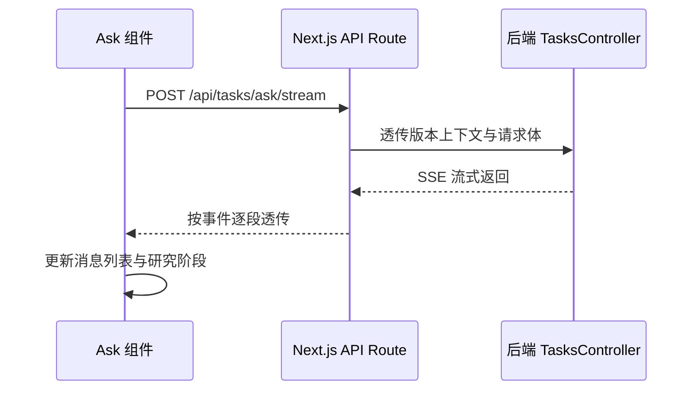

# Heimdall 架构专题：前端架构

> 文档类型：专题文档
>
> 所属分组：运行时
>
> 最后更新：2026-05-25
>
> 返回入口页：[`architecture.md`](../architecture.md)
>
> 顺序导航：上一篇 [`AI Provider 架构`](../runtime/ai-provider-architecture.md) ｜ 下一篇 [`API 总览`](../runtime/api-overview.md)

## 文档范围

本文描述 Next.js 16 前端在 Heimdall 中承担的职责，包括路由设计、组件分层、BFF 代理、版本上下文透传、状态组织与关键设计取舍。后端业务流程和数据库细节不在本文展开。

## 核心职责

| 主题 | 主要对象 | 职责 |
|------|------|------|
| 页面入口 | `src/app/*` | 组织首页、仓库页、Slides、Workshop 与管理后台页面 |
| 组件层 | `src/components/*` | 封装树形导航、Markdown 渲染、问答、刷新、版本切换等 UI 能力 |
| BFF 代理 | `src/app/api/**/route.ts`、`next.config.ts` | 代理后端接口、处理流式转发与必要的前端校验 |
| 上下文与 Hook | `src/contexts/*`、`src/hooks/*` | 提供认证、语言、仓库上下文以及任务流监听 |
| 版本透传 | URL Query 与页面跳转逻辑 | 保证 Wiki、Ask、Slides、Workshop 使用同一版本上下文 |

## 关键结构

### 路由分组

| 路径 | 作用 |
|------|------|
| `/` | 仓库导入入口 |
| `/repositories/[repositoryId]` | Wiki 主浏览页 |
| `/repositories/[repositoryId]/slides` | 演示文稿页面 |
| `/repositories/[repositoryId]/workshop` | 工作坊页面 |
| `/admin/*` | 平台管理能力 |
| `/api/*` | 前端 BFF 代理路由 |

### 组件协作摘要

## 关键流程

### 1. 仓库页加载流程

1. 页面根据 `repositoryId` 和查询参数读取当前仓库与版本上下文。
2. 前端通过 BFF 获取仓库详情、版本列表、页面树和当前页面正文。
3. 用户切换版本时，只修改 URL Query，再由页面重新请求对应数据。
4. 用户点击刷新时，前端提交任务后订阅状态流或轮询状态接口，直到页面生成完成。

### 2. 流式问答流程

## 模块职责

| 模块 | 关注点 | 说明 |
|------|------|------|
| 页面组件 | 组合内容区域和工具栏 | 不直接处理复杂业务逻辑 |
| `Ask.tsx` | 问答对话、流式渲染、研究态展示 | 是前端最重的交互组件之一 |
| `RefreshPanel.tsx` | 刷新策略和生成参数采集 | 负责把用户意图转成后端任务入参 |
| `VersionSwitcher.tsx` | 版本列表展示和切换 | 保持前端对版本底座的显式感知 |
| `useTaskStream` | SSE 任务监听 | 隔离浏览器事件流细节 |
| `AuthContext` / `LanguageContext` / `RepositoryContext` | 共享全局上下文 | 避免跨层传参失控 |

## 依赖关系

| 依赖项 | 用途 |
|------|------|
| 后端 API 契约 | 页面展示、任务触发、版本解析与问答流式输出 |
| URL Query | 维护页面间共享的版本上下文 |
| 前端 Context 与 Hook | 统一处理认证、语言和任务流订阅 |
| Markdown / Mermaid 渲染链路 | 将后端知识内容稳定呈现为页面 |

## 设计取舍

| 取舍点 | 当前选择 | 理由 |
|------|------|------|
| 前端职责 | 薄前端，只做展示和交互编排 | 避免业务规则在多端重复实现 |
| 状态管理 | 以 React 原生状态和 Context 为主 | 当前复杂度可控，减少全局状态库成本 |
| 代理策略 | Rewrite 与 API Route 混合 | 简单透传与流式/校验场景分治，兼顾性能与灵活性 |
| 版本管理 | 使用 URL Query 显式透传 | 便于分享、回放和多页面间保持一致 |

## 导航与关联阅读

### 返回入口

- [`architecture.md`](../architecture.md)

### 顺序导航

- 上一篇：[`AI Provider 架构`](../runtime/ai-provider-architecture.md)
- 下一篇：[`API 总览`](../runtime/api-overview.md)

### 关联阅读

- [`runtime/api-overview.md`](./api-overview.md)
- [`overview/domain-model.md`](../overview/domain-model.md)
- [`persistence/configuration-and-env.md`](../persistence/configuration-and-env.md)
- [`governance/architecture-decisions.md`](../governance/architecture-decisions.md)
