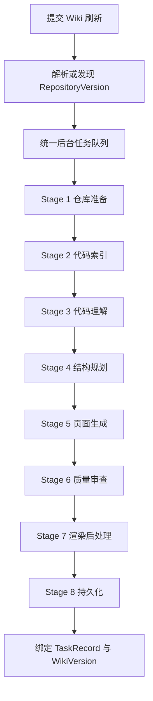

# Heimdall 架构专题：Wiki 生成管线

> 文档类型：专题文档
>
> 所属分组：运行时
>
> 最后更新：2026-05-25
>
> 返回入口页：[`architecture.md`](../architecture.md)
>
> 顺序导航：上一篇 [`领域模型`](../overview/domain-model.md) ｜ 下一篇 [`AI Provider 架构`](../runtime/ai-provider-architecture.md)

## 文档范围

本文聚焦 Wiki 生成运行时主链路，描述 8 阶段流水线、结构规划策略、`BM25` 检索注入、代码理解和大仓库分治策略。数据库表细节与 Provider 适配细节分别下沉到持久化与 AI Provider 专题。

## 核心职责

| 阶段 | 核心服务 | 职责 |
|------|------|------|
| 仓库准备 | `RefreshOrchestrationService`、仓库源服务 | 判定是否复用快照、拉取代码、准备文件树 |
| 代码索引 | `CodeIndexService` | 用 Tree-sitter 建立文件级与块级索引，并构建 BM25 |
| 代码理解 | `CodeUnderstandingService` | 从文件、模块、系统三个层级提炼摘要 |
| 结构规划 | Deterministic / LlmJson / LlmEnhanced | 生成 Wiki 页面结构骨架 |
| 页面生成 | `WikiPageGenerationService` 等生成服务 | 按页面维度组合 Prompt 和检索上下文，产出 Markdown |
| 质量审查 | `WikiGlobalConvergenceService` | 做全局一致性检查、弱页识别与重生成 |
| 渲染后处理 | `WikiRenderPostProcessor` | 修正文档结构、Frontmatter、Mermaid 和链接 |
| 持久化 | 持久化事务服务 | 写入 `WikiVersion`、页面树、关系和任务结果 |

## 关键流程

### 结构规划三策略

| 策略 | 适用场景 | 优点 | 代价 |
|------|------|------|------|
| `Deterministic` | 默认、安全、低成本 | 零 Token 消耗、可预测、稳定 | 结构表达能力受规则限制 |
| `LlmJson` | 小到中型仓库、需要较强语义归纳 | 一次调用即可生成完整 JSON 结构 | 对模型输出稳定性依赖更高 |
| `LlmEnhanced` | 既要稳定骨架又要增强语义 | 结合规则稳定性与 LLM 语义修正 | 实现与调试复杂度更高 |

### BM25 检索注入链路

1. 页面主题与章节上下文先触发 BM25 关键词检索。
2. `HybridSearchService` 对 BM25 结果做相关性排序、关键文件加权和上下文预算截断。
3. 结果片段与系统摘要、页面约束共同注入生成 Prompt。

### 大仓库分治策略

当仓库规模超过阈值时，`AgentOrchestratorService` 会按模块切分上下文窗口与生成任务，主 Agent 负责全局收敛和跨模块一致性，避免单个上下文无法容纳整个仓库。

## 模块职责

| 模块 | 输入 | 输出 | 与其他模块的关系 |
|------|------|------|------|
| `CodeIndexService` | 仓库文件树 | 文件索引、块索引、BM25 数据 | 为代码理解和页面生成提供原材料 |
| `CodeUnderstandingService` | 索引、关键文件、仓库文档 | 文件/模块/系统摘要 | 为结构规划和页面生成提供语义背景 |
| 结构规划服务 | 系统摘要、目录结构、策略配置 | 页面结构 JSON | 决定后续生成批次与页面树 |
| 页面生成服务 | 页面结构、检索结果、Prompt 模板 | Markdown 页面草案 | 把规划转化为可展示知识内容 |
| `WikiGlobalConvergenceService` | 页面草案全集 | 质量报告、修正后的页面内容 | 负责跨页术语统一与薄弱页补强 |

## 依赖关系

| 依赖项 | 作用 |
|------|------|
| 版本模型 | 确保整个生成链路基于单一 `RepositoryVersion` 与新建 `WikiVersion` |
| Prompt 模板体系 | 为不同阶段提供角色、约束与质量标准 |
| AI Provider 架构 | 为理解、规划、生成、审查阶段提供模型调用能力 |
| 任务工件 | 支撑阶段间恢复、审计与调试 |
| 数据库与索引表 | 保存索引、页面、日志与最终生成结果 |

## 设计取舍

| 取舍点 | 当前选择 | 理由 |
|------|------|------|
| 执行方式 | 统一后台队列而不是同步请求内执行 | 生成链路耗时长，需要恢复、排队与状态追踪 |
| 阶段拆分 | 8 阶段细粒度管线 | 便于观测、恢复、替换单阶段策略 |
| 检索方案 | `BM25` 主导检索 | 与当前代码实现保持一致，优先保证符号和路径命中稳定 |
| 大仓库处理 | Agent 分治作为增强策略，而非默认路径 | 保持普通仓库路径简单，同时为超大仓库保留扩展能力 |

## 导航与关联阅读

### 返回入口

- [`architecture.md`](../architecture.md)

### 顺序导航

- 上一篇：[`领域模型`](../overview/domain-model.md)
- 下一篇：[`AI Provider 架构`](../runtime/ai-provider-architecture.md)

### 关联阅读

- [`overview/domain-model.md`](../overview/domain-model.md)
- [`runtime/ai-provider-architecture.md`](./ai-provider-architecture.md)
- [`persistence/database-design.md`](../persistence/database-design.md)
- [`governance/architecture-decisions.md`](../governance/architecture-decisions.md)
