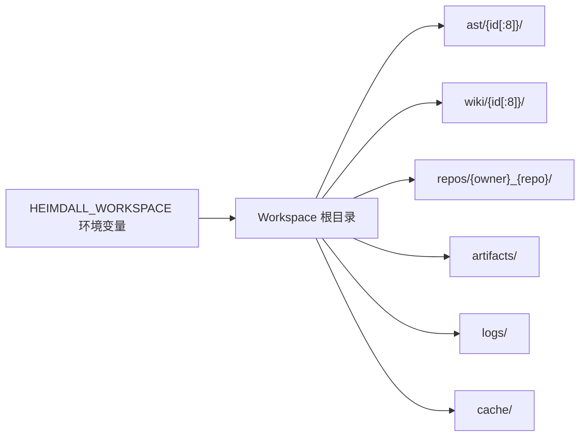
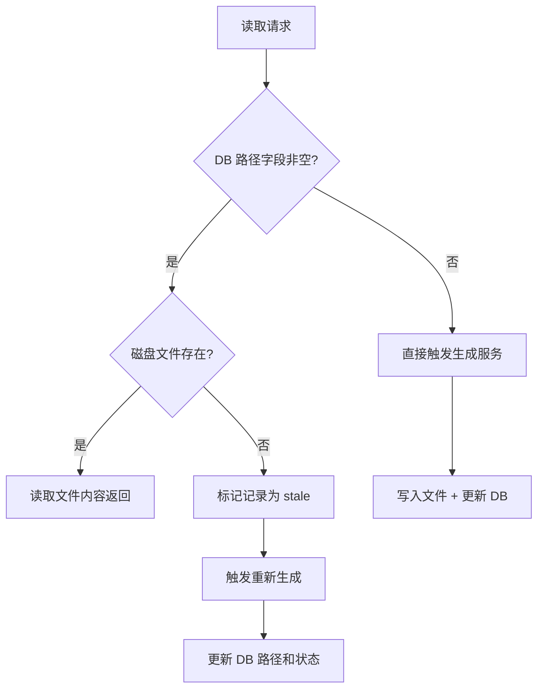

# Heimdall 架构专题：Workspace 文件系统

> 文档类型：专题文档
>
> 所属分组：运行时
>
> 最后更新：2026-05-28
>
> 返回入口页：[`architecture.md`](../architecture.md)
>
> 顺序导航：上一篇 [`AI Provider 架构`](../runtime/ai-provider-architecture.md) ｜ 下一篇 [`前端架构`](../runtime/frontend-architecture.md)

## 文档范围

本文描述 Heimdall 的 Workspace 文件系统——涵盖目录结构、路径解析服务、各数据类型的文件存储规范、缓存失效与重新生成触发机制。Workspace 是大文本内容（Wiki 页面 Markdown、AST CST S-expression、Wiki 结构 JSON）的物理存储层，与 PostgreSQL 共同构成系统的双存储架构。

## 核心职责

| 组件 | 职责 |
|------|------|
| `WorkspaceService` | 根目录配置、标准目录初始化、路径解析（`GetRepoPath`/`GetAstDir`/`GetWikiDir`/`GetArtifactDir`/`GetLogDir`/`GetCacheDir`） |
| `HEIMDALL_WORKSPACE` 环境变量 | 指定 Workspace 根目录，未设置时默认 `./workspace` |
| 文件读写服务 | 各业务服务直接通过路径读写文件，`WorkspaceService` 只负责路径解析和目录保证 |
| 缓存失效逻辑 | 读取前检查文件是否存在，缺失时标记 `stale` 并触发重新生成 |

## 标准目录结构

```
{workspace}/
  ast/{ast_version_id[:8]}/        # AST 解析结果
    manifest.json                  # 文件清单与统计（total_files、total_symbols、total_call_edges、total_chunks）
    files/{file_hash}.cst          # 单文件 CST S-expression（Tree-sitter 原始语法树）
    symbols.json                   # 轻量符号索引（符号名、类型、文件路径）
  wiki/{wiki_version_id[:8]}/      # Wiki 版本内容
    structure.json                 # 结构规划 JSON（WikiStructureDto）
    pages/{page_order:D4}_{slug}.md # 页面 Markdown 内容（4 位序号 + slug）
  repos/{owner}_{repo}/            # 克隆的仓库副本（替代原 %TEMP%/heimdall_repos/）
  artifacts/                       # 任务工件文件
  logs/                            # 运行日志
  cache/                           # 临时缓存
```

## 关键流程

### 路径解析



- `GetAstDir(astVersionId)` → `{workspace}/ast/{astVersionId[:8]}/`（使用 Guid 前 8 位十六进制字符）
- `GetWikiDir(wikiVersionId)` → `{workspace}/wiki/{wikiVersionId[:8]}/`
- `GetRepoPath(owner, repo)` → `{workspace}/repos/{owner}_{repo}/`
- 路径解析对同一参数幂等，多次调用返回相同路径

### 启动初始化

`WorkspaceService.EnsureDirectories()` 在启动时递归创建根目录和所有顶层子目录。若指定的 Workspace 根目录不存在，自动创建；创建失败时抛出明确异常。

### 文件缺失即缓存失效



## 各数据类型的存储规范

### AST 解析结果

- **写入时机**：`AstPersistenceService` 完成仓库全量 AST 解析后
- **存储位置**：`workspace/ast/{ast_version_id[:8]}/`
- **文件清单**：
  - `manifest.json` — 包含 `total_files`、`total_symbols`、`total_call_edges`、`total_chunks`
  - `files/{sha256[:16]}.cst` — 每个文件的 Tree-sitter 原始 CST S-expression
  - `symbols.json` — 符号名、类型和文件路径的轻量索引
- **DB 关联**：`AstVersion.ast_dir_path` 记录目录路径，`symbol_names_json` 和 `file_list_json` 保留轻量索引在 DB 中支持无 I/O 快速搜索

### Wiki 页面内容

- **写入时机**：Stage 5 页面生成完成后
- **存储位置**：`workspace/wiki/{wiki_version_id[:8]}/pages/{page_order:D4}_{slug}.md`
- **文件格式**：Markdown（含 Frontmatter、Mermaid 图表、代码块）
- **DB 关联**：`WikiPage.content_file_path` 记录文件路径，`ContentMarkdown` DB 列保留为空

### Wiki 版本结构

- **写入时机**：Stage 4 结构规划完成后
- **存储位置**：`workspace/wiki/{wiki_version_id[:8]}/structure.json`
- **DB 关联**：`WikiVersion.structure_file_path` 记录路径，`StructureJson` DB 列保留为空

### 仓库克隆

- **写入时机**：Stage 1 仓库准备阶段
- **存储位置**：`workspace/repos/{owner}_{repo}/`
- **克隆策略**：`git clone --depth=1`，目标路径已存在非空目录时跳过克隆直接复用

## 依赖关系

| 依赖项 | 作用 |
|------|------|
| 环境变量 `HEIMDALL_WORKSPACE` | 指定根目录路径 |
| 领域模型 `AstVersion` | 提供 `ast_dir_path` 字段关联 |
| 领域模型 `WikiPage` | 提供 `content_file_path` 字段关联 |
| 领域模型 `WikiVersion` | 提供 `structure_file_path` 字段关联 |
| `AstPersistenceService` | AST 解析结果的写入方 |
| `WikiTaskService` | Wiki 页面和结构的写入方 |
| LLM Tools（ReadCodeFile 等） | 从 Workspace 文件读取 AST/CST 数据 |

## 设计取舍

| 取舍点 | 当前选择 | 理由 |
|------|------|------|
| 存储分层 | DB 存元数据 + 文件系统存大文本 | 避免 DB TEXT 列膨胀，文件系统更适合大内容读写 |
| 目录命名 | Guid 前 8 位十六进制 | 兼顾唯一性和可读性，避免过长路径 |
| 文件缺失处理 | 标记 stale + 触发重新生成 | 保证数据完整性，而非静默失败 |
| 仓库克隆位置 | Workspace 统一管理 | 替代 `%TEMP%` 分散存储，便于统一清理和管理 |
| DB 轻量索引 | `symbol_names_json`/`file_list_json` 保留在 DB | 支持无需文件 I/O 的快速符号搜索 |

## 导航与关联阅读

### 返回入口

- [`architecture.md`](../architecture.md)

### 顺序导航

- 上一篇：[`AI Provider 架构`](../runtime/ai-provider-architecture.md)
- 下一篇：[`前端架构`](../runtime/frontend-architecture.md)

### 关联阅读

- [`overview/domain-model.md`](../overview/domain-model.md)
- [`runtime/wiki-pipeline.md`](./wiki-pipeline.md)
- [`persistence/database-design.md`](../persistence/database-design.md)
- [`persistence/configuration-and-env.md`](../persistence/configuration-and-env.md)
